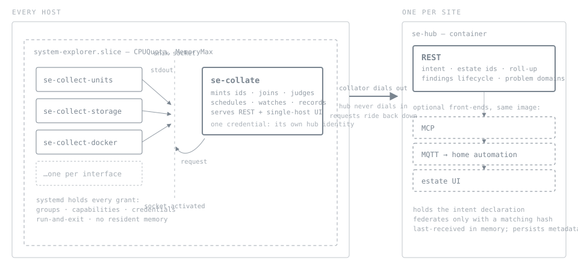
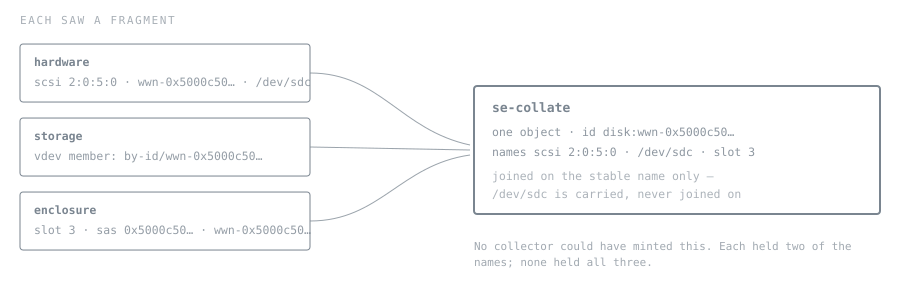

# The observation model

*Why a homelab's truth drifts from its owner's belief, and what a product has to do — and refuse to do — to keep the two together.*

## Summary

**A homelab accumulates belief, and beliefs go stale silently.** Every native tool stays correct while that happens, which is what makes it hard to notice. The failure this product exists to prevent is **confident wrongness**, and this estate produced two examples in a week: "are all hosts up to date" answered yes with the internet-facing host five revisions behind, and months of green replication over data with no off-site copy.

**System Explorer answers the questions that cross native tools — over a whole estate, with a stated opinion, and against a record of what came before** — and never writes to the system it observes. That names four kinds of value: **join, estate, judgement, record**.

**Three tiers.** A **collector** reads one native interface, writes what it saw, and exits. A **collator** is one service per host: it schedules collectors, mints ids, joins what no collector could see, judges what is self-evidently wrong, and keeps the record. A **hub** holds intent — what *should* be — and is the only tier that can judge one host against another.

**Two axes.** Collections are organised by what the OS offers; questions are asked by what somebody wants to know. Problem domains are assembled from collector domains, and this product has built only the first axis. That is the best single predictor of which parts of it are good.

**Six layers, five laws.** Names are observed and ids are minted. Reach decides tier. Relations are minted, and their observability is stated. Every claim names its origin. Every tier is complete without the tiers above it.

Two of those laws exist because both founding incidents were failures of the same kind. **A registry that agrees with itself is not a complete registry**, and **an edge observed at one end is not an edge** — green replication with no off-site copy is a half-observed relation reported as a whole one.

**What the system is, and what we could establish about it, are separate axes.** A dark host does not make the storage sicker; it makes the answer narrower. Merging the two invents a false belief in both directions, and the test that catches it is one sentence: *removing evidence must never improve either the verdict or the epistemic status.*

**And the targets are stated, because a specification with no tolerances invites unbounded rigour.** Ten hosts, one-second time resolution, hours of hub downtime tolerable, one part-time maintainer. Every proposal must name the target it moves; "more correct in general" is not one.

**Time is a prohibition, not a subsystem.** An age is measured on one clock and two hosts' wall clocks are never compared — because the timestamps that answer an administrator's questions live *inside the data*, where no precision of ours can improve them. Our stamps answer only how stale a page is, which needs seconds.

**The spec is founded on captured reference answers** — one corpus per native source, in variant states, with every declaration written against a real document sitting beside it.

- **What is binding.** Unmarked prose and `[schema]` blocks are the contract — a `[schema]` fixes the members and what they mean, not their spelling. **Nothing marked `[decision]` or `[open]` may be implemented**: those are choices this document is asking for rather than making, and two people building against them will build different systems.
- Chip legend: `[audited]` case-study support · `[decision]` proposed, do not build · `[schema]` binding members and meanings · `[open]` blocked

> **How this document is governed**
>
> **This is the living record of intent, and it outranks every other artefact, including the code.** Wherever it is unclear, silent, or self-contradictory, the gap is not filled in place — it goes to the adjudication queue (appendix C), gets ruled on, and the ruling is written here *before* any code is built against it. A chip is how a section says it is still waiting.

---

# Part I — the problem this exists to solve

## 01 · Why

A homelab accumulates belief. You set something up, it works, you stop looking at it. The belief persists; the system moves.

Every native tool stays perfectly correct while that happens, which is what makes it hard to notice. htop is never wrong about what is using the machine — the belief about *which container that is* goes wrong. `systemctl status` is never wrong — the belief that the backup ran, because the timer is enabled and green, goes wrong.

> **The failure this exists to prevent**
>
> **Confident wrongness.** Not an outage — a gap between a system and somebody's model of it, which persists precisely because everything on screen is true.

Two from this estate, inside one week:

> **Both answers were true. Both beliefs were false.**
>
> **"Are all hosts up to date?" → yes.** The only internet-facing host in the estate was five revisions behind, registered with no hub, and absent from every listing. Every host the registry knew about *was* up to date. The answer was correct and the belief it created was not.
>
> **Irreplaceable data, no off-site copy, months of green replication.** Every job succeeded. Every dashboard was clean. Nothing was safe. The replication was real; the belief that it constituted a backup was not.

These are not two anecdotes about carelessness. They are two instances of one structure, and the model below is built to make each of them impossible to reproduce:

- **The first is a registry reporting on itself.** A list of hosts answered a question about all hosts, and nothing anywhere held an independent belief about how many there were. §23 is the answer.
- **The second is an edge observed at one end.** The push was real and honest; the far end was never looked at; and the product had no vocabulary for the difference between a relationship confirmed at both ends and one asserted at one. §13 is the answer.

### Which is why the disciplines are what they are

These read as good engineering habits. They are not — each is a direct defence against a specific way a belief goes stale:

| Discipline | The drift it prevents |
|---|---|
| **Absence is never health** | a false green *is* the drift — it is the exact shape of both incidents above |
| **Opinions cite their evidence** | a belief you can check is one that can be corrected; one you must trust cannot |
| **Observed / derived / declared** | you should know what you are trusting at the moment you form a belief from it |
| **Unobservable says so, by name** | "I could not look" and "I looked and it was fine" produce opposite beliefs |
| **A registry says it is a registry** | completeness assumed is the belief that hid a host for five revisions |
| **A record of before** | drift is invisible without one — you cannot see a change you have no baseline for |

### And why the four kinds of value are the ones that matter

They are not virtues in themselves. Each closes a place where belief and system come apart:

- **join** — beliefs cross tools, so drift hides in the gaps between them
- **estate** — nobody holds six hosts in their head, so the forgotten one is where it hides
- **judgement** — a number never tells you your belief about it is wrong
- **record** — without a before, a changed thing looks exactly like a thing that was always so

## 02 · The problem, concretely

A Linux host exposes its state through dozens of interfaces — D-Bus, procfs, sysfs, netlink, cgroupfs, engine APIs — each with its own vocabulary, its own tool, and its own narrow question. **Those tools are excellent.** htop turns half a million procfs entries into "what is using this machine, ranked". `systemctl status` turns a unit's property set into state, cause, and the last few log lines. `lsblk` uses tree shape because the shape *is* the answer. None of them is improved by being reimplemented, and a collection that reimplements one is strictly worse than the original — the original is already installed.

What is left over is that **an administrator's questions do not respect those boundaries.**

> *Why is this host slow?* — crosses cgroups, units, containers and disks.
 *Is this data safe?* — crosses datasets, snapshots, jobs, and a repository on another machine.
 *What changed?* — crosses all of them, and time.

> **What this product is for**
>
> **System Explorer answers the crossing questions — over a whole estate, with a stated opinion, and against a record of what came before.**

### Which names exactly four kinds of value

Everything below follows from these, and scope is decided by them:

| Value | What it adds | What its absence looks like |
|---|---|---|
| **join** | crosses interfaces no single tool crosses | `zpool status` cannot tell you the disk is in slot 3 of the enclosure |
| **estate** | **the union is not obtainable by asking each subject in turn at comparable cost** | `systemctl` answers for one box, and you have six |
| **judgement** | an opinion attached, so a reader need not already know what is bad | a table of numbers is data, not an answer |
| **record** | what it looked like before — **where the subject outlives the sweep and the diff is not dominated by counters** | nothing on the box remembers |

> **The scope test, in one line**
>
> **A collection must deliver at least one of join, estate, judgement or record, over what the native tool already does.** None of the four means it has reimplemented a native tool, worse.

> **And then taste, deliberately**
>
> Which crossing questions to answer *first* is opinion, and should be. The scope test says what is admissible; it does not say what is interesting. Same division as the interface, where routes are contract and grouping is judgement — the principle bounds the space and preference chooses within it.

## 03 · What the product does today, audited `[audited]`

Before the model: what applying it found. Fifty-five collections judged against the four values, the laws and a measured cost budget, on six live hosts. §33 carries the full audit; this is the part that belongs beside the problem, because it *is* the problem, still happening.

> **The family built for the founding failure is green over a job that has never run**
>
> On one host, a maintenance job — call it `vault-maintenance` — reads **State: ok**, **Basis: registered-never-succeeded**, and carries **no opinion at all**. No unit, no receipts, no result. Its window is 14 days, barely begun, so it has nearly two weeks of reading green ahead. protection/jobs on that host is **16 of 16 ok**.
>
> **The facts are honest; the judgement is absent.** `registered-never-succeeded` is on the row — the five-states discipline worked. What is missing is any opinion, so the dot is green and the roll-up counts it as fine. The mechanism is a gap in a ladder: *stale and never* is critical, *stale* is warn, *last run failed* is warn — a job that has *never run* and is not yet late matches none of them.
>
> And it matters more than a generic hole because of which job it is. The destination that job maintains declares, in its own security prose, that until a separate maintenance identity exists the pushing credential retains authority it should not keep. The job that would establish that identity is this one. So a declared gap is visible only by reading two prose facts on two pages, and nothing above the fact level raises it.

### The ranking, and what predicts it

Ranked by use, independently of any model: *units — truly great. disks — magical. resources — maturing but not great. protection and apps — potential but messy.*

A model is only worth writing down if it predicts judgements already made. This one does: the two good subsystems have **zero** violations of the laws in §11, the middling one has **one**, and the two messy ones have **two each**. The ranking falls out of the count, and §32 shows the working.

Protection is the one worth reading carefully, because the count alone understates it. It is not messy because it is badly built — it is the *highest-stakes belief in the estate*, and the product half-delivers on it. What "messy" measures there is the gap between how much it matters and how much arrives.

### Four findings that changed the model rather than the code

An audit that validates its own instrument perfectly is not an audit:

- **Twelve ESTATE credits struck.** The product is estate-wide, so every collection was being credited with estate by association. Measured against live capabilities, `storage/arrays` has subjects on one host of five and eleven app-tier collections observe exactly one instance.
- **RECORD was a property of the hub**, not of the collection — nine credits rested on "perishable, therefore recorded, because the hub snapshots everything". A value axis nothing fails is not an axis.
- **Nothing said what a counter does to a diff.** The single highest-yield missing line, and its absence produced the same finding six times.
- **Eleven reach faults resolve to one absent component.** No cross-host rule exists anywhere in the product. Not eleven bugs — one empty column, and §24 names the tier that fills it.

## 04 · Two axes, and the one we have not built

Collections are organised by **what the OS offers**. Questions are asked by **what somebody is trying to find out**. These are different axes, and the product has only ever built one of them.

> **The two domains**
>
> **A collector domain** is a family of things one interface can tell you about: PCI and SCSI and USB devices; block devices and partitions; filesystems; packages; units and cgroups; sockets and rules.
>
> **A problem domain** is a question somebody actually has: *what is running and should it be? is the storage healthy? is my data protected? is this box up to date? what can reach it? why is it slow? what changed?*
>
> Problem domains are **assembled from** collector domains, many-to-many. Neither is derivable from the other, and confusing them is where the product's weaker parts come from.

That is one claim, and §32 makes another: quality tracks the number of law violations. They are not two rival predictors — **the first is the cause and the second is the mechanism.** Building a problem domain in its source's shape is what puts identity and reach in the wrong place, because a collection that mirrors one interface mints ids from that interface's names and judges with only that interface's facts. The confusion is the disease; the fault count is the symptom you can measure.

### Which re-reads the ranking

| Subsystem | What it actually is | Consequence |
|---|---|---|
| **units** | a collector domain that nearly coincides with a problem domain | "truly great" — question and interface happen to share a shape, so no assembly is needed |
| **disks** | a problem domain, hand-assembled from five collector domains | "magical" — somebody did the assembly by hand, and the assembly *is* the value |
| **resources** | a collector domain presented as if it were a problem domain | "maturing" — shaped like an answer to *why is this slow*, without the assembly that would make it one |
| **protection** | a problem domain built with the shape of its source | "messy" — three collections mirroring a manifest's three stanzas. The question is *is my data safe*; the shape is *what does this file say* |
| **apps** | a collector domain per vendor API | "messy" — seven subsystems shaped by seven APIs, and nobody asks a question in those terms |

> **Two tests that follow**
>
> **A problem domain is whatever produces an answer, a verdict, a basis and a reach (§25) — source count is not the test.** A single collector domain plus intent, history and judgement can be a real one; *is this box up to date* is nearly that shape. But a single-source domain producing none of those is a collector domain with an aspirational name, and one source is the smell that says look closer.
>
> **A collector domain feeding no problem domain is inventory.** It may be perfectly correct and still answer nothing.

Both reproduce verdicts reached independently: the first flags protection — one source, and no answer object anywhere; the second catches `hardware/usb`, which the audit retired for delivering none of the four values.

### The map, as it stands

Rows are questions, columns what must be assembled to answer them. **Bold** means the product assembles it today; plain means the facts exist and nothing joins them; *italic* means the facts are not collected at all.

| Problem domain | Assembled from | State |
|---|---|---|
| **What is running, and should it be?** | **units** · containers · VMs · cgroup workloads · *declared-vs-loaded* | partly — four collector domains, no assembly, and nothing compares the unit file on disk with what is loaded |
| **Is the storage healthy?** | **SCSI/NVMe · SMART · enclosure · block · pools · datasets · arrays** | assembled — this is "disks", the only fully built one |
| **Is my data protected?** | the manifest · jobs · receipts · *the datasets it names* · *snapshots* · *the destination's own state* | not assembled — the manifest is read; the data it describes is never joined to it |
| **Is this box up to date?** | generations · packages · *every other host's revision* | not assembled — the cross-host comparison exists nowhere, and this is the question that answered "yes" wrongly |
| **What can reach it?** | **listening sockets · firewall rules · chains** · links · routes · tailscale | assembled — port-exposure, with two closures |
| **Why is it slow?** | cgroup counters · PSI · io · *the unit behind the cgroup* · *containers* · *disks* | partly — the attribution is done; the join to what the workload *is* is not |
| **What changed?** | snapshot history · generations · deployment receipts | partly — the diff exists and is dominated by counters, so it reports change continuously |
| **Is the box itself healthy?** | platform/DMI · CPU · memory · temperatures · boot · clock | not assembled — six collector domains, one overview card, no question |

### And so: two views, not one

The first view — **facts and derived facts with opinions overlaid, organised by the interface that produced them** — is built, and most of this document describes it. It must exist and must be complete: it is where an answer is checked, where evidence hangs, and what a language model walks.

The second — **the problem-solving view, organised by the question being asked** — is barely started. Nobody arrives at a screen wanting a collector domain. They arrive with a question, and today the product mostly makes them do the assembly in their head.

> **What this makes of "views"**
>
> Views today are a config-driven page composing existing collections. That is the right *mechanism* and the wrong *framing*: it treats a projection as a dashboard somebody arranges, when a problem domain is a first-class thing with its own identity, its own opinions and its own answer.
>
> The difference is in what each can say. A dashboard can put the protection manifest beside the dataset list. A problem domain can say **"this dataset is declared irreplaceable and has no copy anywhere this host can see"** — an opinion belonging to neither collection, statable by neither. §25 gives it a shape.

---

# Part II — the architecture

## 05 · The envelope: what this is built for

Everything below is fitted to a particular size and a particular tolerance, and until those are written down every reader supplies their own. That is not a hypothetical failure — it is the one this document has actually suffered. Each review has proposed the next increment of correctness; each increment was individually defensible; and the only reason to decline any of them was a target nobody had stated.

> **The rule that makes "no" a decision rather than laziness**
>
> **A specification with no stated tolerances invites unbounded rigour.** Absent a number, the reviewer supplies one, and theirs will always be tighter — because tighter is defensible in the abstract and only a target makes it excessive.
>
> Which is this product's own discipline turned on its documentation. It refuses to report absence as health; this document refuses to *imply* a precision it is not aiming at. An unstated tolerance is a belief the reader supplies and the page never earned.

### The targets

These are aspirations, not measurements. Where a figure was measured, the section that uses it says so.

| Dimension | Target | What it licenses — or forbids |
|---|---|---|
| **Estate size** | ~10 hosts, 2 sites | the hub holding last-received in memory; a full checkpoint on every reconnect costing nothing worth optimising |
| **Per host** | ~2,000 objects, ~15,000 facts | SQLite; whole-collection commits; **no pagination inside a collection**, which is why a ceiling is a scope error rather than a cursor |
| **Time resolution** | **one second** | no clock-synchronisation subsystem, no uncertainty arithmetic, skew reported to the nearest second (§09) |
| **Freshness** | 60 s typical; hours for slow collections; on-demand for the rest | polling with declared cadence; watches as an optimisation, never as the contract |
| **Hub availability** | hours of downtime tolerable | no HA, no failover, no quorum, no leader election. A site is one hub |
| **Recovery** | estate view back within minutes | checkpoint-on-reconnect rather than a durable replication log |
| **Concurrency** | one operator, occasionally two | no locking model, no multi-tenancy, no per-user views |
| **Trust** | one owner; a second site owned by somebody trusted; a LAN not fully controlled | authentication between tiers is required; a hostile-multi-user threat model is not |
| **Loss tolerance** | both survivable — history archived, lifecycles reset | the big-bang cut (§06): losses are stated on screen, and the effort goes into arriving instead |
| **Product cost** | ≤1% of a core; bounded resident memory | the slice, run-and-exit collectors, and cost published as a fact about ourselves |
| **Maintainer** | **one person, part-time** | the hardest constraint in the table, and the one the mechanism budget in appendix A exists to protect |

### And what it is deliberately not built for

Stated as flatly as the targets, because these are where proposals arrive and a polite silence reads as an omission rather than a decision:

- **Sub-second cross-host ordering.** Nothing consumes it. §09 works through why.
- **Exactly-once delivery.** Collectors are read-only and idempotent, so at-least-once with generation ordering is sufficient and much smaller.
- **Byzantine tolerance between hubs.** A sibling hub is trusted or not federated; there is no third state and no voting.
- **Unbounded scale.** Ten hosts is not a hundred, and a design that stayed honest to a hundred would be worse at ten.
- **Continuous availability.** The product being down is an inconvenience; the product being *wrong* is the failure it exists to prevent. Where the two trade, correctness wins and the outage is stated.

> **Which gives every future proposal a question to answer**
>
> **Name the target it moves, or the target it would otherwise miss.** "More rigorous", "more correct in general", and "a real system would" are not targets — and a mechanism that improves a number nobody is aiming at costs the one budget in the table with no slack in it.

## 06 · Three tiers

The two axes have a structural consequence. **A collector domain is host-local by nature** — one interface, one machine, what is. **A problem domain almost always needs intent** — what *should* be — and intent is estate-wide. Nothing can be both, so the product is three tiers and the boundaries between them are the load-bearing decisions in this document.



***The deployment.** Every arrow into a collector originates at the collator, and the connection to the hub is opened by the host, never toward it. The collator holds no group, no capability and no credential belonging to the observed system — systemd applies those per collector unit, which is what makes the blast radius one interface rather than their union.*

### Collector

**A collector is a program, in any language, that reads one native interface, writes what it saw, and exits.** It holds no state between invocations, which is what makes its idle cost zero and its memory bounded by one acquisition rather than by uptime. It mints no identity, joins nothing, and has never been shown estate configuration — it reports what one interface said about the host it runs on.

Each is a systemd socket-activated unit. The collator connects to a per-collector socket; systemd spawns the collector with the connection as its standard input and output, applies that collector's grants and sandbox, and reaps it when it exits.

> **Why socket activation, and the payoff that falls out of it**
>
> The alternative is a collator that forks its collectors — which means the collator must hold the union of every grant in order to hand them down. That is the blast radius this design exists to break, reintroduced in the one process that talks to the network.
>
> With `Accept=yes` on the socket unit, systemd hands the accepted connection to the collector as fd 0 and fd 1. **So a collector never opens a socket, never links a socket library, and never contains daemon code.** It reads a request line from stdin and writes NDJSON to stdout — which is *identical* to how it behaves when a person runs it in a terminal. The wire contract and the command-line contract are the same contract, a collector can be written in shell, and every collector is testable with a pipe.
>
> It also means `RuntimeMaxSec` bounds a hung collector, the journal already has its stderr, and a collector that crashes takes nothing with it.

### Collator

**One long-lived service per host.** It is the only tier that sees every collector's output at once, and everything it does follows from that:

- **Mints host-scoped ids**, because identity requires seeing every candidate name together (law 1)
- **Joins across collector domains** — the cgroup to the unit to the container, the block device to the vdev to the enclosure slot — which no single collector can do and which is where most of the product's value has always come from
- **Mints host-scoped relations** and states whether each was confirmed at both ends (§13)
- **Judges what is self-evidently wrong**: a unit failed, a pool is degraded, a disk reports pending sectors. No intent required
- **Schedules**, from each collector's declared freshness and its measured cost against the slice budget
- **Watches** — udev, inotify, D-Bus signals — and turns a notification into a scheduling decision, never into a fact (§31)
- **Anchors time**, because it shares a kernel clock with every collector (§09)
- **Keeps the record**: the snapshot store and the diff behind *what changed*
- **Serves the host**: REST and the single-host UI, so a host stays completely usable with no hub anywhere

> **What the collator does and does not hold, stated precisely**
>
> It holds **no credential belonging to the observed system** — no docker group, no capability, no vendor API key. Everything privileged happens in a collector that systemd launched with exactly the authority that collector declared.
>
> It does hold **one credential of its own**: the client identity it presents to the hub. That is not an exception to the rule, it is a different category — an identity for the collator as a network participant, useless for reading anything on the host.
>
> And it does touch native interfaces, in one narrow way: it **subscribes to change notifications** — udev, inotify, D-Bus signals. It never reads state through them. The distinction is load-bearing rather than pedantic, and §31 is where it earns its keep: a notification schedules a collector, and the fact still comes from something that looked.

### Hub

**One per site, in a container.** The hub holds *intent* — what should be — and is therefore the only tier that can say *"this is not what you asked for"* rather than merely *"this is self-evidently bad"*. It is also the only tier that can see two hosts at once, which is what makes the cross-host questions answerable at all.

By default it exposes REST and nothing else. **MCP, MQTT and the estate UI are front-ends on the same image, enabled by configuration** — the pattern the repository already uses to build three console scripts from one distribution. They are separate because their postures differ: MCP is a surface a language model reads, MQTT writes into somebody else's broker, and the UI is unauthenticated.

> **What outbound-only forces the hub to hold**
>
> The connection is opened by the collator, so the hub cannot fetch on demand. Two consequences, and both need writing down before somebody solves them by opening an inbound port:
>
> **The hub holds the last-received envelope per collator, in memory.** That is not a cache in the forbidden sense — it is the only copy of what a host said, and it is stamped with when it arrived. It is served with its age visible, never as though current, and it does not survive a restart.
>
> **Evidence-on-demand rides back down the collator's own channel.** A request for a raw native payload travels over the connection the host opened; the collator invokes the collector and streams the answer up. Evidence stays captured-fresh and stored nowhere — only the direction of the request changes. That reverse channel carries `evidence`, `object` and `lookup` and nothing else, only for collections this collator's own declaration lists, and anything else is refused and recorded — a closed list, not a filter of known-bad verbs.
>
> Which names the cost of reversing the direction, and it should be stated rather than discovered: **outbound-only removes the network as a containment layer, so the hub's identity becomes the only thing standing between it and every host's collectors.** That is a trade, not a free win, and it is why the client identity in §08 is mutual rather than decorative.
>
> Persistence at the hub stays what it already is: **metadata, never observations**. Findings lifecycle, transitions, coverage claims, and the immutable basis of §25 — which is metadata under this rule, because a basis is *a quotation of what we claimed and when*, not a copy of host state. It may be served in answer to a question about a finding and never in answer to a question about now. §14 already grants exactly this exemption for our own claims about our own claims.

> **A restarted hub must not resolve the estate**
>
> The hub's observations are in memory, so after a restart it holds findings and no facts. Left alone, that reads as *every condition in the estate cleared at once* — the absence-as-health shape, written into the permanent record, at the moment of least attention.
>
> The rule that prevents it already exists and must be carried forward: **absence only resolves where the host could look.** A collection the sweep could not evaluate freezes its findings — lifecycle untouched, current honestly unstated — rather than resolving them. The new architecture adds one state that rule has never needed before: **a collator that has not yet reconnected since the hub started is `unswept`, not `dark`**. Nobody has told us is a different claim from the host told us and stopped, and only one of them is evidence about the host.
>
> Telling them apart costs one thing: each finding persists the batch generation and arrival stamp that derived it, so a restarted hub can say which it is.

### Reconnect: declarations, then a checkpoint, then transitions

Nothing about a hub that only receives makes it obvious when it knows enough to answer, so the order is fixed. On connect a collator sends **its declarations** — the hub cannot render or serve MCP without the fact axes — then a **current-state checkpoint**, then the ordinary stream. Until the checkpoint completes the host is `unswept` and says so.

> **"Complete" needs a wire meaning, or a hub answers from a fragment**
>
> A checkpoint **opens with a manifest** — every collection this collator declares, with its current generation and status — and **closes with a terminal record**. It is promoted **all at once**, and until it is, nothing in it is visible to a roll-up, a problem domain, or a projection.
>
> Without that, the failure is specific and quiet: the hub receives one collection, considers the host swept, recomputes an estate finding over a subset, and *resolves* it — a finding cleared by partial knowledge, which is the failure this whole document is written against, arriving during recovery when nobody is looking.

One checkpoint, on the wire:

```jsonl schema=se.checkpoint/1
{"record":"manifest","checkpoint":"cp-8f21","host":"storage-1","boot_id":"5e000000-0000-4000-8000-000000000001","declarations":["sha256:11e4","sha256:9a03"],"collections":[{"collection":"pools","generation":412,"freshness":"current","objects":2},{"collection":"leases","generation":0,"freshness":"stale","stale_reason":"unsupported"}]}
{"record":"collection_state","checkpoint":"cp-8f21","collection":"pools","generation":412,"objects":[{"id":"pool:tank","facts":{"Health":"DEGRADED"}},{"id":"pool:scratch","facts":{"Health":"ONLINE"}}]}
{"record":"terminal","checkpoint":"cp-8f21","collections":1,"history_gap":{"from":81422.5,"to":98301.0}}
```

Three things in it are the whole of why the shape is this shape. **`leases` is in the manifest and sends no state**, because it has never applied — generation 0, stale, and the reason it is stale is carried. A manifest that listed only what follows would make completeness unfalsifiable, and the hub could not tell a collection that is missing from one that is empty. **The terminal counts the state records** rather than merely arriving, for the reason every commit carries counts: a receiver that inferred completeness from arrival alone cannot tell a checkpoint that finished from one whose middle was lost. And **`history_gap` is stated rather than omitted** — it is required, and null on a first connection — because a missing member and a stated absence of gap are the difference between a timeline with a hole in it and a timeline that says where its hole is.

And a finding remembers **every input that produced it** — each contributing host, collection, generation and arrival — not a single batch id. One generation cannot say whether the two other collections that fed a cross-host answer have come back yet, and a finding that cannot enumerate its own contributors cannot tell "all my evidence returned and the condition is gone" from "one third of my evidence returned".

Without that rule a hub restart leaves collections at long cadence, or invoked only on demand, missing for hours while everything on screen looks settled. And one thing the checkpoint deliberately does *not* attempt: replaying every transition that occurred during a partition. A condition that appeared and resolved while the link was down is **lost, and the gap is stated** — a `history-gap` marker over the disconnected interval — because the alternative is an unbounded queue whose failure mode is the collator dying of somebody else's outage. A stated gap is a worse answer than complete history and a far better one than a confident timeline with a hole in it.

> **One regression to accept deliberately**
>
> Putting the hub in a container on a host means that when that host's container engine is down, the estate UI is down — which is exactly when somebody wants it. The founding invariant survives, because each collator serves its own host in full and can be reached directly. But it survives *only if the collator keeps its own UI*, so that is not optional: the collator serves the single-host interface, the hub serves the estate one, and both render the same envelopes so there is no second judgement to drift.
>
> **And the same argument applies to both consumers, not one.** If a human keeps a surface when the hub is down, so does a model — there is no UI-private API, and an asymmetry here would make the two-consumers rule a slogan. So MCP is a front-end on *both*: host-scoped at the collator, estate-scoped at the hub. A per-site MCP endpoint is also what stops any site's visibility depending on an inter-site path.

### What the split fixes, at the root

Protection today is a collector that reads a declaration — a fact generator doing a hub's job. Its three symptoms are that one misplacement:

- **Twenty-two targets published by every host.** A collector republishing estate config, five times.
- **Owner-scoped opinions.** A workaround for the consequence: a host judging estate intent would judge it once per host, so the judgement was suppressed everywhere but one.
- **The chain cannot be assembled.** Every host holds the intent and only its own facts.

Move the intent to the hub and all three go. **Owner-scoping does not get fixed — it deletes itself**, because it only ever existed to compensate for judgement sitting where the facts were not. Which is law 2 resolving itself: the opinion had been weakened in place because the facts were out of reach; put the intent where it can reach every host's facts and the opinion moves there, as the law says it must.

**The ruling of 2026-08-20 does not weaken this diagnosis — it is the same argument applied a second time.** Protection leaves the public product for an estate's plugin (appendix C), and the tier it attaches at is the *hub*, for precisely the reason above: its intent is estate-wide and its facts sit on hosts no one of them can read. The collector stops being first-party; the diagnosis does not, and neither does the split it argues for. Nothing here rests on protection alone in any case — the first founding failure needs the same tier and no plugin owns it, because "are all hosts up to date" is answered from `nix/generations` and the membership sources and still cannot be answered below the hub (§23, §25).

### Hubs agree or refuse

Two hubs federating from different declarations are describing different estates, and merging them silently mixes two worldviews. So a hub hashes its declaration, exchanges the hash on connect, and **refuses to federate while they differ**. That is a *protocol* check where the present arrangement has only a deployment hope: today the protection adapter's own source note asserts that "the declaration is identical on every host" — an assumption the design depends on, stated in prose, and verified by nothing.

> **Two things the refusal has to get right**
>
> **It must be legible.** Not a connection error — *"this site holds declaration abc123, the sibling holds def456; the estate view is unavailable until they agree"*. The same distinction the hub already draws between an agent that is dark and one that is empty.
>
> **Local observation must be untouched.** Each hub keeps serving its own site in full; only the cross-site view degrades, and it says why.

**And one consequence to accept deliberately:** during a rolling deploy the hubs legitimately disagree for a window, so the estate view goes away and comes back. That is the right behaviour — an incoherent merged view is worse than a stated gap — but it will be visible on every deploy, so it should be a decision rather than a surprise.

### What a sibling hub may ask for, and what it may not

Reversing the connection deletes the mechanism cross-site federation was built on. The old arrangement had one hub proxy live to another site's hosts, and the addressing was what made loops impossible — the host URLs a hub hands out are site-internal, so a cross-site consumer necessarily goes through the owning hub rather than dialling hosts itself. A collator that only dials out cannot be proxied to at all, so the rule needs restating rather than assuming.

> **A hub answers for its own hosts from what they told it, and for a sibling's only by asking the sibling**
>
> Exactly one hop, as before, and now enforced by capability rather than by URL shape: **a hub has no way to reach another site's collators**, so it cannot forward even if it wanted to.
>
> A sibling's data is served with **two ages visible** — when the host told its own hub, and when that hub told this one. Collapsing them into one figure is how doubly-stale data gets presented as current, and only the second is this hub's to measure.

Which side dials is a deployment choice and must be stated per pair rather than assumed symmetric — a site behind NAT can only originate, **which means the other member accepts, and that acceptance is not the forbidden port: a hub may accept an authenticated sibling session.** The prohibition is on inbound paths to collators and hosts — the reachability model the rest of this section removes. A sibling request names its origin, is answered only from the receiving hub's own site, and is never forwarded onward; and the handshake carries protocol and semantic versions beside the intent hash, because two hubs agreeing on what the estate *is* while disagreeing on what a fact *means* is the same wrong merge, quieter. The one shortcut that stays forbidden outright: **replicating observations between hubs**, which would make every hub a store of another site's facts and quietly repeal the metadata-only rule.

> **Estate findings have one owner `[decision]`**
>
> An estate-scoped finding — a coverage gap, a cross-host comparison, a protection-chain verdict — could be derived by either hub, and two hubs each persisting their own copy diverge at the first partition and disagree about acknowledgements forever after. So **the intent document names one hub as the owner of estate-scoped finding lifecycle**; the sibling serves those findings read-only, marked with their origin. Site-scoped findings stay with the site's own hub, untouched. The cheapest rule that prevents the split-brain, and it costs one member in the intent schema.

> **What the one-owner rule does not have to solve, and what it must `[decision]`**
>
> Three things that look like problems here are answered by mechanisms already in this document, and saying so is what keeps the rule as small as it is.
>
> **Identity needs no negotiation.** A relation's key is derived from the source object's id, the type, the declared discriminator and the target's name *as published* — never from a resolved id (§13). Two hubs deriving the same key from the same published names is arithmetic rather than agreement, so there is no protocol to design here and nothing to reconcile after a partition.
>
> **The declarations already agree, or federation has already refused.** Estate intent is held by every hub and its hash is exchanged on connect. Two hubs describing different estates never reach the point of disagreeing about a finding; they are refusing to merge, legibly, for a stated reason.
>
> **What is left is the real one, and it is a taxonomy rather than a conflict.** A machine can state observations about itself and desires it holds about other machines, and nothing else. One host declaring that its data must reach a destination is a *desire*; the far side declaring a target that receives it is what makes the pair authoritative. Where the two do not correspond — a desire nothing answers, a target nothing sends to — that is not a fault in the model to be resolved away. It is the condition an admin most needs shown, and across two sites it is the ordinary case rather than the exception.
>
> **And law 5 says which hub may resolve such a mismatch: neither, alone.** A tier that cannot reach the facts must say so rather than read green, so a hub seeing one end states what it saw and what it could not reach. Minting a resolution from one end would be owner-scoping again — the workaround §06 opens by diagnosing — moved up a tier: a judgement made where half its evidence is not.
>
> One surface consequence, recorded here rather than discovered in phase 5: a mismatch renders as a row of its own, carrying both ends and its reach, and never as an error state decorating one of them.

### The cut

The replacement is a **big-bang cutover, not a strangler**. The new stack is built to completion against its own harnesses (§18), lands first on the estate's disposable canary host, and then replaces the old agent outright. No dual-mode hub, no per-host migration state machine, no findings-key mapping — that is machinery for protecting an estate this product does not yet have, and the effort goes into arriving sooner instead.

Two consequences are accepted and *displayed* rather than engineered away. **The record does not cross the cut:** the old snapshot store is kept as a read-only archive, and comparisons across the cut are not offered, because law 1 re-mints every id and the old rows carry no temperament. **Findings lifecycle resets:** `first_seen` restarts at the cut and says so where it is shown, so a post-cut finding is never mistaken for a new condition. And one role survives the old stack's retirement: while the new one is being built, the old agent's envelopes on a live host are the **reference implementation** — the thing a ported collector's output is diffed against.

### What each tier is made of

The principles and the stack beneath them are settled.

- **Collectors are the simplest components in the product, and the cheapest.** They gather data points and leave. Minimal overhead is a hard requirement with a measured basis — an interpreter start costs 126–632 ms on this estate against 1.5 ms for a binary, twenty times a sweep — and ease of writing is what lets coverage grow one small program at a time.
- **The collator is long-running on every observed host:** robust, lightweight, and disciplined about memory. The current agent's 100 MB resident — import weight plus allocator arenas that never return — is the measured failure this requirement exists to not repeat.
- **The hub is where expressiveness pays.** It holds the judgement, the intent, the problem domains and every outward surface — REST, MCP, MQTT — and it is the component that changes most often. Maintainability outranks footprint: one per site, on the largest box, and its memory has never been the complaint.
- **The UI prefers modern native HTML and CSS over JavaScript**, under one lightweight design system shared by the host and estate views. Server-side rendering is also what the model itself wants: §27's rule — the renderer knows nothing the producer knows — is satisfied trivially when the producer renders, and the class of browser-side fourth-copy bugs this product has already shipped three of becomes structurally impossible. `[decision]` The design system proposed is the one already in production: the token set the current UI ships — palette, type scale, spacing, chips — carried forward as *the* library, no external framework. It is small, it is owned, and both scales of the product already speak it.

| Tier | Proposed | Because |
|---|---|---|
| **collectors** | Go, one static binary each; shell stays legal for trivial ones | 1.5 ms spawns, no runtime on the host, cross-compiles for the whole estate. The contract stays language-neutral — this binds first-party code only |
| **collator** | Go | long-running under the strictest memory discipline in the product; single-binary deploys; the behavioural tests survive as corpus fixtures whatever the language |
| **hub** | Python | the existing hub, MCP and findings code evolves rather than being rewritten; the richest MCP/REST/MQTT libraries; expressiveness where the product changes most |
| **UI** | server-rendered HTML + CSS from collator and hub; JavaScript only for polling and filtering | one design-token system, two scales of one product; the design library itself is queued |

## 07 · Where each layer runs

The six layers of §10 are not free to live anywhere. Each has a lowest tier that can see what it needs, and law 2 puts it there.

| Layer | Collector | Collator | Hub | Why there |
|---|---|---|---|---|
| **1 · Observed fact** | all of it | — | — | only a collector touches a native interface, and every observed fact must name one |
| **2 · Identity** | none | host ids | estate ids | aliasing needs every candidate name at once; a collector sees one interface |
| **3 · Structure** | pointers within one interface | across interfaces | across hosts | a relation is minted where both endpoints resolve — which rises with scope |
| **4 · Derived fact** | within one acquisition | host arithmetic | cross-host arithmetic | a collector exits, so it can derive from what it just read and nothing else |
| **5 · Opinion** | none | self-evident | intent-relative | the split that keeps a hubless host judged (§17) |
| **6 · Projection** | none | single host | estate + problem domains | an audience is an estate concept; a host still renders itself |

*Layer 4 is deliberately not "none" at the collector: arithmetic over values read in the same acquisition needs no memory and forbidding it would be ceremony. What a collector cannot do is derive across acquisitions or across collectors — it has exited, and it never saw the other one.*

> **The consequence that is easiest to miss**
>
> Today one process holds every adapter, so `docker` can emit an edge to a block device because it happened to observe both ends. **Split the processes and that stops being true** — every cross-domain edge in the product loses its legal home under a law that requires one observer to have seen both, and the block↔dataset↔container joins that make disks "magical" would have nowhere to be emitted from.
>
> That is why law 3 is restated rather than kept. A tier may mint a relation no collector could have, because it is the tier that sees both names — but only along names a collector actually *published*, never by matching values that merely resemble each other.

## 08 · Configuration: four kinds, four owners

"Configuration" is four unrelated things that fail differently, and keeping them apart is what stops a credential ending up in a store path or a host inventing an estate opinion.

| Kind | Owned by | Contains | Rule |
|---|---|---|---|
| **Fleet** | the host deployment | which collectors exist, and any parameter a probe cannot discover — a socket path, an endpoint, an instance list — each instance named, and the name becomes part of id scope (§11) | world-readable, no secrets, generated by the module |
| **Authority** | systemd, not us | groups, capabilities, credentials, read paths, sandbox | **never enters our config at all.** It is unit configuration, applied by systemd to one collector, and the collator cannot see or pass it |
| **Reach** | the collator | the hub URL and the collator's own client identity; the budget; the history path | optional in full — a host with no hub block is a complete product, not a degraded one |
| **Intent** | the hub, alone | what should be: estate membership and its discovery policy, expected units, reachability, host roles, estate object identity, and any stanza a hub-tier plugin declares — `protection` targets and destinations being the worked example, and an estate's rather than this product's (§22, appendix C) | never reaches a host. Hashed, and federation refuses on mismatch (§22) |

The first three answer *what may this host do*. The fourth answers *what is this estate supposed to be*, and it is the only one that can make the product confidently wrong in a new direction — which is why every fact derived from it carries `declared` kind, so a reader always knows they are trusting an assertion rather than a measurement.

> **What the slice buys, beyond tidiness**
>
> Putting every unit in `system-explorer.slice` makes the budget a **kernel-enforced ceiling rather than an arithmetic we perform**. `CPUQuota` and `MemoryMax` on the slice mean the product cannot exceed its declared share even if our scheduler is wrong, which is a materially different promise from one our own code makes about itself.
>
> It also makes the product's cost observable through its own collectors: the slice is a cgroup, and `resources` already reads cgroupfs. **What System Explorer costs the host is a fact the product publishes about itself**, measured the same way it measures everything else.
>
> **But a ceiling is not a guarantee**, and the failure mode is specific: under quota, collectors run late, collections miss their declared freshness, and the product serves stale readings as current. §15 makes that a stated finding rather than silent decay.
>
> And one shape of the ceiling is actively dangerous. **A single `MemoryMax` over the whole slice lets a runaway collector kill the collator** — the one component whose job is to notice and report that a collector went wrong. The budget is therefore two-level: a per-collector limit, and beneath it a **protected control-plane reservation the collectors cannot reach.** The observer must be the last thing in the slice to die, or its failure is silent by construction.

## 09 · Time, and why there is less of it than you expect

Every distributed observation system meets the same wall: two hosts' wall clocks disagree, so any comparison between them inherits an error nobody measured. The usual answer is a clock-synchronisation subsystem — timestamp exchanges, offset estimates, uncertainty bounds carried on every record forever.

This product does not need one, and building one would be answering a question nobody asked.

> **The rule, and it is a prohibition rather than a mechanism**
>
> **An observation's age is measured on one clock. Two hosts' wall clocks are never compared.**
>
> On a host: the collector and the collator share a monotonic clock, so age is exact and no wall clock is involved. Across hosts: the hub stamps arrivals from its own clock, and that single domain is the whole of the cross-host time model.

### Why nothing more is needed

Ask what an administrator's questions actually turn on. *When did the backup run?* — the receipt's own timestamp. *When was this snapshot made?* — ZFS's. *When does this certificate expire?* — the certificate's. *How long has this unit been failed?* — systemd's.

> **The timestamps that answer questions are inside the data**
>
> They are wall-clock facts the observed system stamped, and **no precision in our transport improves them.** If two hosts' clocks disagree, their receipts and snapshots disagree, and the fix is NTP — which every distribution runs by default — not a second time service inside an observation tool.
>
> Our own stamps answer exactly one question: *how stale is what I am looking at?* That question is answered in seconds, and it is answered by one clock.

So the machinery a stricter reading of "bounded uncertainty" would demand — a four-timestamp exchange, an affine clock mapping, drift bounds widening between probes, per-record error intervals — is **deliberately not here.** It would be a competent reimplementation of SNTP inside a product whose consumers cannot tell the difference between two observations four seconds apart on different machines, and whose own budget rules (§15) sample most collections at intervals two orders of magnitude larger than the precision it would buy.

### Skew is an observation, not an instrument

Clock skew is still worth reporting, because a genuinely wrong clock breaks real things — TOTP at thirty seconds, Kerberos at five minutes, log correlation at whatever a person can hold in their head. **Every one of those thresholds is coarse**, so a crude measurement is a sufficient one.

The collator reports its host's wall reading as an ordinary fact; the hub compares it against its own on arrival. Network transit contaminates that by milliseconds, which is noise against a threshold measured in seconds, so it is not corrected for — it is stated. Because it is a relation between two clocks (§13), the offset lands on that edge rather than being smeared across every observation either host makes.

### Three things that are correctness, not precision

Each of these produces an age that is *wrong* rather than imprecise, which is why they survive a section otherwise dedicated to doing less:

1. **`CLOCK_BOOTTIME`, and every stamp carries its boot id.** Monotonic stops across suspend, which a homelab does. And a monotonic reading means nothing outside the boot that produced it, so without the boot id a stale reading is uninterpretable rather than merely old. This is journald's own dual-stamp pattern.
2. **A time namespace breaks the shared-clock assumption entirely.** `CLONE_NEWTIME` offsets `CLOCK_BOOTTIME` per namespace, a container is the ordinary way to acquire one, and the boot id is identical on both sides — so the arithmetic silently yields a wrong age. The collator compares its own offset against the collector's at handshake and **states a mismatch rather than correcting for it**, because a correction we cannot verify is the confident arithmetic this document exists to refuse.
3. **Retention deletes data using wall-clock arithmetic, so a clock jump destroys records.** That is not a time-model problem and it is the one place a clock genuinely governs loss, so it gets a safeguard where it lives (§15) rather than a synchronisation protocol here: a retention pass whose *now* has moved implausibly against monotonic time refuses to run and says why.

> **And the stamp breaks toward older, never fresher**
>
> An object's `at` is taken **immediately before the earliest native read that contributes to it**. A collection that takes six seconds — and one in this estate does — would otherwise report itself up to six seconds fresher than its oldest contributing byte.
>
> That overstates age slightly, which is the harmless direction: it can make something look staler than it is and never fresher. The joined object then carries the *oldest* contributing `at`, by the same reasoning one level up.

---

# Part III — the model

## 10 · The six layers

| # | Layer | What it decides | Sight required | Sites |
|---|---|---|---|---|
| 1 | **Observed fact** | What a native interface said, about a native name, at a stated time | the interface | one per interface |
| 2 | **Identity** | Which native names denote the *same* object. Aliasing only. | every candidate name at once | exactly one per scope |
| 3 | **Structure** | What parts an object has; relations to others, and whether each was seen from both ends | both endpoints' names | many |
| 4 | **Derived fact** | Arithmetic or inference over 1–3 | whatever 1–3 supply | many |
| 5 | **Opinion** | Judgement over 1–4, citing the facts it read | every fact it cites | many |
| 6 | **Projection** | Which of the above an audience sees, and how. Screens are instances. | — | many |

**Identity and structure are separate layers because they fail differently.** Aliasing fails by one object appearing twice, or two objects wrongly merging — you can only catch that by seeing every candidate name together, which is why it must have exactly one home per scope. Structure fails by a part going missing, or by a relationship being asserted from one side and never confirmed. Forcing every relation through the identity site would be expensive and would prevent neither.

Layer 3 is the layer this document previously understated. It does not only hang pointers off objects; **it can produce objects of its own**, and §13 is why that matters more than it sounds.

## 11 · The five laws `[audited]`

These are stated against the architecture rather than above it. Each names the tier it constrains, and each is checkable by something other than good intentions.

> **Law 1 · names are observed, ids are minted**
>
> **A collector publishes native names and never an id.** An id is minted only where every candidate name for that object is **co-visible in one place** — the collator for a host, the hub for the estate — and **the id carries the scope that makes it unique.**
>
> Scope is not only the host. Where a collector fronts one *instance* of something — a container, an application — that instance is part of the scope, because two instances of one application legitimately mint the same native name. Absent means host-native.

> **Instance scope is not optional, and dropping it breaks something already built**
>
> Two Servarr instances in one project both speak API v3 and both emit ids shaped `indexer:3`. Without an instance in the scope they are one object, and the estate view is silently wrong — which is the fault §32 records against **apps**.
>
> It is also load-bearing beyond correctness: the shipped findings registry is *keyed* on that scope, so a design that re-keys identity without carrying it orphans every acknowledgement in the estate — the cut (§06) accepts that reset and displays it, rather than hiding it.

A bare name is not an identity. `nginx.service` is a name *inside a service manager*; `sanoid` is a job name *inside a host*. Treating either as global is how two objects quietly become one.

The change from "exactly one site mints an id" is that the site now has a name, and the consequence is larger than it sounds. Today twenty-one adapters each apply their own prefix convention, and a browser held a thirty-one-entry copy of that convention which rotted. **With minting in one process, the prefix registry is one table, and two collectors cannot disagree about an id because neither makes one.** The law stops being a discipline and becomes a property of where the code runs.



***Why the collator is the minting site.** The overlap is what makes the walk possible, and the *choice* of overlap is what makes it safe: all three collectors publish the WWN, so the join runs on that. `/dev/sdc` is published and carried as a name a person will search for, but it is never the hop — kernel device names are reassigned on rescan, and a join across two collectors that ran either side of one would link the wrong disk.*

> **Law 2 · reach decides tier**
>
> Every opinion and every derivation runs at the **lowest tier that can see every fact it cites.** Where a tier cannot reach a fact, the judgement **moves up — it is never weakened in place, and never guessed.**

This is the law that is easiest to break by accident and hardest to see afterwards, because breaking it produces a page that looks fine and is quietly judging less than it appears to. Under three tiers it also becomes enforceable: an opinion declares the facts it cites, and registering it at a tier that cannot resolve them fails at load rather than at 3am.

> **Law 3 · relations are minted, and their observability is stated**
>
> A relation is minted **from names a collector actually published**, never from values that merely resemble each other — a tier may join what no collector could see.
>
> And every relation states what is known of each end: **confirmed at both, asserted at one, or contradicted.** An edge whose far end was never observed is not a weaker edge — it is a different fact, and it must not render as the same one.
>
> **An endpoint that resolves to nothing is a statement, not a licence to delete the edge.**

The first clause is what unblocks cross-domain structure once collectors are separate processes. The second is the founding failure, stated as a rule: months of green replication over data with no off-site copy was an edge asserted at one end and displayed as an edge.

The third clause exists because the obvious implementation quietly re-creates that failure. Requiring both endpoints to *resolve* before minting sounds like rigour, and it deletes exactly the case the law was written for: a repository nothing in the estate reads has a name that resolves to nothing, so the strict rule discards the relation and the target disappears from the graph — clean, defensible, and identical in effect to never having looked. §13 is the whole of that argument, and §19 is where it is easiest to get wrong.

> **Law 4 · every claim names its origin**
>
> Every observed fact names **the collector that observed it and the interface it came from.** Every derived fact additionally names **the tier that computed it and the facts it consumed.**

With one process this was implicit and nearly free. With three tiers and an estate it is the difference between two claims that render identically and mean different things: a figure read on this host, and the same figure computed at a hub from two hosts. `observed · derived · declared` says how much to trust a claim; origin says who is making it, and from where.

> **Law 5 · every tier is complete without the tiers above it**
>
> A collector is useful with no collator. A host is fully observable with no hub. **And what the missing tier would have added is named as absent, never silently omitted.**

This is the founding rule — absence is never health — turned on our own architecture. It is the reason the collator keeps a UI, the reason a collector's stdout is human-readable, and the reason a hubless host must show *"no intent declared here; nothing is comparing this host to any other"* rather than an unqualified green. A product whose aggregator is a precondition for its judgement has rebuilt the failure it exists to prevent, one level up.

## 12 · What a fact is

> **The definition, corrected**
>
> **A fact is a non-judgmental, provenance-bearing assertion about an object.** Its *kind* says where the assertion came from: **observed** — a native interface said it; **derived** — arithmetic or inference over other facts; **declared** — somebody asserted it in the intent document. An *opinion* is judgement over facts, and is never one.

The earlier definition — "what a native interface said" — described only the first kind and then quietly contradicted itself by admitting the other two. It also used `measured` where `observed` belongs, and that word was doing damage: `Health: "ONLINE"` was never measured, it was read, and *measure* is separately the word this document uses for counters and gauges. Two vocabularies, one word, in a document whose thesis is that a consumer must never have to guess.

### Five temperaments

How a fact *changes* is a different question from where it came from, and the differences are operational rather than philosophical. **Knowing a disk is there, knowing which DNS servers are configured, and knowing a CPU counter's value are three different kinds of knowledge.** An *event* is deliberately not among them: an event is not a kind of fact about an object, and §14 is where that boundary is drawn.

| Temperament | Example | Changes when | Re-observation | Can be watched? |
|---|---|---|---|---|
| **Existence** | `scsi:0:0:0:0` is present | hardware appears or goes | can contradict | yes — udev |
| **Configuration** | resolver `Nameservers` | somebody intends it | can contradict | yes — inotify, D-Bus |
| **State** | unit `ActiveState` | the system decides | can contradict | yes, at a cost |
| **Counter** | `CpuUsageUsec` | continuously, one way | supersedes; only *differences* mean anything | **no — must be sampled** |
| **Gauge** | `MemoryCurrentBytes`, `PsiIoFullAvg60` | continuously | supersedes, never contradicts | **no — must be sampled** |

**Existence and configuration are cheap and watchable.** A disk appears; udev says so. `resolv.conf` changes; inotify says so. These can be observed reactively, cost nothing at idle, and a stale one is a bug.

**State is watchable but the cost lands on the wrong side.** Subscribing to systemd makes PID 1 broadcast a property change for every unit transition, permanently, to every subscriber. On a one-core box that is a cost imposed on *the observed system* to save the observer — which is the wrong side of this product's line. Watch state only where the notification is already being emitted for someone else.

> **And measures are different in kind**
>
> **Nothing can notify you that a counter advanced** — it advances constantly, and that is what it is for. Counters and gauges must be sampled, which means the product chooses a rate, and that choice shows up on somebody's CPU bill.
>
> And the two are not the same thing. A **gauge** reads meaningfully on its own: 612 MB resident is a fact about now. A **counter** does not: `CpuUsageUsec = 4118442900` answers nothing by itself, and only a *difference between two samples* does. The kernel concedes this by computing PSI averages for you over fixed windows — a pre-differenced gauge, published precisely because the raw counter was not usable.

> **A counter is never published as a rate — and never rendered as one either**
>
> A rate is a claim about a window, and the window belongs to whoever sampled. So a counter travels as a counter, and where a rate is wanted **the collator publishes a companion derived gauge whose window is declared**: `CpuUsageUsec` the counter, `CpuUsageRate60s` the derived gauge, window stated on the fact.
>
> This is the only arrangement that satisfies both rules at once. A renderer computing a rate would need two samples — which would make the renderer a derivation site, exactly what §27 forbids. The collator holds the record, so it is the tier that already has both samples. The producer owns the window, as it must.

> **The rule the temperaments were missing**
>
> **A fact whose temperament is counter or gauge must not participate in the snapshot diff.** A counter changes on every sample by definition, so a diff that includes one reports change continuously and says nothing.
>
> Measured on the estate: 57 of 222 `nft-rules` rows change hourly and every one of them differs only in `CounterPackets` and `CounterBytes` — 96 times a day for thirty days. Every SMART row on every disk changes on every 24-hour diff, because `SmartSnapshotAgeSeconds` is computed at acquisition and stored, which is a permanent false positive that would *hide a Serial or EnclosureSlot actually changing*. 17 of 18 datasets churn on `AvailBytes` alone.

> **Which forces a decision the rule alone does not make**
>
> Exclude counters and gauges from the diff and `resources` — almost entirely measures — has no record value left at all. That is the honest outcome and it should be stated rather than discovered: **resources delivers join, estate and judgement, and not record.**
>
> What replaces it is not history of the measure but history of the *opinion* over it. "This workload was above its memory high watermark" is a state with a present tense, it can resolve, and it diffs meaningfully. The counter belongs to a time-series database if anyone wants its shape; the judgement belongs here.

**And it explains resources.** That subsystem is the only one made almost entirely of measures, in a product whose model — identity, current state, re-observation contradicting the last look — is built for the other three temperaments. It is not badly built. It is the one place where the model fits worst, and "maturing but not great" is exactly what that feels like.

### The axes a fact declaration carries

| Axis | Answers | Consumer | Failure if wrong |
|---|---|---|---|
| **type** | integer, number, string, boolean, enum, timestamp, list, object | sorting, filtering | a numeric column sorts lexically and `"10"` lands below `"9"` |
| **unit** | bytes, bytes/sec, microseconds, celsius, percent, count, none… | rendering | 2.0 GB/s displayed as 1.8 GiB/s, disagreeing with every table the reader checks next |
| **temperament** | existence · configuration · state · counter · gauge | acquisition, diff | polled when it could be watched; or churning the diff forever |
| **kind** | observed · derived · declared | trust | arithmetic restated with the confidence of a reading |
| **origin** | the collector and interface; for derived, the tier and inputs | trust, debugging | a cross-host derivation reads as a local reading (law 4) |
| **discloses** | nothing · identity · location · content · secret | disclosure | a serial published to a public corpus, or a bus address scrubbed as though it were an address (§21) |

> **Why this is not over-engineering**
>
> Without declared type and unit, the renderer has to guess — and it does, from fact-name suffixes: `*Bytes`, `*Seconds`, `*BytesPerSec`, `*Percent`. That is a consumer inferring semantics the producer already knows, which is the fourth-copy failure this product has fixed twice elsewhere.
>
> And it is already leaking: `Usec` is not in the suffix list, so **every microsecond fact in resources renders as a bare integer.** `CpuUsageUsec: 4118442900`, on screen, unlabelled. Declared units delete that class of bug rather than adding another suffix to the guesser.

## 13 · Relations

The model so far treats objects as primary and edges as attributes hanging off them. That is wrong for a specific and consequential class of thing, and the evidence is the founding incident.

> **The second founding failure is an edge failure**
>
> *Months of green replication over data with no off-site copy.* The push side was observed and honest — jobs ran, exited zero, receipts were written. The far side was never looked at. And the product had no way to express the difference between **a relationship confirmed at both ends** and **one asserted at one end**, so it rendered the second as the first.
>
> Everything else in that incident worked correctly. The gap was a missing distinction in the model, not a missing check in the code.

### The design pressure is already visible as workarounds

Two places in the current product are relations wearing costumes, and both were built that way because a fact needs an object to hang on:

- **Protection hop facts became structured dictionaries** — `{"Destination":…, "Host":…, "Job":…}` stuffed into a single fact on a target — because the facts belong to the *hop* and there was nowhere else to put them.
- **Routes are minted as objects.** A route *is* a relation between a prefix, an interface and a gateway, carrying its own facts (metric, protocol, scope, table). We already model that edge as a node, because a node is the only thing that can hold facts.

> **The test**
>
> **Does the edge carry facts that belong to neither endpoint?** If yes, it is an object, and it arrives through structure rather than through a collector's own naming. If no, it stays what it is today — a typed pointer.

| Edge | Facts of its own | So |
|---|---|---|
| `pool contains vdev` | none | a typed pointer, exactly as today |
| `unit runs container` | none | pointer |
| `hostA peers-with hostB` | Online, LastSeen, Relay, CurAddr, RxBytes | **an object** |
| `target copied-to destination` | last receipt, lag, verification state | **an object** |
| `clockA skews-from clockB` | offset, uncertainty | **an object** |
| `prefix routed-via gateway` | metric, protocol, scope, table | **an object** — which is why it is already one |

*Not a new layer. The admission that *some objects are relations*, and that they arrive through a different door — minted from endpoints rather than observed under a name.*

### Three properties that make them genuinely different

**They are directed, because observation has a vantage.** `Online: true` for a tailnet peer is not a fact about that peer; it is a fact about the link *as seen from here*. Two hosts reporting different values is not a contradiction to resolve — it is two facts about two edges. Directing relations means each holds one value per fact, and "these two disagree" becomes a statement about the *assembly* — the next layer's to make, never the vantage's — and precisely the estate-discovery finding §23 needs.

**Their identity is minted from names, like everything else.** Nothing on the box has a native name for the link between two things, so a relation's key is derived — from the source object's id, the type, the declared discriminator, and *the target's name as published*. Never from the target's resolved id: resolution is a property that changes, and a key that changed with it would reset the relation's lifecycle every time the estate learned something. Tier placement stays arithmetic — a relation is minted where its *source* resolves: host-local at the collator, cross-host at the hub — and law 3 remains an identity constraint rather than a rule of good behaviour.

**They have an observability state of their own — and it lives on the assembled relation, never on one vantage's assertion.** Directed assertions are what is stored; the states below are computed over every assertion about the pair, because confirmation and contradiction are claims about an end no single vantage can see. Three values, and the distinction between the first two is the founding failure:

| State | Means | Example |
|---|---|---|
| **confirmed** | both ends observed, and they agree | a container's mount, seen by docker and by the block collector |
| **asserted** | one end observed; the far end never looked at | **a backup job that pushes to a repository nothing in the estate reads** |
| **contradicted** | both ends observed, and they disagree | host A sees the peer online, host B does not |

`asserted` is the state the product needed and never had. It is not a degraded `confirmed` and it must never render as one — an asserted relation carries a positive claim about what was *not* looked at, which is the same discipline as `unobservable` on a fact, applied to structure.

And `contradicted` is a state, not a verdict — asymmetric visibility is sometimes benign. Where it does matter, **a finding cites the state**, and gains what a state cannot have: a lifecycle, an acknowledgement, and a resolution when the vantages re-agree.

### What happens when an endpoint does not resolve

This is the single easiest place to rebuild the founding failure while believing you have fixed it, so the rule is split by **why** the endpoint failed to resolve rather than by the fact that it did:

> **Resolution is two-stage, because each tier may only test what it can see**
>
> **At the collator: nothing on this host claims the name.** No collector here published it — and that is the whole test, because intent never reaches a host (§08). **Mint the relation, mark it `asserted`, carry the target as the bare name.** This is not a dangling pointer — it is the condition this section exists for.
>
> **At the hub: every asserted relation is re-tested** against the intent declaration's objects and every other host's published names, and its resolution upgraded where a match exists. An upgrade flips the target's `resolved` property and attaches the id — **it never changes the relation's key**, so no lifecycle resets when the estate learns something. A repository declared in intent confirms this way; a repository nothing anywhere claims stays `asserted`, which is the founding condition, preserved at estate scope.
>
> **A collector published the endpoint and it went.** The walk hit a device removed mid-sweep, and the endpoint's absence is *itself observed*. Drop the relation, and record the drop on the source object with its reason — a dropped relation is a statement, and a statement needs somewhere to live.

The distinction is whether anybody looked, which is the distinction the whole document turns on. A renderer must be able to tell the two apart without reading prose, so a target carries `resolved` alongside its name, and an unresolved-and-unclaimed target renders as an edge into open space rather than as no edge at all.

### Identity: endpoints alone are not enough

A relation's id derives from its endpoints and type, which collides the moment two instances of the same relationship exist — and they routinely do: two backup jobs from one target to one destination, two ECMP routes to one prefix, the same filesystem mounted at two paths, two connections between one pair of services.

So a relation type **declares its discriminator**: the fact, or ordered facts, that distinguish parallel instances. A type that declares none is asserting it is at most singular between any pair, and that assertion is checkable — a second instance arriving is an error the collator reports rather than a silent overwrite.

> **Where the shape is genuinely more than binary**
>
> A route relates a prefix, a gateway, an interface and a table, and forcing it into two endpoints and a discriminator is a worse model than the one the product already has: **it is an object with typed roles.** The test in this section is not "make everything a relation" — it is "does this edge carry facts of its own", and where the answer is yes *and* the shape is more than two-ended, the honest form is an object whose roles are named. Routes stay exactly as they are.

> **What this fixes, beyond the incident**
>
> **The protection chain** becomes a chain of relation objects with per-hop facts and per-hop observability, so "asserted, never confirmed" is a *state on the row* rather than a caveat somebody has to notice in prose. The chain is an estate's to publish and the relation model is this product's to provide (appendix C) — which is the division working, not a caveat on it.
>
> **Estate discovery** becomes edges from an observing host to an observed name, so coverage is the union of observed relations against the declared set — and no observable discovery source means an honestly empty union rather than a silent one.
>
> **Clock skew and replication lag** stop needing homes invented for them: offset and uncertainty land on the edge between two clocks, where they belong, instead of being smeared across every observation either host makes.

> **And one thing `confirmed` must not be allowed to mean**
>
> Bilateral observation proves that a copy *exists at the far end*. It does not prove content integrity, an independent failure domain, retention, key recoverability, prune authority, or that a restore has ever succeeded. **Confirmed is a statement about observation, not about safety**, and the protection answer must name which of those it has established rather than letting a solid line imply all of them.
>
> This matters because protection is the flagship case — and since 2026-08-20 the flagship *plugin* case, which softens nothing: a plugin's answer is minted by this hub, under this contract, and inherits every constraint in this section. Upgrading it from "the push succeeded" to "the copy is there" is a large step and still not the whole question — and a product that framed the second as the answer would have invented a new confident wrongness at one remove from the old one.

Two things this does **not** change. Structural pointers stay exactly as they are — most edges carry no facts and making them objects would be ceremony. And **no collector gains a new obligation** beyond the one it already has: publish the names you saw, and say from where. Relations are still minted above, from names, and never correlated.

## 14 · Which system owns what

> **The boundary**
>
> **An object has a present tense. An event has only a past.** System Explorer owns a thing when *"what is it doing right now?"* is a meaningful question about it. Where that question is a category error, the thing is an event, and it stays with the system that already stores it — **journald** for log entries, a **flow collector** for closed flows, **systemd-coredump** for dump payloads, a **time-series database** for a metric's history.

Ask it of a journal entry and the question dissolves. The entry is not doing anything; it happened, and its relationship to the system was fixed at write time. The same is true of a closed NetFlow record and of the bytes of a core dump.

> **Two tests that look right and are not**
>
> **"Not re-observable" is false.** A journal entry is perfectly re-observable — read it a thousand times and get the same bytes. What it lacks is not readability, it is a *now* to read.
>
> **"Immutable, therefore somebody else's" is also false**, and the product itself refutes it: a nix generation's closure never changes, and generations are unarguably System Explorer's — because `Current`, `Booted` and `Profile` change even though the closure does not. **The object needs a present tense; its contents do not.**
>
> Nor is it about volume, which gets it wrong in both directions: ZFS snapshots run to thousands and belong to System Explorer, because `used` and holds change under you; core dump payloads number in the tens and belong to systemd-coredump, because the bytes are what they were.

### Worked

| The thing | Temperament | Owned by | System Explorer's part | Because |
|---|---|---|---|---|
| journal entry | event | systemd-journald | reads it as **evidence** | immutable, and its id is a cursor. journald already has remote, upload and gatewayd. |
| *a unit's* critical entries in the last hour | gauge | System Explorer | derives it | attached to a unit, which has a now — so it can rise, fall and resolve |
| NetFlow record | event | a flow collector | links out to it | a closed flow is final |
| conntrack entry | state | System Explorer | publishes it | state, counters and expiry all change under you |
| core dump payload | event | systemd-coredump | links out to it | the bytes are what they were; storing them would make this a storage engine |
| core dump *inventory* | existence | System Explorer | publishes it | `COREFILE` goes present → missing when tmpfiles vacuums at three days |
| nix generation | existence + state | System Explorer | publishes it | the closure is immutable; `Current` and `Booted` are not |
| a metric's history | gauge over time | a time-series database | publishes the current reading only | retention and downsampling are a different job with different storage |
| ZFS snapshot | existence + gauge | System Explorer | publishes it | identity, and figures that change. Volume alone would have said no. |

### What the journal is *for*, then

"Not an object" is not the same as "not useful", and the stream has two legitimate roles that outrank exclusion:

- **As evidence.** A journal entry is exactly the raw payload that backs an opinion about a unit. Evidence is captured fresh and never cached, which fits precisely: you fetch the lines when somebody asks *why*, and not before.
- **As a derived measure on something that does have a present.** Critical entries in the last hour, attached to the unit that emitted them. That can rise, fall and resolve — which is what alerting needs and what an entry itself can never offer.

One place the product legitimately stores events, stated so the rule does not look violated: **finding lifecycle transitions.** Those are events about *our own claims* — "we said this at time T" — not about the system. That is provenance, not observation.

## 15 · Scope: what to collect, and when

§02 says what is admissible: a collection must add join, estate, judgement or record. That bounds the space. Within it, three further decisions remain, and conflating them is what makes scope feel arbitrary.

"Has a present tense" says what *could* be an object. It says nothing about what should be, and every sysfs attribute on the box passes it. Today 5 of 21 collectors state the question their collections answer, and nothing checks — so the surface grew by taste rather than by rule.

But the obvious rule is wrong, and wrong in a way that would quietly gut the product: **"collect what someone asks for" is a present-tense test applied to a thing whose value is mostly latent.** The fact that settles an incident at 3am is worthless on the 364 days before it, and by the time the circumstance arrives, adding a collector is too late.

> **Scope is three decisions**
>
> **1.** Should a collector for this *exist*?
 **2.** How often should it be *invoked*?
 **3.** Should its output be *kept*?
>
> They have different tests, and only the second is about routine usefulness.

### 1. Existence — and the bar is low, because breadth is nearly free

A collector should exist if there is *any* circumstance in which someone would want it. That is a deliberately low bar, and the architecture is what makes it affordable *at runtime*: **a socket-activated collector that is never connected to costs a unit file on disk.** No import, no resident memory, no sweep time.

> **Runtime is not the only budget, and the other one has no ceiling**
>
> A dormant collector still costs a declaration to keep true, a corpus to capture and re-capture per version, unit configuration, a sandbox to get right, packaging on every platform, attack surface if it holds any authority, documentation, and somebody to own it when its interface changes. **None of that is bounded by a slice**, and all of it is paid by one maintainer.
>
> So the low bar is a runtime claim, not an admission policy. A collector is admitted on: a consequence worth the interface changing under it, a named owner, a source stable enough to declare against, testability from the corpus, and — where it holds authority — a blast radius somebody has looked at. "Someone might want it" clears the runtime bar and does not clear this one.

This inverts the current pressure. Today every collection is imported into one process and swept on one clock, so breadth is paid for continuously by every host — which is precisely why scope feels fraught. Make invocation the thing that costs, and the question "should this exist" stops being expensive to answer wrongly.

The test that remains is not usefulness but *fit*: does this product add anything? If the answer is one native command away, with no join, no estate view, no history and no judgement, then reading it natively is better and the collector is latency with extra steps.

> **A low bar for existence is not a licence to read everything**
>
> The estate's storage host carries **76,000 entries under /sys and 476,000 under /proc**. The product publishes, on that same host, **1,993 objects and 14,785 facts** — about 37:1. Four separate rules say no to the rest, and each cuts differently:
>
> - **It is not 552,000 facts.** /sys is a projection: one disk appears under /sys/block, /sys/class/block and /sys/devices/pci…, all symlinks to one object. Collapsing that is the identity layer's job.
> - **Almost none pass the promotion test** — cited by no opinion, used in no join, part of no declared answer. They are *evidence*, already reachable, already free until asked.
> - **You never collect a tree. You walk a class from an anchor.** `/sys/class/scsi_device/*` is fourteen entries, not seventy-six thousand. A collector whose acquisition is a tree walk has skipped the identity step, and its size is the symptom.
> - **And the budget catches what the rules miss.** A collector reading 76,000 files has a measured cost to match, so its derived interval stretches until it barely runs — the system reporting a scope error as latency rather than paying for it silently forever.
>
> The 37:1 is defensible. What is inside it has never been argued fact by fact, and that is the gap the promotion lint exists to close. One indication of what it will find: `nix/generations` is **1,918 of those 14,785 facts — 13% of everything the host publishes**, for a collection reconstructible from immutable store paths and separately measured at 79% of a sweep's cost.

### 2. Cadence — the budget, driven by routine value

Each collector declares a freshness it wants, the collator measures what it actually costs, and the interval is derived against the slice's declared share of a core. A collection nobody reads routinely can sit at a very long interval, or at none at all — invoked only when asked. **Existing and being sampled are different states.**

> **The collection is the unit of cadence, of cost, and of authority**
>
> One unit, everywhere, or the scheduler cannot do its arithmetic: **freshness is declared per collection, generation is issued per collection, commit is per collection, and cost is reported per collection.** Per-fact sampling rates sound appealing and give the scheduler nothing to allocate against.
>
> A collector may still serve several collections from one acquisition — `zpool status` answers for pools and vdevs at once — so the invocation names the collections wanted and the commits attribute the cost between them. What is forbidden is a batch that reports one number for work the scheduler must apportion.

Facts that genuinely want different rates therefore say so by belonging to different collections, which is a real design constraint and a clarifying one: if half a collection wants sampling every ten seconds and the other half every hour, that is usually two questions wearing one name.

> **A missed budget is a finding, not a slower page**
>
> The slice is a ceiling, not a scheduling guarantee. Under quota, collectors run late and collections drift past the freshness they declared — and a product that then serves those readings without comment has reintroduced its own founding failure through the door marked performance.
>
> **A collection past its declared freshness produces a finding that names the reason**: budget exhausted, collector timed out, or host under pressure. The resource limit becomes an honest statement rather than silent decay.

### 3. Retention — and this is where the 3am case is actually won

The test is not value. It is **perishability**:

> **The retention test**
>
> **Would the circumstance in which you want this fact also destroy your ability to obtain it?** If yes, collect it eagerly and keep it. If no, it can be fetched when the question is asked, and keeping it is storage without a reason.
>
> **And the test is applied to a question, not to a fact.** "What is this pool's state?" is answerable at any time by asking. "What was it on Tuesday?" is not answerable at all unless somebody wrote it down — and it is the same fact. Read carelessly, perishability makes almost every mutable value perishable, because some future question always wants an earlier value.

Which means retention is bounded by the questions the product commits to answering, not by what might one day be interesting. Each recorded fact names the diagnostic question its history serves, and each horizon is declared and separately budgeted — snapshots, perishable facts, bases, declarations, intent revisions, evidence commitments and finding transitions age out on different clocks and for different reasons. **A finding whose basis has aged out says so** rather than presenting a warrant it can no longer produce.

| Fact | Obtainable later? | Consequence |
|---|---|---|
| *"is this pool healthy?"* | yes — ask again | no need to record; the question is about now and now is always available |
| *"was it healthy last Tuesday?"* | no | record it, or the question is unanswerable — the same fact, a different question |
| a container that crashed and was removed | no — it is gone | eager, and kept |
| SMART on a drive that has since failed | often not — it may not answer | eager, and kept |
| a protection job's receipt | no — the run is the only trace | eager, and kept |
| a nix generation's closure delta | yes — store paths are immutable | **reconstructible; a poor candidate for eager work** |
| the current listening sockets | yes | sample at a rate; no need to keep every reading |

### Fact or evidence — where most scope questions actually resolve

> **Facts are a promotion**
>
> **A fact must be cited by an opinion, used in identity or a relation, or be part of the collection's declared answer. Everything else is evidence.** Evidence is captured fresh, unbounded in scope — and bounded per request like everything else (§19) — costing nothing until somebody asks — so "should we publish every sysfs attribute" answers itself: no, and they are all one request away.

### What makes this enforceable

- **Every collection declares its question**, in the words someone would ask it, carried on the wire. Seeded as a budget at the collectors that do not, ratcheting to zero.
- **Every fact is cited, joined, or in the answer** — the fact-dictionary orphan check pointed the other way. Its first run is expected to find real inventory.
- **Every collection publishes what it costs**, so cost and question are read together.
- **Every recorded fact declares its perishability** — which of the three classes in appendix A it claims.

## 16 · Identity: prefer a walk to a correlation

The best join in the product is not a correlation engine. The disks view picks **one anchor** — the SCSI address — and *walks*: every other identity is reached by following a link the kernel already publishes from that anchor. Enclosure slot, SAS address, by-path name, block device, PCI address, hwdb model. Nothing is matched against anything; each step is a link that either exists or does not.

The near-miss shows what that buys: a drive's `WWN` and its `SASAddress` differ in the last nibble — target port address versus device address. A correlating matcher pairs those. A walk never sees them as candidates for each other at all.

> **Identity, in practice**
>
> **Pick the native identity whose own interface contains navigable links to the others, and follow them.** Where such an anchor exists, identity is a walk. Where none exists, identity is a correlation and needs a declared, reviewable rule — and correlation is where merges go wrong, so declare it rather than inferring it.

> **A walk is safer than a correlation. It is not infallible, and four things break it**
>
> - **Name reuse.** `/dev/sdc` is reassigned on rescan and across boots — that is why `by-id` exists. A join that hops via a kernel device name links whatever holds that name now. **A join must use stable names only, and declare which name class it used.**
> - **Non-atomicity.** Three collectors run at three moments. A device removed between them leaves a walk pointing at something gone, and under §13 that is a relation whose far end failed to resolve — dropped with a reason, never dangling.
> - **Partial permission.** A collector that can read only part of its interface publishes fewer names, silently narrowing the join. The missing name must be an `unobservable` record, not an omission.
> - **Source defects.** udev rules and hwdb entries are wrong sometimes. A walk inherits that, and the only defence is that evidence makes it checkable.

### Does the collator need configuration to do this?

Almost none, and the exception matters more than the rule. **Host identity needs no configuration at all**, because it is a walk and the links come from the kernel. What it needs instead is an obligation on collectors:

> **The obligation that replaces identity config**
>
> **A collector publishes every native name it observed for a thing — not only the one it would have used itself.** The collator cannot follow a link it was never shown, and a collector that reports only its preferred name has silently deleted a join it did not know anyone wanted.

That costs a collector nothing: the names are already in the payload it read. **Estate identity does need declaration, and only the hub can hold it.** A restic repository at `b2:bucket/path` observed from two hosts is one object, and nothing on either host can know that — neither can see the other, and the repository has no native identity either of them can walk to.

| Scope | Minted by | Mechanism | Configuration |
|---|---|---|---|
| **Within one interface** | collator | the native name | none |
| **Across interfaces on a host** | collator | a walk along published stable names | none — collectors publish their names |
| **Across hosts** | hub | declared identity | the intent declaration names the object and the per-host names that denote it |

> **And one identity problem no walk solves**
>
> `machine-id` changes on reinstall, so a rebuilt host is a new host to everything keyed on it — its history detaches, and its findings resolve *en masse* because nothing is saying them any more. That is the absence-as-health shape arriving through the door marked "clean install".
>
> The fix is that a host's estate identity is **declared at the hub**, like every other cross-host identity, and `machine-id` becomes a fact about it rather than its name. A changed `machine-id` under a declared host is then a legible event — "this host was reinstalled" — instead of a silent substitution.

## 17 · Opinions

An opinion is a judgement over facts that **names the facts it read**. It carries a level, a message written for a person, and the evidence keys. It never restates a fact; it says what the fact means.

Opinions are pure functions of facts — no acquisition, no I/O — so they can be tested exhaustively without a host, and a row and an opened object can never disagree about severity because both call the same function.

### Two classes, because a host must stay judged

Law 2 places an opinion at the lowest tier that can reach its facts, and with intent at the hub that divides opinions cleanly in two. The division is not cosmetic: it is what stops the hub becoming a precondition for judgement.

| Class | Runs at | Says | Examples |
|---|---|---|---|
| **Self-evident** | collator | *this is bad on its own terms* — no intent needed, and true of any Linux host | a unit failed · a pool is degraded · a disk reports pending sectors · a filesystem is at 98% · a certificate expires in 3 days |
| **Intent-relative** | hub | *this is not what you asked for* | this host is behind the others · a unit that should run is not loaded · a port is open that no role permits · a declared target has no copy anywhere · a host exists that nothing declared |

> **"Self-evident" is two things, and one of them is policy wearing a native costume**
>
> *A unit failed* is a fault the system itself declares — systemd says `failed`, and no threshold of ours is involved. *A filesystem is at 98%* and *a certificate expires in three days* are nothing of the kind: 98 and 3 are **our numbers**, and they encode a risk appetite, a workload and a renewal lead time that vary by host and by owner.
>
> Shipping those as "self-evident" hides a policy decision inside a word that means "not a decision". So the class splits three ways, and only the first is genuinely evidence:
>
> - **Intrinsic** — the source declares the fault. No threshold of ours exists to argue with.
> - **Default policy** — our threshold, shipped, versioned, and *visible on the finding it produces*. A reader must be able to see 98 and disagree with it.
> - **Estate policy** — the same threshold, overridden in intent. Which makes it intent-relative, and moves it up a tier by law 2.

The practical test is whether the number could reasonably differ between two hosts. Where it could, it is policy, and policy that cannot be seen or changed is the product asserting a preference as though it were a measurement.

**A host with no hub keeps every intrinsic opinion and every default policy, and loses every intent-relative one** — and law 5 says it must say so rather than reading green. The single-host UI carries the statement directly: *"no intent declared here; nothing is comparing this host to any other."*

This is also the answer to the question the whole product failed once. **Every opinion the product can state today is self-evident**, which is exactly why "are all hosts up to date" could answer yes: nothing anywhere held the belief that there were six hosts. The intent tier is not an enhancement, it is the missing half of the founding failure.

> **Where the declarative engine fits**
>
> Roughly four fifths of opinions are expressible as data: a predicate over facts, a level, and a message template. The remaining fifth need real code — arithmetic with unit rendering, set algebra across list facts, comparisons of two independently-decaying kernel averages with a tolerance that scales.
>
> **Making the four fifths declarative is a portability move, not a quality move**, and it should not be done before identity is right: it would deliver a beautifully portable engine for opinions still attached to the wrong objects. It does become more attractive under three tiers, because the same predicate then evaluates at whichever tier can reach its facts — which is law 2 implemented rather than merely stated.

---

# Part IV — the contracts

## 18 · The collector contract

A collector reads one request line on standard input and writes to standard output. Under socket activation systemd supplies both from the accepted connection; in a terminal a person supplies them. **Those are the same contract**, which is what makes a collector testable with a pipe and writable in any language.

```
declare                       # static: what it serves and what it means
probe                         # can it run here — a verdict, not an exit code
collect <collection:gen>…     # NDJSON: the named collections, each under its own generation
object <collection> <name>    # one object, in full
evidence <collection> <name>  # the raw native payload, redacted as declared, streamed
lookup <name> <input>         # a parameterised read-only question
```

Note `<name>`, not `<id>`. A collector is addressed by the native name it published, because it does not know what id the collator minted for it (law 1).

> **The request line is data, and the collator is the validating party**
>
> Names in this product legitimately contain slashes, colons and spaces — `dataset:tank/photos` is an ordinary id. So the request line is **a fixed token count, length-bounded, with a declared encoding for anything containing whitespace**, and **a collector treats every token as data — never as a path fragment, never as an option, never as part of a command string.**
>
> Validation belongs at the collator because the collator is the party that *knows*: it minted the id and it holds the name the collector published, so it can reject a name that was never emitted rather than guessing whether one is safe. A collector that receives a name it did not publish declines; it does not sanitise.

This needs saying because the contract advertises shell collectors, and a shell collector is where an unquoted expansion is one keystroke away. **A shell collector receives its request tokens as positional parameters and never interpolates them into a command string** — and a token beginning with `-` is passed after `--` or not at all. The rule this replaces was already in the product and was already right: a lookup input *never reaches a shell and never selects which command runs*. Splitting the process must not quietly repeal it.

The socket carries the same discipline at the other end: **mode `0600`, owned by the collator's user**, and the collector verifies its peer's credentials before answering. Socket activation means systemd creates it, so this is unit configuration and therefore generated — but unstated, it is generated wrong once and nobody notices, because a too-permissive socket behaves identically until it is abused.

> **Exit status means one thing only**
>
> **Non-zero means "I could not run".** A collector that ran and found nothing, or found the subsystem absent, or was refused permission, exits **zero** and says so in a record.
>
> A decline is data. Making it an error would put the product's founding failure into the process contract: a non-zero exit is indistinguishable from a crash, and both would read as absence.

### What run-and-exit costs, stated plainly

A collector that exits cannot memoise. Any derivation expensive enough to want caching therefore does not belong in a collector — it belongs at the collator, which is long-lived. That is a constraint, and it is a clarifying one: **a fact is about right now, and anything that needs to remember across invocations was never a fact.**

It also means collectors want to be compiled: a process spawn is 1.5 ms for a binary and 78 ms for a Python interpreter with one module loaded. Across a sweep, that is the difference between negligible and a third of the bill.

### Three things break differently, and only one is new

Moving a collector out of Python raises the question of what happens to the hundred conformance tests that walk the Python source. It is narrower than it looks, because those tests were never doing the job that matters most.

| Failure | Example | Caught by |
|---|---|---|
| **Internal hygiene** | a fact emitted and never documented; a name nothing resolves; a path read with no reference command | the source lints today — and **declaration validation** after, since the declaration carries the same data as JSON |
| **Interface drift** | `docker inspect` changes shape; OpenZFS renames a field; systemd drops a property | **the corpus and the lab.** The source lints read *our* code and have never caught one (§20) |
| **Declaration mismatch** | a collector declares it emits X and emits Y | **contract verification** — genuinely new, because today the declaration and the code are one artefact |

**Contract verification is cheap and belongs in CI:** run `declare`, run `collect`, and assert that every fact emitted was declared, every declared fact has a sentence, every value matches its declared type, and every relation type and discriminator was declared. That is a generic harness — one implementation, every collector, any language — and it checks what the collector *does* rather than what its source appears to say.

> **But run naively, that harness is a subset guard**
>
> A decline exits zero, by the law above. So on a CI machine with no ZFS, no docker and no nftables, `collect` emits three declines and **every assertion passes over an empty set.** A green suite that establishes nothing, reporting success about everything it could not reach — the exact shape this document is written against, built into its own test strategy.
>
> The fix is already in the document and merely unconnected: **the corpus of §20 is the harness's input.** Replaying captured payloads makes the check non-vacuous by construction, and it works before any real interface exists — which also answers how a collector is developed before it can be deployed anywhere.

So the harness has two modes, and they assert different things. **Replay** runs every collector against every corpus variant, in CI, on a machine with none of the interfaces present. **Live** runs on a real host, where a decline is a legitimate result and what is asserted is that it names a reason from the closed set rather than failing.

And one tier is still uncovered by both. **The collator harness feeds two collectors' recorded streams in and asserts what comes out** — the ids minted, the joins made, the relation observabilities assigned, the opinions raised. That is where this architecture's new value lives, it is entirely deterministic given two streams, and nothing else in the strategy touches it.

## 19 · The declaration and the stream `[schema]`

These are the two artefacts everything else is generated from. The members and meanings below are binding; only the spelling may still move.

### The declaration

**The declaration is the contract's teeth.** It is static JSON, the same on every host, and six other things are derived from it rather than maintained beside it: the fact dictionary, the conformance harness, the deployment's sandbox paths, the renderer's semantics, the MCP tool descriptions, and the module's build-time check that an enabled collector has the authority it needs.

The example below is **illustrative and is not `storage`'s shipping declaration**, resolved that way on 2026-08-20 when the collector it was written ahead of landed. It shows every member and how they compose; the facts it names are not the ones the ported collector emits, and `go/cmd/se-collect-storage/declaration.json` is the one that binds. CI validates this example's *shape* against the schema and nothing checks it against any collector, which is why it says so here rather than being trusted to stay accurate.

```json schema=se.declaration/1
{
  "schema": "se.declaration/1",
  "collector": "storage",
  "version": "0.7.0",

  "authority": {
    "read_paths": ["/proc/spl/kstat/zfs", "/dev/zfs"],
    "groups": [], "capabilities": [], "credentials": [],
    "commands": ["zpool", "zfs"]
  },

  "probe": "the zfs kernel module is loaded and /dev/zfs is readable",

  "collections": [{
    "name": "pools",
    "question": "are my pools healthy, and is anything degraded or resilvering?",
    "prefix": "pool",
    "freshness": "60s",
    "perishability": "sampled",
    "answer": ["Health", "AllocPercent", "ErrorsRead", "SlowIos"],
    "ceiling": {"records": 5000, "bytes": 4194304},

    "names": {
      "guid":    {"class":"stable",    "sentence":"The pool GUID, which survives rename and import."},
      "devices": {"class":"stable",    "sentence":"by-id links to each member, as ZFS records them."},
      "kernel":  {"class":"ephemeral", "sentence":"Kernel device names. Reassigned on rescan; never joined on."}
    },

    "facts": {
      "Health":     {"type":"enum","values":["ONLINE","DEGRADED","FAULTED","OFFLINE","UNAVAIL","REMOVED"],
                     "temperament":"state","kind":"observed","discloses":"nothing",
                     "from":"/pools/0/state",
                     "sentence":"The pool's overall verdict, as ZFS itself reports it."},
      "SizeBytes":  {"type":"integer","unit":"bytes","temperament":"gauge","kind":"observed",
                     "discloses":"nothing","from":"/pools/0/properties/size/value",
                     "sentence":"Total raw capacity, before parity and before compression."},
      "AllocPercent":{"type":"number","unit":"percent","temperament":"gauge","kind":"derived",
                     "derived_from":["AllocatedBytes","SizeBytes"], "denominator":"SizeBytes",
                     "discloses":"nothing",
                     "sentence":"Allocated over size. Not a promise about how much you can still write."},
      "ErrorsRead": {"type":"integer","unit":"count","temperament":"counter","kind":"observed",
                     "from":"/pools/0/error_count/read", "rate_companion":"ErrorsReadRate60s",
                     "discloses":"nothing",
                     "sentence":"Read errors ZFS has attributed to this pool since it was imported."},
      "SlowIos":    {"type":"integer","unit":"count","temperament":"counter","kind":"observed",
                     "discloses":"nothing","from":"/pools/0/slow_ios",
                     "sentence":"Operations ZFS considered slow but not failed. The pre-failure signal a healthy-looking pool hides."},
      "ScanState":  {"type":"enum","values":["SCANNING","FINISHED","CANCELED"],
                     "temperament":"state","kind":"observed","discloses":"nothing",
                     "from":"/pools/0/scan_stats/state",
                     "sentence":"The state of the running or last-completed scrub or resilver."}
    },

    "relations": [
      {"type":"contains",  "carries_facts":false},
      {"type":"backed-by", "carries_facts":true, "discriminator":["VdevPath"],
       "inverse_observable":false,
       "facts":{"VdevPath":{"type":"string","temperament":"configuration","kind":"observed",
                            "discloses":"identity","from":"/pools/0/vdevs/*/name",
                            "sentence":"The vdev this member sits in, as zpool names it."}}}
    ],

    "redactions": [
      {"path": "/pools/*/vdevs/*/*/path", "discloses": "identity"},
      {"path": "/pools/*/guid",           "discloses": "identity"}
    ],

    "reference_commands": [
      {"purpose":"the same verdict, by hand","argv":["zpool","status","-j",""]},
      {"purpose":"capacity as ZFS reports it","argv":["zpool","list","-j",""]}
    ],

    "mutations": [
      {"name":"scrub","argv":["zpool","scrub",""],
       "changes":["ScanFunction","ScanState","ScanStartTime"], "destructive":false}
    ]
  }]
}
```

Several members do unobvious work:

- **`answer`** names the facts that belong on a row — today twenty-one separate adapter judgements with no rule, and the single biggest lever on whether a table is readable.
- **`from`** is the extraction path into the evidence payload, declared *once* rather than restated on every emitted value. That is what makes §25's digest worth having: a reader with the payload and the path can check the collector's reading rather than trusting it.
- **`denominator` and `rate_companion`** are what §28's rendering rules actually need. A percentage renders beside the figure it is a percentage *of*, and a counter renders as its declared windowed gauge — neither is possible unless the producer names the other fact, and a renderer that guessed would be the fourth-copy failure again.
- **`inverse_observable`** says whether this relation type *can* be confirmed from the far end. Some can never be, and a type that declares so is honest rather than perpetually `asserted`; a type that declares it can be, and never is, is a finding. A type that can be confirmed names, in `confirmed_by`, the assertion that confirms it, and pairing carries a maximum age spread — two assertions farther apart than the tighter collection's declared freshness neither confirm nor contradict, because they are two ages of the world.
- **`redactions`, or a written exemption** — see below.
- **`labels`, `bound`, `discovers`** — members downstream sections already depend on: a boolean's two display labels (§28), a gauge's bound where one exists (§28), and — where a collection produces estate-membership candidates — the capability, with its universe and blind spots stated by the collector that knows its interface (§23).
- **`mutations`** are declared and never executed: nothing here runs them, but declaring them beside the facts they would change means an action catalogue is derived from the graph rather than hand-maintained, and that verification of an action is re-observation of those exact facts.

> **Every collector that serves evidence declares its redactions, or declares why it needs none**
>
> Evidence is a raw native payload, and raw native payloads carry credentials. **A collector serving evidence must name the payload paths it withholds, or carry a reviewed statement that its source has no credential surface.** Declaring neither is a build failure, and a collector that announces a redaction it did not perform inverts the provenance contract as surely as performing one silently.
>
> Putting this in the declaration rather than in a shared library is what makes it survive the split: a Python redactor cannot help a collector written in Go, but a declared path list is checkable by the same harness in any language. The same boundary bounds and scrubs decline `detail` and truncation reasons, because those strings now travel to a hub and out over MCP — and one of this estate's planned upstreams accepts its API key only as a query parameter, so a single 401 is a credential channel.
>
> **Stderr is the channel that bypasses all of this** — it goes straight to the journal. So the rule is behavioural and enforced by test rather than by plumbing: a collector writes diagnostics to stderr and never payload content, and the corpus plants **canary credentials** in its fixtures precisely so the harness can assert their absence from every channel at once — stdout, evidence, facts, decline detail, stderr, and the journal it lands in.

### The stream

NDJSON, one object per line, discriminated by `record`. A run is a **batch**, and the batch is what makes a missing object mean something specific rather than one of five things.

```jsonl schema=se.stream/1
{"record":"begin","request":"rq-4471","batch":"01JC8K…",
 "declaration":"sha256:9ab3…","boot_id":"4f2a1c8e-7b3d-4a91-9e2f-6c5d8a0b1e37","timens":0,"instance":null,
 "generations":{"pools":8814,"arrays":77}}

{"record":"object","collection":"pools","name":"tank",
 "names":{"stable":   {"guid":"11550964…","devices":["by-id/wwn-0x5000c50…"]},
          "ephemeral":{"kernel":["/dev/sdc"]}},
 "facts":{"Health":"ONLINE","SizeBytes":32985348833280,
          "AllocPercent":61.2,"ErrorsRead":0},
 "absent":["ScanState"],
 "evidence":{"media_type":"application/json","digest":"sha256:5e11…","canon":"jcs/1"},
 "at":214697.204}

{"record":"relation_assertion","collection":"pools","name":"tank",
 "type":"backed-by","vantage":"pools",
 "target":{"kind":"block-device","name":"by-id/wwn-0x5000c50…"},
 "facts":{"VdevPath":"raidz2-0"}}

{"record":"unobservable","collection":"pools","name":"tank","fact":"SlowIos",
 "reason":"unsupported","detail":"not reported by this OpenZFS version"}

{"record":"decline","collection":"arrays","reason":"absent",
 "detail":"no md devices in /proc/mdstat"}
{"record":"commit","collection":"arrays","generation":77,"objects":0,"assertions":0,"unobservable":0,"cpu_ms":0.4}

{"record":"commit","collection":"pools","generation":8814,
 "objects":3,"assertions":8,"unobservable":1,"cpu_ms":9.1}
{"record":"end","request":"rq-4471","batch":"01JC8K…","cpu_ms":11.4,"wall_ms":38.2}
```

> **A committed collection is authoritative. An uncommitted one is authoritative for nothing.**
>
> **Everything a committed collection did not emit is gone** — that is what expresses deletion, and it is why no tombstone record exists. A collection with no `commit` is held and never applied: its objects are a partial read, and a partial read must not be allowed to delete anything.
>
> **And a decline of `absent` is a successful reading, so it commits.** "There are no md devices" establishes something, and it must be able to retire the array objects a previous batch published — so `absent` is followed by a commit with zero objects, and the two records together are the statement. The other three decline reasons never commit: `unauthorised`, `unavailable` and `unsupported` leave prior state in place and mark it *stale*, because nothing was established.
>
> There is no partial commit. A `commit` in v1 always means *this is the whole collection*; anything less does not commit at all.

That distinction is the whole record type. Collapsing it — treating every decline as a failure, or every decline as an emptiness — produces one of the two errors this product is about: stale arrays displayed forever, or a whole subsystem deleted because a socket was busy.

### Nine properties, each closing a specific way this goes wrong

- **Truncation is detectable without the exit status.** A collector killed by `RuntimeMaxSec` mid-stream exits non-zero, but a person piping the same command has no exit status to consult and neither does a corrupted transport. The `commit` marker makes the stream self-describing, and its counts let the collator check it received what was sent. All three counts — `objects`, `assertions`, `unobservable` — are required members, not optional ones: a subject that can disable the check by omitting the count has defeated it.
- **`names` is split by stability class.** This is where law 1's obligation lands — everything the collector saw that denotes this thing — *and* where §16's rule becomes enforceable rather than advisory: **a join runs on `stable` only.** `ephemeral` names are carried because a person searches for `/dev/sdc`, and are never hopped through, because the kernel reassigns them on rescan.
- **`at` is stamped immediately before the earliest native read that contributes to the object**, as a monotonic reading from the clock §09 names. Per object rather than per batch because a collector reading three interfaces legitimately has three ages. Before rather than after, because the tie must break toward *older*: a six-second acquisition stamped at completion reports itself up to six seconds fresher than its oldest contributing byte.
- **`unobservable` is a record, and `absent` is a list.** These are different statements and neither is a null: *we could not read this named fact* versus *we read, and this object genuinely has no such property*. §28 renders them differently, so the stream must distinguish them, and a missing key means neither — it means the collector does not serve that fact at all. An unobservable reason draws from the decline vocabulary *minus* `absent`: could-not-read-because-it-is-not-there is the absent list's statement, on its own channel. A fact's value is therefore never `null` — the three statements each have their own channel, and a null names none of them.
- **A collector emits a relation *assertion*, never a relation.** It names its vantage, the type, the native name of the far end, and any discriminator — and it does **not** state observability, because it cannot: whether the far end was seen is a fact about another collector's output, which only the collator holds. A collector that claimed `confirmed` would be minting a judgement one tier below where the evidence for it exists.
- **An unresolved target is minted, not dropped** — see §13. The collator resolves against its own host's published names; a name nothing here claims yields an `asserted` relation keyed on the name, which the hub later re-tests against intent and the other hosts — upgrading resolution without ever re-keying. Only an endpoint whose absence was itself observed is dropped, and the drop is recorded on the source object with its reason.
- **A target's `kind` names a declared `prefix`, and that is how resolution finds the collection to look in.** The collator does not guess that a kind `block-device` probably belongs to a collection called `block-devices` — it reads the producer's own declaration, where every collection already states the prefix its object ids carry. That keeps law 3 intact at the one place it is easiest to break: the relation is minted along a name a collector *published*, never by matching values that resemble each other. A kind matching no served prefix therefore resolves against nothing and stays `asserted`, which is the founding condition and not a failure to look harder. Two collections declaring one prefix is refused rather than resolved to whichever was read last.
- **The evidence commitment is taken at acquisition**, because it cannot be taken later — the document will have changed. `digest` is over the *redacted* payload the collector would serve, under a named canonicalisation, so that re-reading and re-digesting is a meaningful comparison rather than a coin toss over key ordering. JSON names its rule (`jcs/1`); any other media type digests the exact post-redaction bytes, and `media_type` says which regime applies. Which fact came from where in that payload is declared once, statically, in the declaration — not restated on every emission.
- **The declaration hash rides in `begin`,** with the boot id and the time-namespace offset §09 requires. A hash mismatch triggers a refetch rather than a second spawn on every collect.
- **`instance` scopes everything beneath it.** A collector fronting one of several instances of an application carries the fleet-assigned instance name in `begin`, and the collator mints every id, origin and relation under (host, instance) scope — law 1's answer to two instances of one application both emitting `indexer:3`. Null means host-native.

### Ordering, size, and what the collator owes back

> **The collator decides what is newest, not the arrival order**
>
> The collator issues a **monotonic generation per collection** and the collector echoes it in `begin`. A commit whose generation is older than the applied one is **refused, not applied**.
>
> Without it there is a live hazard, because this design has two things that start collections: a watch fires, batch A begins; the schedule fires, batch B begins later and finishes first; A commits last and replaces newer state with older. Distinct batch ids make that *look* handled — they make retry idempotent and nothing else.
>
> Four rules settle it, and a fifth settles what "retry" means:
>
> - A commit whose generation is **below** the applied one is refused.
> - **Equal**, with the same content, is a no-op — that is what makes a retransmission safe.
> - **Equal, with different content, is a protocol error**, not a merge. Two different readings claiming one generation means somebody reused it.
> - Applying a collection and advancing its generation are **one durable transaction**, so a collator that dies mid-apply comes back having done all of it or none.
> - And **a fresh acquisition always takes a new generation.** Re-sending bytes already captured may reuse one; going back to the interface may not. A transport retry and a second look at the system are different events and only the first is idempotent.

**A ceiling is a scope error, not a transport limit.** Declared record and byte ceilings exist so an unbounded read cannot exhaust the slice, and exceeding one ends the collection without a commit and with a truncation reason. But a collection that *honestly* exceeds its ceiling every time is not a transport problem to paginate around — it is a collection that should be split, and leaving it permanently unapplied while showing a reason is the system reporting a scope error rather than hiding it. Where genuine size is unavoidable, the split happens at the collection boundary, where the question boundary already is.

The request-shaped verbs carry the same discipline: `evidence`, `object` and `lookup` have their own declared byte and time bounds, run single-flight per collector, and a response that hits its bound says so on the payload — a truncated document marked truncated is still evidence; an unmarked one is a lie about the system.

Two smaller rules complete it. **Retry is always safe** — collectors are read-only and hold no state, so a failed batch is re-run and the batch id makes a duplicate arrival idempotent. And **a join runs over the latest committed generation of each collection**, with the minted object carrying the *oldest* contributing `at`, so a joined object is never presented as fresher than its stalest input.

### Every member is judged in one of two regimes

> **Byte-compared, or rule-governed — never neither**
>
> A stream record's members split two ways. A **claim** — a fact, a name, a structure — is compared byte-for-byte against the reference answer, under typed equality: `true` is not `1` and `20` is not `20.0`, because a consumer in a typed language sees the difference even where a dynamic one does not. A **run-varying member** — a clock reading, a batch id, an issued generation, a measured cost — legitimately differs between two correct runs, so byte comparison is the wrong instrument; each is governed by a **named structural rule** instead: `end` closes the batch and request that `begin` opened; a commit echoes the generation the request line issued; `at` is finite, boot-scale and non-decreasing within its collection; `boot_id` is UUID-shaped and never the nil UUID; a batch that emitted objects reports a positive `wall_ms`.
>
> **Replay pins the clock, so replay can never authenticate a clock reading** — and the corpus says so rather than pretending. Three members are bounded here and authenticated elsewhere, each with its venue named. A **constant-but-plausible `boot_id`** is indistinguishable in any single capture — a boot id is *supposed* to vary only across boots — so the shape rule catches the stub and the nil UUID, and the live comparator owns the rest. That venue was built on 2026-08-18 and it closes this deferral more cheaply than the cross-boot capture originally named: beside a real machine the boot id is not a shape question at all, it is `/proc/sys/kernel/random/boot_id` read and compared, so the corpus's own constant fails in one run on one boot. Verified by running a port built to emit it. **Self-reported cost is advisory by construction**: a replayed collector cannot measure real cost and a live one could misreport it, so the rules bound `cpu_ms` and `wall_ms` without authenticating them — the authoritative figure is the collator's own accounting of the slice, which no collector writes. And **`at`** is judged here for shape only — finite, boot-scale, non-decreasing within its collection — because a deeper claim about a clock is untestable under a pinned one; the live comparator, which sees real readings beside the reference's, owns its truth. It does so two ways: every stamp must land inside the CLOCK_BOOTTIME window measured around the run, which the replay constant misses by four orders of magnitude, and a second run must show the stamps advance — the one check with no replay analogue at all, since under a pinned clock identical stamps are the *correct* answer.
>
> The rule of ownership generalises, and it is what keeps this harness from being asked to prove what it cannot: **the harness authenticates what varies within one stream; the collator authenticates what varies across streams; the live comparator authenticates what varies with time itself.** A rule placed at the wrong tier is not extra safety — it is a guard that cannot fail, wearing a stricter one's clothes.
>
> The judge and the collator apply the same stream rules with different blast radius, and the difference is deliberate: **replay refuses the whole stream** — under a pinned corpus an incomplete emission is a broken collector — while **the live collator holds only the offending collection and applies the rest**, because one bad collection must not cost the host its other facts. Two verdicts from one rulebook, scoped to what each tier owes.
>
> The set of run-varying members is closed, enumerated beside the rules that govern it, and the harness proves the enumeration is exhaustive — a member in neither regime fails the harness's own tests, not a code review. This was this document's most expensive lesson to date: an earlier harness dropped seven members from comparison on the promise that "something else checks them", and for five of the seven nothing did. A member the judge cannot see is a free-fire zone for every wrong value a port can put there.

## 20 · The reference corpus

Everything above describes what a collector emits. Nothing so far says what it is emitting *from*, and that gap is why "what do we take from each source" has been the hardest question in this document to answer rigorously.

> **The spec is founded on captured reference answers**
>
> For every native source: **the real payloads, in variant states, versioned — plus the declaration written against them, plus a ledger of every field deliberately left.** A declaration is not written from memory of what a tool outputs; it is written beside a document that tool actually produced.

This turns three vague obligations into one artefact. Every sentence in the fact dictionary becomes checkable against a real value. Every type and unit is verified rather than asserted. And the skip ledger makes the 90% we do not take into a stated decision per field rather than an aggregate ratio — which is the difference between "we take 7% of docker" and knowing which 93% and why.

> **The trap, and it is this document's own favourite failure**
>
> A specimen shows one machine on one day. A healthy `zpool status -j` does not contain the degraded shape. A payload from one version does not show a field the next version adds. **Found a spec on single captures and you have rebuilt the subset guard** — the corpus enumerates what its author happened to capture and implies completeness about everything else.
>
> So the corpus states its own coverage, in the same way every other part of this product does:
>
> - **Variants, named:** healthy, degraded, absent, and the edge case that broke something once.
> - **A producing-version stamp on every capture** — OpenZFS 2.2.4, docker 27.1, systemd 256 — because a field's presence is a fact about a version, not about the tool.
> - **Every declared fact marked `seen-in-corpus` or `documented-but-uncaptured`**, so a reader knows which sentences rest on a specimen and which rest on a manual page.

> **The second trap: the reference grading its own answers**
>
> The expected half of a pair is generated by running the reference implementation over the payloads. That proves *determinism*, never *correctness* — wherever the reference is wrong, the corpus enshrines the wrongness as the standard and fails the collector that gets it right. This happened: a chain-reachability walk missed jumps nested inside a verdict map, the wrong answer was committed as expected, and two independently written correct collectors were rejected against it.
>
> Two rules break the circle:
>
> - **A variant carries planted truth.** Whoever stages a capture writes down, at staging time, the handful of facts the variant exists to teach — *I faulted disk three; the pool reads DEGRADED; this chain is reached from `input`* — as anchor assertions in the variant's metadata, and the expected half must agree with its anchors, mechanically. Staging is the one moment ground truth is known independently of any implementation, which is what makes an anchor an authority the generated half is not.
> - **A challenger mismatch is an adjudication, not a verdict.** When an independently written collector disagrees with the reference, the disagreement is the finding: the harness surfaces it and a person rules, against the anchors and the payload. Auto-ruling for the incumbent is how the reachability defect survived review — and N independent implementations disagreeing is the cheapest defect-finder this product will ever have, but only if the reference can lose.

> **The third trap: a finite corpus implies an infinite claim**
>
> Replay equivalence proves a collector right about the machines the corpus holds, and nothing else. The space of uncaptured machines is unbounded, so *no wrong collector passes* is not a proposition a corpus can decide: a port that hardcodes its way through the captured cases is green by construction, and every added variant only moves the frontier. A gate that claims the uncovered space is the subset guard again, one level up — enumerating what its authors captured and implying completeness about the rest.
>
> So the corpus is also a **seed set**. A mutator applies structural transformations a real machine could exhibit — an extra address family, a second caller, a mixed vdev layout, a scan still running, a member marshalled as null — and the reference and the challenger run each mutated payload side by side, with **disagreement as the verdict**. Agreement proves consistency with the reference, never truth; truth on the reference rests on the anchors and the adjudication rule above, which is the same layering, reused. Every collector that has ever fooled a judge is kept as a fixture that must visibly disagree under mutation — so each catch closes a class and becomes regression, instead of closing an instance and becoming history.
>
> What replay and mutation together still cannot see, the live comparator owns: the ported collector runs beside the reference on a real machine and their streams are diffed, which is where clock readings, boot identities and genuinely novel shapes get their truth tested. Coverage claims end where the declared coverage ends. Beyond it the product names its net — it never implies absence of holes.

> **The payoff: interface drift becomes mechanical**
>
> Interface drift is the failure that actually breaks a working product, and until now only "boot a guest and hope something fails" could catch it. If the multi-OS lab's job becomes **regenerating the corpus**, then **a diff over the regenerable variants is the drift detector**. OpenZFS renames a field and the corpus diff shows it before any code runs.
>
> *Regenerable* is doing real work in that sentence. A lab guest can re-stage healthy, absent and several edge cases on a new version; it cannot re-stage a degraded twelve-bay enclosure. So drift in failure paths — which is where the facts that matter most live — stays uncovered by the diff, and the corpus must mark which variants it could not re-stage rather than presenting a clean diff over a partial set.
>
> It still answers the version-matrix question concretely: **as deep as the corpus**, with the uncovered set named.

One real cost, and it must be paid properly. Reference answers captured on a live estate carry serials, MAC addresses, dataset names, hostnames and paths, and this repository is public. **Anonymisation has to preserve structural consistency** — the same WWN appearing in three collectors' payloads must remain the same WWN after scrubbing, or the specimens stop demonstrating the joins they exist to teach. A naive per-file scrub destroys exactly the property that makes the corpus worth having.

## 21 · What a value discloses `[decision]`

The product publishes to places that deserve different amounts of truth. A host's own screen may show everything. A hub may hold everything but a credential. A broker somebody else runs, a language model's context, and a public corpus each deserve less — and until now each of those was solving the problem separately, with its own ad-hoc rule.

> **Which produced a real defect, in committed corpus**
>
> The anonymiser matched IPv6 addresses with a pattern, and rewrote **every disk's `phys_path`** from `pci-0000:03:00.0` into the documentation range — because a PCI address and an IPv6 address are the same characters in the same order. A second pass then turned a scrubbed MAC into an IPv6, because `02:35:5f:b1:13:02` is still colon-separated hex.
>
> No pattern can fix that, and a better pattern would only move the failure. **The collector knows: `phys_path` is a bus address.** It parsed it. Guessing from the value's shape is a consumer inferring semantics the producer already holds — the fourth-copy failure, in the one place where getting it wrong publishes somebody's hardware.

> **The producer says what a value discloses; intent says where it may go**
>
> **Every declared fact carries `discloses`**, and so does every payload path a collector serves as evidence. That is a fact about the value, which the collector is the only thing qualified to state.
>
> **What may travel where is policy, and policy is intent** — held at the hub, like every other statement about what should be. A collector that decided its own disclosure rules would be a fact generator holding an opinion about an estate it has never been shown.

### Five classes, and the word is deliberate

Not *private*: everything this product observes is private in the sense that it belongs to somebody, so the word divides nothing. And it asks the wrong question — the useful one is not *is this secret* but *what does this tell a reader*, because that is what a policy can act on.

| Reveals | Meaning | Examples |
|---|---|---|
| **nothing** | a state, a count, a verdict, a measurement — the same on every machine that has one | `ONLINE` · `drop` · `61.2` · **a PCI address**, which locates a card on a bus and is identical across every machine of that model |
| **identity** | correlates one specific thing across captures and across time | serial · WWN · MAC · `machine-id` · UUID · pool GUID |
| **location** | where something sits in *this estate*, or how it is reached — never where it sits on a bus, and never a protocol constant | a globally routable address · hostname · FQDN · filesystem path. *Not* loopback, multicast, link-local or a range's own base |
| **content** | names or text somebody chose, or that arrived from outside the estate | dataset and container names · unit descriptions · media titles · anything third-party (§29) |
| **secret** | a credential. Withheld at the source and never emitted at all | API keys · tokens · connection strings · a URL carrying either |

*There is no default. `discloses` is a required member of a fact declaration, because both possible defaults are wrong: assume nothing and a forgotten serial is published, assume identity and the corpus is scrubbed into uselessness. One word per fact, in a file being written anyway.*

### The policy, which is intent's to set

| Destination | nothing | identity | location | content | secret |
|---|---|---|---|---|---|
| the host's own interface | verbatim | verbatim | verbatim | verbatim | never emitted |
| the hub, and the estate view | verbatim | verbatim | verbatim | verbatim | never emitted |
| a language model (§29) | verbatim | verbatim | verbatim | marked as third-party | never emitted |
| a broker somebody else runs (§30) | verbatim | opaque key | withheld | withheld | never emitted |
| the public corpus (§20) | verbatim | substituted | substituted | substituted | never emitted |

*These are the shipped defaults. An estate may tighten them in intent and may not loosen the `secret` column, which is the one row that is not policy.*

### The class is a property of the value, not of the field

An IP address discloses location — except when it does not, which is most of the time. `127.0.0.1`, `224.0.0.251`, `fe80::` and `100.64.0.0/10` are the same on every machine on earth; they are protocol constants, and treating them as locators is theatre that costs a specimen its meaning.

> **What blanket substitution did to a real capture**
>
> A firewall rule matching `100.64.0.0/10` — the RFC 6598 range every Tailscale installation shares — was rewritten to `192.0.2.135/10`. That is not a weaker specimen, it is a **wrong** one: the rule no longer says what it matched, and `192.0.2.135` is not even a valid base for a /10. `fe80::` went the same way.
>
> And the same range holds the opposite case in the same document: an address like `100.71.9.42` is one node's tailnet address and does correlate that node across captures. One range, two classes, decided by what the collector was publishing — an address in a routing table against an address in a peer list.
>
> *(Every address in this document is synthetic. An earlier draft illustrated this very rule with a real node's address, which is the disclosure the rule exists to prevent — a document is published bytes exactly as a corpus is.)*

> **Two rules for addresses, and both generalise**
>
> **A well-known constant is never substituted.** It is protocol-assigned, identical everywhere, and load-bearing to a reader trying to understand what a rule matches. The table is a fact about the internet rather than about any estate, so it ships with the product (appendix A).
>
> **Everything else is substituted within its own space.** A CGNAT address becomes another CGNAT address, an RFC 1918 address stays RFC 1918, a published ULA prefix survives with only its host part replaced, and only a globally routable address becomes a documentation address. **The space is part of the value's shape**, and the shape is what a specimen exists to exercise.

The well-known table may only relax a declared `location` to `nothing`. It can never soften `identity`, `content` or `secret` — otherwise a tailnet peer address would slip through on the strength of being non-routable, which is exactly the case above.

### Three rules for substitution, each learned the hard way

1. **A substitution keeps its original's shape.** A WWN stays sixteen hex digits, a MAC stays six octets, a twenty-digit GUID stays twenty digits and does not acquire a leading zero. The specimen exists to exercise a parser, and a replacement of the wrong shape silently stops exercising it.
2. **One original maps to one replacement, globally.** Per file is worse than not scrubbing at all: the same WWN in three payloads is what teaches the join those payloads exist to demonstrate, and three different replacements delete exactly that.
3. **A replacement is never itself scrubbed.** Classes overlap in shape — a substituted MAC is still colon-separated hex — so every replacement is parked out of reach until the pass ends. This is the bug above, and it is invisible without a shape assertion per class.

### The scrubber reads a manifest, and its checker shares nothing with it

> **Classification is declared per field, deny-by-default**
>
> The scrubber does not guess a value's class from its shape — the pattern-guessing scrubber is the one that rewrote bus addresses into the documentation range and twice left real identifiers untouched. Each collector ships a **scrub manifest**: every payload field its interface produces, mapped to a disclosure class. A payload containing a field the manifest does not classify is **refused, not passed through** — an unclassified field is a capture the tool does not yet understand, and the failure mode of passing it is publication. Values are substituted with their JSON type preserved: an identifier an interface emits as an integer is scrubbed as an integer, within the range that interface can produce.
>
> **Substitution is keyed.** A replacement is derived from the original *and a per-corpus secret* held beside the reverse map, never in the repository. An unkeyed digest is a lookup table for anyone who can enumerate the input space — a /10 of addresses falls in seconds — so without the key, determinism within a corpus would be de-anonymisation of it.
>
> **The checker is a second opinion, not an echo.** The publish gate detects identifying material with its own deny-by-default detectors — identifier shapes in every spelling, integer ranges no real interface exceeds, prefix bases that must be valid for their length — and shares no pattern, no code path and no manifest with the scrubber. A verifier that greps with the remover's own pattern can only confirm the removal it just performed; it agrees with every mistake the scrubber will ever make, by construction.

> **And the reverse map is the sensitive artefact**
>
> The substitution map de-anonymises every specimen it was used on. It is written outside the repository, it never travels with the payloads, and the tooling refuses a path inside the working tree — because the one place it will be put by accident is next to the thing it decodes.

### What this absorbs

Three mechanisms in this document were each solving one face of this, separately and inconsistently, and become instances of one rule: **evidence redaction** is the `secret` column; **the opaque MQTT topic key** is `identity` not travelling to a broker in the clear; **marking third-party text for a model** is `content` arriving from outside. A new vocabulary must earn its place by deleting one or catching a defect nothing else catches (appendix A); this does both.

It also makes contribution possible, which the corpus needs and cannot otherwise have. A person with hardware this estate does not own — a different enclosure, a degraded pool, a vendor nobody here runs — can capture, scrub and submit a variant deterministically, because the classification travels with the collector rather than living in the head of whoever wrote the scrubber.

## 22 · The intent declaration `[schema]`

One document per estate, held by every hub, hashed and compared on federation. It is the only place in the product where somebody writes down what *should* be true, and it is what turns self-evident judgement into judgement against a purpose.

```json schema=se.intent/1
{
  "schema": "se.intent/1",
  "estate": "home",
  "revision": 41,
  "reviewed": "2026-08-14",

  "membership": {
    "discovery": [
      {"collection":"network/tailscale", "independence":"tailnet-control-plane"},
      {"collection":"network/leases",    "independence":"site-dhcp"},
      {"collection":"network/neighbours","independence":"link-layer"}
    ],
    "min_independent_sources": 2,
    "min_vantages_per_source": 2,

    "hosts": {
      "storage-1": {"roles":["storage","hypervisor"], "machine_ids":["9f2c…","44ae…"],
                    "expected_units":["sanoid.timer","zfs-zed.service"], "expected_disks":12},
      "edge-1":    {"roles":["internet-facing"], "machine_ids":["0b71…"]}
    },

    "not_hosts": [
      {"id":"nh-7", "denoted_by":[{"source":"network/tailscale","name":"phone-1"}],
       "why":"a handset", "by":"estate-owner", "revision":38, "review_by":"2027-02-01"}
    ]
  },

  "objects": [
    {"id":"repository:offsite-vault", "kind":"restic-repository",
     "denoted_by":[{"host":"storage-1","name":"b2:bucket/vault"},
                   {"host":"nas-1","name":"/srv/restic/vault"}]}
  ],

  "protection": [
    {"target":"tank/photos", "owner":"storage-1", "class":"irreplaceable",
     "destinations":["repository:offsite-vault"], "window":"14d"}
  ],

  "reachability": [ {"role":"internet-facing", "permitted_ports":[22,443]} ]
}
```

`objects[].denoted_by` is the estate-identity mechanism from §16: the only way two hosts' native names become one object, and declaration rather than correlation on purpose. `membership` is §23, and it is the part that closes the first founding incident.

> **The `protection` stanza is intent a plugin supplies, and this schema cannot yet say so `[decision]`**
>
> Since appendix C's ruling of 2026-08-20 the protection collections belong to an estate rather than to this repository — but `se.intent/1` names `protection` as a member and closes the document against any other, so one estate's concern is spelled into the public contract while a second estate's hub-tier plugin has nowhere to write its intent at all.
>
> **Phase 4 owes the way out**, because phase 4 is where intent lands: an extension member keyed by plugin, whose contents are validated by the declaration that plugin ships rather than by this file. Until it exists the stanza stays exactly as written, named rather than quietly generalised — a contract that reads as open while enumerating one estate's concerns is the subset guard again, wearing a schema.

> **The symmetrical risk**
>
> A stale or wrong declaration makes the product confidently wrong in a *new* direction: reporting drift that is not there, or missing drift because the declaration moved along with the system. Which is why the hash check is not optional decoration, why `revision` and `reviewed` are carried and displayed, and why every fact derived from a declaration carries `declared` kind.

## 23 · Estate boundary and coverage

"Are all hosts up to date?" answered yes while the only internet-facing host in the estate sat five revisions behind. Every host the registry knew about *was* up to date. The registry was the problem, and a registry cannot detect that it is incomplete.

> **Which the architecture, left alone, would reproduce exactly**
>
> Hub federation hashes the intent declaration and refuses to merge while hashes differ. That proves **two hubs share the same registry**. It proves nothing whatever about whether that registry lists every host. Forget one, both hubs agree, and the question answers wrongly again — with a cryptographic check standing behind the wrong answer.
>
> This is the estate's most repeated defect in its purest form: *a check that enumerates what its author thought of, and reports success about the rest.*

> **Membership is a claim, and a claim states its coverage**
>
> The estate is not "the hosts in the declaration". It is a claim carrying the **declared**, **discovered-but-not-declared** and **unclassified** identity lists, the discovery sources that were and were not readable, each host's reachability — **connected**, **dark**, or **unswept** — a provenance, and a review age. **No answer of the form "all hosts…" may be given without its coverage attached.**

### Discovery: collections declare, intent selects

A registry needs a second, independent opinion about what exists — and it must come from somewhere nobody updates as a documentation step. Nobody adds a machine to the tailnet to be tidy; they do it because they want the machine to work.

> **The product already collects this and throws it away**
>
> `network/tailscale` mints an object per tailnet peer — `HostName`, `DNSName`, `OS`, `Online`, `LastSeen`. That is an independent host inventory — complete only for its own declared universe, which is the point of declaring one — gathered on every host that runs tailscale, compared against nothing. DHCP leases are a second such source and also already shipped.
>
> **The finding that would have caught the founding incident costs a comparison, not an architecture.**

But hardcoding "tailscale and kea" would be a third-party's problem and a maintenance trap. So the mechanism follows the document's own division of labour:

- **A collection declares that it produces estate-membership candidates** — a capability in its declaration, like any other. It does not know what an estate is.
- **The intent document selects which collection instances count** as independent discovery, and sets the policy. Somebody running an unfamiliar DHCP server gets estate discovery by writing a collector, with no change from us.
- **A candidate is a relation**, not a host: an edge from the observing host to an observed name, carrying `source`, the stable identity it was seen under, and `last_seen`. Which is why §13 comes first — two vantages disagreeing about a peer is `contradicted`, and that is a finding rather than a merge conflict.

### Four rules, each closing a way this could be quietly defeated

> **Classification, never filtering**
>
> A real tailnet carries handsets, laptops and a friend's node, so most discovered candidates are not estate hosts. **Excluding one is a written statement with an author and a revision** — the `not_hosts` block above — and never a filter list in code or a pattern in config. An unclassified candidate produces a finding until somebody rules on it.
>
> Build the filter and call it classification and you have rebuilt the subset guard with better manners.

1. **Vantages and sources are different things, and only one of them buys independence.** Reading the tailnet peer list from two hosts guards against one host being wrong or dark. It does *not* make two sources: both hosts are asking the same coordination server, so one ACL, one outage or one stale record defeats both at once. **A second vantage is redundancy; a second *independence group* is evidence.** Getting this wrong would be this section committing the failure it opens by describing — a check satisfied by a count that never had to discriminate.
2. **Discovery has its own reach, and it is recursive.** If the only host that can see the tailnet is dark, discovery is dark — and coverage resting on a source that could not be read is the founding failure one level further out. So the coverage claim names which discovery sources were readable at the time it was made.
3. **No observable source means coverage is unknown**, and the hub **refuses the unqualified answer**. "All 6 hosts are up to date" becomes "all 6 declared hosts are up to date; no discovery source was readable, so I cannot tell you whether 6 is the right number." Slower to read, and true.
4. **Review age is a fact.** A declaration nobody has looked at in a year is a weaker claim than one reviewed last week, and the roll-up should say so rather than treating both as ground truth.

The result is that *a host forgotten within a declared universe is loud*. It appears in a discovery source, matches no declared host, is not classified as a non-host, and produces an intent-relative finding at the hub — the exact class of opinion §17 says the product has never been able to state.

> **And a host outside every universe is still silent, so the claim is worded to admit it**
>
> A machine with a static address, no lease, no tailnet membership and no ARP traffic past any observer appears in nothing. There is **no closed-world authority in a homelab** — no source that can say "these and no others" — so completeness is not available and pretending otherwise would be the original failure with more machinery.
>
> What is available is an honest conditional, and it is the only form an estate answer may take: *"all six hosts declared or visible through the tailnet and DHCP are current; those sources do not see a statically-addressed host on a network neither observes."* Longer than "all hosts are up to date" and it does not lie.
>
> Which is why each discovery source **declares its own universe and blind spots**, in its collection declaration rather than in intent — the collector knows what its interface can and cannot see, and the estate should not have to guess on its behalf.

One more state has to be kept rather than tidied away. **A candidate that disappears before anyone classified it is classification debt, not a resolved question** — it was seen once, nobody said what it was, and it is now gone. Dropping it silently is how a host that appeared for one afternoon leaves no trace at all; it is held, with its last sighting, until somebody rules on it or an explicit expiry retires it with that reason recorded.

## 24 · What each tier derives `[schema]`

Layer 4 with addresses. Nothing here is a new kind of thing; the point is that each derivation has exactly one legal home under law 2, and today most of the hub column is empty.

| Derivation | Tier | From | State |
|---|---|---|---|
| object identity, host scope | collator | every collector's `names` | new — the walk exists inside adapters today |
| host-scoped relations + observability | collator | resolved names on both ends | new as a tier function |
| cgroup → unit → container | collator | resources + units + docker | the "why is it slow" join, unbuilt |
| arithmetic over one host's facts | collator | facts | exists, inside adapters |
| counter → windowed rate gauge | collator | two samples + declared window | new — §12 |
| self-evident opinions | collator | facts | exists |
| snapshot diff, counters excluded | collator | the record | exists; the exclusion does not |
| freshness violations | collator | declared freshness vs actual | new — §15 |
| capability and cost roll-up | collator | collector declines and cost records | exists |
| **estate object identity** | hub | the intent declaration; re-tests and upgrades collator-asserted relations (§13) | nothing above one host mints identity at all |
| **estate membership + coverage** | hub | declared vs discovered candidates | the first founding failure |
| **revision comparison** | hub | every host's deployment revision | the question that answered wrongly |
| **clock skew** | hub | each host's wall reading against the hub's on arrival | crude on purpose; the thresholds that matter are coarse (§09) |
| **the protection chain** | hub | target · snapshots · jobs · receipts · the destination's own state | the second founding failure; supplied by a hub-tier plugin since 2026-08-20 (appendix C), derived here |
| **intent-relative opinions** | hub | facts + declaration | the missing half of judgement |
| findings lifecycle | hub | host findings over time | exists |
| estate roll-up, with reach | hub | every host's status + who was dark | exists; reach is not stated |
| problem-domain answers | hub | everything above | §25 |

> **Eleven faults, one missing component**
>
> The audit found eleven separate reach faults and they resolve to a single absence: **no cross-host rule exists anywhere in the product.** "Are all hosts up to date" needs a revision comparison implemented nowhere; clock skew's deciding fact is another clock the hub holds on every sweep and never compares. These are not eleven bugs. They are one empty column in the table above.

## 25 · The problem-domain object `[schema]`

A problem domain is not a page template. It is an object, minted at the hub, with an id, facts, opinions and relations like anything else — and the page is its projection.

**Two are worked here, and the pair is the point.** The first is first-party and is the founding failure's own question — estate-scoped, answerable nowhere below the hub, assembled from `nix/generations` and the membership sources. The second is `protection`, which since appendix C's ruling of 2026-08-20 is not this repository's collector at all but an estate's plugin, attaching at the hub tier. They are the same object under the same schema, and **nothing in either says which is which.** That is the property the plugin surface was built to have, demonstrated rather than asserted.

```json schema=se.answer/1
{
  "id": "question:estate-current",
  "scope": "estate",
  "question": "are all hosts up to date?",

  "answer": "No. edge-1 is four revisions behind. Two of five declared hosts could not answer — one dark since last night, one not a NixOS host — and a sixth candidate is discovered and unclassified.",

  "verdict":   "degraded",
  "epistemic": "partial",
  "freshness": "current",

  "basis": [
    {"claim":"the estate declares revision 41 current",
     "kind":"declared", "origin":"intent@r41",
     "value_as_read":41, "ref":"/hub/intent/r41#revision"},

    {"claim":"edge-1's booted generation carries configuration revision 37",
     "kind":"observed", "origin":"edge-1/nix/generations",
     "value_as_read":"37",
     "batch":"01JC8M…", "generation":221,
     "evidence_digest":"sha256:9c40…", "canon":"jcs/1",
     "from":"/generations/2/configurationRevision",
     "ref":"/v1/nix/generations/generation:214"},

    {"claim":"edge-1 is four revisions behind the estate's declared current",
     "kind":"derived", "origin":"hub", "rule":"membership.revision-behind@1",
     "observability":"confirmed",
     "consumed":["/hub/intent/r41#revision",
                 "/v1/nix/generations/generation:214"],
     "window":{"from":"2026-08-20T09:00:00Z","to":"2026-08-20T09:20:00Z","complete":true}}
  ],

  "reach": {
    "consulted": ["storage-1/nix", "edge-1/nix"],
    "declined":  [{"host":"nas-1","collection":"nix/generations","reason":"unsupported"}],
    "dark":      [{"host":"build-1","since":"2026-08-19T23:41:07Z"}],
    "coverage":  {"declared":["storage-1","edge-1","nas-1","build-1","gw-1"],
                  "discovered_not_declared":["gw-2"], "unclassified":["gw-2"],
                  "sources_readable":["tailnet-control-plane","link-layer"],
                  "sources_unreadable":["site-dhcp"]}
  },

  "contributors": ["nix/generations","network/tailscale","network/neighbours"]
}
```

This is the question §23 opens with, in the shape that would have answered it correctly. The old product answered *yes* because every host it knew about was current; here the same true observation sits beside a coverage list naming a candidate nobody has classified, and the honest reading — right answer, incomplete question — is carried on `epistemic` rather than smuggled into `verdict`. `nas-1` declining `unsupported` is the other half of the same discipline: not a NixOS host, so it has no generation, which is a stated answer and not a gap.

**And the same object for a plugin's domain.** Everything in the basis below is supplied by the estate's `protection` plugin — its collections, its facts, its rule, and the intent stanza the rule reads — and the hub mints the answer exactly as it minted the one above, knowing nothing about backups.

```json schema=se.answer/1
{
  "id": "question:data-protected",
  "scope": "estate",
  "question": "is my data protected?",

  "answer": "Two of eleven declared targets have no copy anywhere the estate can see.",

  "verdict":   "critical",
  "epistemic": "partial",
  "freshness": "current",

  "basis": [
    {"claim":"tank/photos is declared irreplaceable",
     "kind":"declared", "origin":"intent@r41",
     "value_as_read":"irreplaceable", "ref":"/hub/intent/r41#protection/tank-photos"},

    {"claim":"the job carrying it to repository:offsite-vault last succeeded 46 days ago",
     "kind":"observed", "origin":"storage-1/protection/jobs",
     "value_as_read":"2026-06-29T02:14:00Z",
     "batch":"01JC8K…", "generation":8814,
     "evidence_digest":"sha256:5e11…", "canon":"jcs/1", "from":"/last-success/finishedAt",
     "ref":"/v1/protection/jobs/job:tank-photos-offsite"},

    {"claim":"the copied-to relation for tank/photos has not been confirmed in the recorded window",
     "kind":"derived", "origin":"hub", "rule":"protection.unconfirmed-copy@3",
     "observability":"asserted",
     "consumed":["/hub/intent/r41#protection/tank-photos",
                 "/v1/protection/jobs/job:tank-photos-offsite"],
     "window":{"from":"2026-07-15T00:00:00Z","to":"2026-08-14T09:20:00Z","complete":true}}
  ],

  "reach": {
    "consulted": ["storage-1/protection", "storage-1/storage", "nas-1/protection"],
    "declined":  [{"host":"nas-1","collection":"storage/datasets","reason":"absent"}],
    "dark":      [{"host":"edge-1","since":"2026-08-13T22:04:11Z"}],
    "coverage":  {"declared":["storage-1","edge-1","nas-1","…"],
                  "discovered_not_declared":[], "unclassified":[],
                  "sources_readable":["tailnet-control-plane"],
                  "sources_unreadable":["site-dhcp"]}
  },

  "contributors": ["protection/targets","protection/jobs","protection/destinations",
                   "storage/datasets","storage/snapshots"]
}
```

> **Health and knowledge are separate axes, and merging them invents a new false belief**
>
> *"This is unhealthy"* and *"I cannot establish whether this is healthy"* are different claims, and pushing both onto one severity scale corrupts them in both directions: **an unknown estate becomes warning-level unhealthy**, and **a critical observed defect gets softened because coverage was partial.**
>
> So an answer carries `verdict` — what the evidence says about the system — beside `epistemic` — how much of the question the evidence covered — and `freshness`. Attention roll-ups may escalate on missing knowledge; the health claim underneath stays what it was.

The derivation is deliberately crude, and closed: **complete** — everything consulted answered, and every selected discovery source was readable where membership is part of the question; **partial** — anything among them declined, dark, unswept or unreadable; **unknown** — nothing consulted could answer; **conflicted** — sources disagree about a fact the basis cites. Crude is enough: the axis exists to keep ignorance out of the verdict, not to grade it finely — and it makes the monotonicity rule below checkable against definitions rather than intentions. One consequence is stated so no shape forces a lie: an `unknown` answer may carry an empty basis — it knows nothing, and fabricating a citation to satisfy a schema would be the exact failure the basis exists to prevent.

"Degrade the verdict when a host is dark" was the obvious rule and it is the wrong one. The dark host does not make the storage sicker; it makes the answer narrower, and saying so on a different axis is what lets a reader tell a broken estate from an unobserved one at a glance.

> **The monotonicity rule, which is the acceptance test for all of this**
>
> **Removing evidence, or making a source dark, must never improve either the verdict or the epistemic status.**
>
> It reads as obvious and it is violated constantly by ordinary-looking code: a host goes dark, its findings stop arriving, the roll-up counts fewer criticals and the estate reads better than it did. Every aggregation in the product — roll-ups, problem domains, projections, the home-automation surface — is testable against this one sentence, and it is the cheapest single check in this document.

> **A basis is immutable, or it is not a basis**
>
> A basis element's shape follows its kind. **Observed** carries the value as read, the batch and generation it came from, the extraction path, and a digest of the evidence at capture. **Declared** carries the value and the intent revision that asserted it. **Derived** carries the rule and its version, its window, and **the claims it consumed, by reference**. Observed and declared each carry a pointer to where the claim can be read again; a derived claim is re-checked through its rule and what it consumed — and none carries less than re-checking it requires.
>
> A basis that only pointed at a live route would silently start saying something else the moment the underlying fact changed: an opinion whose stated reasoning has moved underneath it. That is confident wrongness, committed by the product, in the one place it claims to be checkable.

And the immutable version makes drift into a feature. Re-reading the pointer and finding a different value than `value_as_read` is exactly the thing this product exists to surface — *"this finding was raised when the receipt was 46 days old; it now reads 2 days old"* — which a mutable basis could never say, because it would have quietly become the new number.

Evidence is still captured fresh and stored nowhere. The **digest** is what survives, which costs bytes rather than storage and answers the only question worth asking later: is the raw document still the one this claim was made from?

Four other properties make it an object rather than a report:

- **It has an id**, minted with the `question:` prefix like any other id, so it can be linked to, bookmarked, watched over time, and carried in a finding.
- **Its verdict is an opinion like any other**, so it enters the roll-up, gains a lifecycle, and can resolve. A problem domain that could not resolve would be a report, not an answer.
- **`reach` is mandatory and structured**, and carries coverage *as identities, not counts* — "six of six" tells a reader nothing they can check, while a list they can read tells them immediately that the host they were thinking of is not in it. What was dark and what was unreadable sets `epistemic`, never `verdict`.
- **It cites rather than restates**, and can cite a relation's observability directly — which is how "asserted, never confirmed" reaches the top of the product instead of being buried on a row.

## 26 · Schema evolution

One process could change its facts atomically. Three independently deployed tiers cannot: a collector may be newer than its collator, a collator newer than its hub, and every combination will occur during a rolling deploy whether or not anyone designed for it.

> **The hard case, and the only honest answer**
>
> **A collector emits a fact its collator has never heard of.** Drop it and data disappears silently. Reject it and every deploy is brittle. Pass it through unmarked and the renderer must guess at its semantics — which §27 forbids.
>
> So: **pass it through, marked `undeclared`, render it raw with the caveat stated — and quarantine it**: an undeclared fact enters no identity walk, no join, no opinion, no roll-up and no problem-domain answer, because shown is not the same as trusted, and semantics arrive only with the declaration. Unknown is stated, never dropped, and never leaned on.

| Change | Breaking? | Handling |
|---|---|---|
| a new fact appears | no | additive; older tiers pass it through marked `undeclared` |
| a fact stops being emitted | no | it leaves rows; history keeps it; the declaration must say it was withdrawn rather than simply omitting it |
| a sentence changes | no | prose, not contract |
| **a unit or type changes** | yes | **a new fact name, never a redefinition.** History holds the old values and a renderer holds the old ladder; silently changing what a number means makes every stored reading wrong |
| a temperament changes | yes | it changes diff participation and acquisition, so the same rule: new name |
| a derived formula changes | soft | the fact keeps its name only if its meaning is unchanged; the formula carries a version, and a basis cites the version it used |
| an opinion threshold or rule changes | soft | the rule version bumps and rides on every finding it produces — findings from two versions are comparable only by saying so |
| an enum gains a member | soft | renderers must already handle an unknown member as unstyled rather than as an error |
| a relation type appears | no | unknown types render as an untyped link; the declaration is what closes the set |

Version skew between a collator and its declarations is handled by the hash in `begin`: a batch carrying an unknown hash is **held, un-applied, until the declaration is fetched and validated** — then applied or refused, never applied on faith. A deploy that replaces a collector is thus picked up on its next run rather than on a restart. **And the hub needs every fact's axes to render and to answer MCP**, which the collator holds — so declarations travel up the same connection, on connect and on change, and a hub with a declaration it does not recognise renders those facts `undeclared` rather than refusing the host.

---

# Part V — the surfaces

## 27 · Rendering

Layer 6. Given facts, derived facts, relations and opinions, how they reach somebody.

> **The rule everything else follows from**
>
> **The renderer knows nothing the producer knows.** Every semantic a consumer needs arrives over the wire. A renderer that infers meaning is a second copy of the producer's knowledge, and it will drift.

This is not theoretical; it has been violated three times and each was found the same way — the copy rotted while nothing noticed:

- **A routing table of 31 id prefixes in the browser.** The whole application tier was missing from it, so every app-tier link rendered as dead text. Nothing in the browser mints ids, so nothing in the browser could have noticed.
- **Three severity tables**, each re-deciding what the rulebook had already decided, two of them over-claiming on conditions the rulebook had deliberately declined to judge.
- **A unit guesser inferring meaning from fact-name suffixes.** It does not know `Usec`, so every microsecond fact renders as a bare integer to this day.

Which is the argument for declaring a fact's **type, unit, temperament, kind and origin**: they are not metadata, they are rendering instructions, and the alternative is the renderer guessing.

### Three densities, and what each is for

| Density | Carries | Exists because |
|---|---|---|
| **row** | the collection's declared `answer` facts, plus warn/critical verdicts | a table is scanned, not read. A row that carries everything carries nothing |
| **object** | every fact, every opinion including the informational ones, and the relations with their observability | this is where somebody arrives having decided this row is the interesting one |
| **evidence** | the raw native document, captured fresh | so an answer can be checked rather than trusted, and so the 90% not published is still reachable |

The measured spread is larger than it looks: a timer's row carries 4 facts and its object 9, and across eight collections the objects are **8.4× the bytes of the rows**. Choosing what a row carries is most of what makes a table readable — which is why it becomes a declared member rather than a per-collection habit.

> **Evidence is checkable, not infallible**
>
> Calling evidence "the one thing that cannot be wrong" overstates it. Evidence is captured *now*, which means it may show a system that has changed since the fact was read; it can be truncated by a limit; and it inherits whatever the source itself gets wrong.
>
> What it genuinely offers is different and still worth the whole mechanism: **it is the only thing in the product that is not our interpretation.** Which is why §25 keeps a digest — so a claim can say whether the document it was made from is still the document you are looking at.

## 28 · The viewing guide

§27 gives the rules. This is the vocabulary they imply — the part a person building a screen needs, and the part a language model needs stated because it has no CSS to fall back on.

### A fact's shape is a function of its declaration

Not a judgement made per screen. Given type, unit and temperament, the widget follows:

| Declaration | Renders as | Rule |
|---|---|---|
| `enum` | a chip, coloured only where the vocabulary is shared | `down` is a fault on a NIC carrying addresses and correct on an empty bridge — colour needs the same meaning everywhere the enum appears, or none. An unknown member renders unstyled, never as an error |
| `boolean` | **its two declared labels** — enabled/disabled, mounted/unmounted — never a tick and a cross, and never a present/absent mark | a cross reads as a failure and most booleans are not verdicts. And `absent` is already a *render state* two rows down, meaning "we looked and there is no such property" — so drawing `false` as absence collapses a measured negative into an epistemic one, which is this document's founding error in miniature |
| `integer` + `unit:bytes` | one ladder, product-wide, labelled | pick IEC or SI once and never mix. The disagreement between two tables is worse than either convention |
| `temperament:counter` | **its declared companion rate gauge**; the raw counter on the object page only | a bare cumulative integer means nothing, and the renderer must not compute the rate itself — the window belongs to the producer (§12) |
| `number` + `unit:percent` | the figure with its denominator beside it | a percentage with no denominator is a number pretending to be an answer |
| `gauge` with a known bound | figure plus a bar against the bound | and no bar where the bound is unknown, because an unbounded bar invents a scale |
| `timestamp` | relative age, absolute on hover; both on an object page | "3 days ago" is the question people actually have |
| `list` of scalars | chips, wrapping, never truncated mid-item | see the firewall-rule failure below |
| `list` of uniform objects | **a nested table** | a structured value earns structure; comma-joining it destroys it |
| `string`, prose | verbatim, wrapping, never clipped | a security statement is load-bearing text; truncating it changes what it says |
| any, `kind:declared` | marked as declared wherever it appears | a reader forming a belief should know it rests on an assertion |
| any, `undeclared` | raw, with the caveat visible | a fact from a newer collector than this renderer (§26) — shown, never dropped, never styled as understood |

### Five states, and only one of them is a value

The most common rendering bug in this product's history is collapsing these into a blank cell:

| State | Means | Renders as |
|---|---|---|
| **value** | we looked, and this is it | the value |
| **absent** | we looked; the thing genuinely has no such property | an em dash, muted |
| **unobservable** | we could not look, and here is why | **the reason, on the row** — never blank, never zero |
| **declined** | the whole collection does not apply here | the collection states its reason instead of showing an empty table |
| **stale** | the newest reading is older than its declared freshness | the value, with its age prominent and the reason if one is known |

> **Where rendering breaks the founding rule**
>
> **Absence must render as absence.** A blank cell reads as fine; a zero reads as measured. Every rule about not reporting absence as health is enforced at acquisition and then thrown away by a renderer that prints an empty string for null.
>
> The clearest case shipped and was caught: a firewall rule truncated at the column edge. `meta iifname tailscale0 tcp dport 22 counter accept` clipped to `tcp dport 22 counter accept` is a rule confining sshd to one interface rendered as one admitting it from anywhere — the exact inversion the renderer goes to great lengths to prevent, reintroduced by CSS.

### Relations render their observability, always

A relation is drawn as a link, and **the three states of §13 are visually distinct at every density** — not a tooltip, not a detail-page footnote:

- **confirmed** — a solid link.
- **asserted** — visibly incomplete, and labelled with what was not looked at. *"pushes to repository:offsite-vault — the far end has never been read"* is the sentence that would have prevented an incident, and it belongs on the row.
- **contradicted** — both ends shown, disagreeing, with each vantage named.

An asserted relation styled like a confirmed one is not a cosmetic bug. It is the founding failure re-entering through layer 6 after five other layers went to considerable trouble to prevent it.

### Navigating between the two axes

- **A problem domain always drills into the collector domains it was assembled from**, and names them even when it has nothing to say about one. That is the reach caveat made navigable.
- **A collector domain names the problem domains it feeds.** A collection feeding none is inventory — a test from §04, made visible on the screen rather than found in an audit.
- **Evidence is always one step from any fact**, at any depth, in either axis.

### The shape of an answer

Every rendering vocabulary the product has is for the collector axis — tables of objects, key/value grids, meters, trees. There is no shape for a *problem domain*, and that is why views feel like arranged dashboards rather than answers. A problem-domain page needs three things a table has no room for:

1. **The answer first, in a sentence.** Not a table that implies one.
2. **The reasoning** — the basis, each element with its kind and origin visible, each linking to what it was read from, and each showing where the current value now differs from the value as read.
3. **The reach** — what was consulted, what declined, what was dark, and what the coverage was, because an answer assembled from six collector domains is only as good as the one that was unobservable.

*"This dataset is declared irreplaceable and has no copy anywhere this host can see"* is a sentence with a reach caveat built into it, and no table can say it.

## 29 · MCP: the consumer without eyes

There is no UI-private API. The browser and a language model receive the same envelopes and render them differently — and the model's rendering is prose, which means it has no CSS to fall back on and no tooltip to hover.

> **For that consumer, the declaration is the rendering**
>
> A model reading `CpuUsageUsec: 4118442900` needs to be told it is a counter in microseconds, observed rather than derived, or it will restate it as a reading and quote it as a rate. Everything the browser gets from a unit ladder and a tooltip, the model must get from the wire.

Which raises the bar on the fact dictionary rather than lowering it: **the sentence explaining a fact is not documentation, it is what one of the two consumers renders.** Three consequences:

- **The axes travel with the data**, or one cacheable fetch away. Making a model fetch the dictionary and correlate by hand is a rendering step performed by the consumer — the thing §27 forbids.
- **Reach and coverage are fields, not prose.** A model summarising an estate must be able to say "and one host was dark, and no discovery source was readable" without inferring it from a missing key.
- **Problem domains need their own tool.** Today's tools are one per route, which is the collector axis exclusively; a model asked "is my data safe" has to do the assembly a person shouldn't have to do either.

| Tool | Returns |
|---|---|
| list_hosts | hosts, capabilities, which are dark, **and the coverage claim** |
| get_status(host?) | roll-up with reach |
| get_collection / get_object | envelopes verbatim, relations carrying observability |
| get_evidence | the raw native payload |
| get_fact_dictionary | sentences plus the five axes |
| what_changed(since) | the diff, counters excluded |
| lookup(name, input) | parameterised read-only questions |
| get_views | the operator-authored projections, read from the deployed directory (fate proposed below) |
| answer(question, scope) | **new** — a problem-domain object: answer, verdict, basis, reach. `question` is a stable id from `list_questions()`, never free text |
| list_questions() | **new** — what problem domains exist, so the tool is discoverable |

> **The fate of views `[decision]`**
>
> **`se.views/1` survives unchanged.** The schema, the deployed-directory pattern and the documents an estate already carries port as they are, served by both tiers like every other projection — a view is operator judgement about arrangement, which problem domains do not replace. When problem domains mature, views may become one way of *rendering* them; nothing about that requires deciding today, and deleting a shipped, working surface to force the question would be churn without a consumer.

> **The injection surface, stated correctly**
>
> Once app-tier collectors publish media titles, release names and container labels, envelopes carry **text written by strangers on the internet**, returned verbatim to a model.
>
> It would be comfortable to say the worst case is a misleading answer, because this product cannot act. **That is false.** A model reading these envelopes is almost never a model with only these tools — it has a shell, a filesystem, an issue tracker. Attacker-authored text arriving through a read-only source can trigger actions through *every other tool in that session*, and our being read-only bounds our own blast radius and nobody else's.
>
> What the product owes is therefore concrete rather than reassuring: **mark which facts carry third-party text**, so a consumer can treat them as data rather than instructions; keep mutations declared and unexecuted, so this surface never gains its own action path; and state this plainly in the MCP surface documentation rather than leaving it to be discovered.
>
> **None of which mitigates the risk.** The marking is provenance that lets a consumer decide; it is not a defence, and no escaping or stripping would be one — filtering the payload would corrupt the raw document evidence exists to be, and would collide with the rule two sections up that a security statement must render verbatim because truncating it changes what it says. The exposure is accepted, and bounding it belongs to the session holding the other tools.

## 30 · Home automation

An MQTT front-end on the hub, publishing to a broker somebody else runs. Small, and easy to get wrong in a way that reintroduces the founding failure at the transport layer.

> **Project findings, never facts**
>
> A fact has no lifecycle and would flap; a finding has one, by design. **The home-automation surface projects the findings registry and the estate roll-up, and nothing else.**

| Decision | Choice | Because |
|---|---|---|
| **Retained messages** | discovery only, never state | a retained state message is *a stored observation served as current* — precisely what the hub is forbidden to do. A restarted broker would replay a green from before an outage |
| **Availability** | an explicit availability topic, driven by whether the hub could look | this is absence-vs-health at the transport layer. A host going dark must make its entities *unavailable*, never leave them at their last value |
| **Unique id** | an opaque, topic-safe encoding of the finding key, scoped by estate | law 1 over a namespace we do not own: two estates on one broker must not collide, native names are not legal topics, and machine identity does not belong in somebody else's broker in the clear |
| **Acknowledgement** | an attribute, never a filter | an acknowledged finding is still true. Suppression is the one power the findings design refuses to create, and a projection must not create it either |

> **Refusing retain is honest, and it needs a republish protocol or it is just silence**
>
> A subscriber that restarts has no retained state to read, so without something more it stays unknown indefinitely — which is technically honest and practically useless. The missing half is that **the hub republishes current state on demand and on its own reconnect**: a birth message when it attaches, a last-will that marks everything unavailable when it does not, and a republish triggered by the broker's own restart. Unknown must be a state you pass through in seconds, not one you live in.
>
> And a resolved finding must have its discovery entry *removed*, not merely set to a good value — otherwise the entity list accumulates every condition the estate has ever had. Topics carry the opaque finding key rather than native names, because a dataset path is not a legal topic and a machine identity is not something to publish into somebody else's broker in the clear.

> **Considered: MQTT deeper in the stack**
>
> Once a broker exists it is tempting to make it the transport — collators publishing observations onto topics, the hub subscribing. Refused, on three grounds, each already load-bearing elsewhere in this document. **Retained messages are stored observations served as current** — this section's own first rule. **The broker becomes a component the observation path depends on** — a stateful third party between tiers, observed by nothing, in a product whose founding invariant is that observation must not depend on an aggregator, let alone somebody else's. And **half the wire is request-shaped** — evidence, object and lookup ride back down the channel, and rebuilding request/response plus §19's generation and checkpoint semantics on top of pub/sub is strictly more machinery than the one connection it would replace.
>
> So MQTT stays what it is here: **a projection out** — publish-only, into a broker the home-automation system already owns, carrying findings and never facts.

The natural entity set is small and should stay small: one per host (its roll-up), one per problem domain, and one per open finding. **Do not project envelopes.** A sensor per fact would be thousands of entities that flap, and the history would live in a recorder that is not a time-series database and was never asked to be one.

Two axes reach this surface too, and collapsing them here would undo §25: **an entity's availability carries the epistemic status and its state carries the verdict.** A host going dark makes its entities unavailable; it never makes them *warn*.

## 31 · Reactivity

Re-reading everything on a timer is the dominant cost of observation, and most of what is re-read never changed. Where the kernel or a service already emits a change notification *for its own reasons*, use it. Where it does not, sample — and choose the rate per *collection*, informed by the temperaments inside it, rather than sweeping everything at one cadence. Facts that genuinely want different rates say so by belonging to different collections (§15).

> **The collator watches; the collector reads**
>
> A run-and-exit collector cannot hold a watch, so **the watches live in the collator** — udev, inotify, D-Bus signals. This is the one place the collator touches a native interface, and it touches it in exactly one way: **it subscribes to notifications and never reads state through them.**
>
> A notification produces no fact. It invalidates a schedule: the collator runs the collector that owns that interface, and the fact still comes from something that looked.

That division is what keeps law 4 intact under reactivity. A fact minted from an event payload would name a collector that never ran, and the first time the event stream and the interface disagreed there would be no way to tell which was wrong.

> **The rule reactivity must not break**
>
> **A missed notification must be visible as a missed notification.** A dropped netlink message, a udev buffer overrun, a transparent bus reconnect — every one of them looks exactly like "nothing changed". A watcher that cannot say *"I may have missed events since T"* reintroduces absence-as-health at the transport layer: the product's founding failure mode, arriving through the door marked performance.

Which means every watch needs a reconcile: a periodic full read whose only job is to disagree with the event stream if it has drifted, and to say so when it does. **The reconcile interval is the honest freshness of a watched fact**, and it is what the declaration carries — not the optimistic interval that assumes no notification is ever lost.

And a watch is a scheduling signal that can arrive in storms — a device reset emits hundreds of uevents in a second. So **a notification sets a dirty bit, and collection runs are single-flight**: one run per collection at a time, a storm collapsing into at most one follow-up, never a queue of them. The floor on how often a dirty collection re-runs is its declared freshness; the ceiling on concurrency is a bounded worker pool, with the collator's own control plane funded first (§08).

---

# Part VI — the warrant

## 32 · The autopsy `[audited]`

The model's warrant. Three fault types, scored against the five subsystems whose quality was ranked independently of it.

| Subsystem | Law 1 — second minting site | Law 1 — missing scope | Law 2 — facts out of reach | Faults | Ranked |
|---|---|---|---|---|---|
| units | – | – | – | 0 | "truly great" |
| disks | – | – | – | 0 | "magical" |
| resources | yes | – | – | 1 | "maturing but not great" |
| protection | – | yes | yes | 2 | "potential but messy" |
| apps | yes | yes | – | 2 | "potential but messy" |

*The ranking was given before the model existed. That it falls out of a fault count is the only reason to believe any of this.*

> **What this table is worth, stated against its own standard**
>
> The ranking genuinely predates the model. But the fault *vocabulary* was built while inspecting these same five subsystems, the scoring was done by their author, and §33 records the model being **amended by the same audit that scores it**. That is training evidence, not validation, and five subjectively-labelled observations could not validate a universal law even if the rubric had been frozen.
>
> So the honest claim is narrower than the table's neatness suggests: **the laws are consistent with every case examined so far, and no case has yet been scored blind.** What would raise it: freeze the rubric, score held-out collections prospectively, have somebody who did not write the model do the scoring, and publish the disagreements and the false positives rather than the tidy column.

**units** borrows nothing: systemd mints the name, resolves it, and hands over the facts on one connection in one acquisition. There is no join to get wrong.

**disks** is the anchor-walk of §16 — nine or more native interfaces, one anchor, zero correlation.

**resources** mints ids from a cgroup directory basename in a tree containing every manager's hierarchy. It *spells* the same as a unit id; it is not one. Three separate defences in one function exist to paper over the collisions that follow.

**protection** satisfies the identity law — a single manifest names every target — and violates reach: the facts about each hop live on hosts that manifest cannot read, so opinions are weakened in place instead of moving to something that can see both ends.

**apps** mints per-instance ids without an instance scope, so two instances of the same application collide.

> **Why reach is a separate law**
>
> It is tempting to fold reach into identity — to say an id must be minted somewhere that can see the whole object. Protection satisfies that completely: a single manifest names all 22 targets, rendered identically onto every host. It is still one of the two worst-rated subsystems.
>
> What protection cannot see is not the identity. It is the **facts** — each hop's receipts live on a host the manifest cannot read. Identity and reach fail separately, so they are separate laws.

## 33 · The audit in full `[audited]`

Fifty-five collections, six live hosts, judged against the four values, the laws and a measured cost budget. §03 carries the headline; this is the rest.

### What the audit found

- **Twelve ESTATE credits struck.** The product is estate-wide, so every collection was being credited with estate by association. Measured against live capabilities, `storage/arrays` has subjects on one host of five and eleven app-tier collections observe exactly one instance.
- **Twenty-two collections carry an identity fault** — four of them on the very record the collection exists to keep.
- **Two retire, five demote to evidence, four split.** `docker/volumes` costs 10.4 ms per sweep to return zero objects. `hardware/usb` mints its id from a bus-port path, so moving a dongle creates a new object and plugging something else into that port inherits the old identity.
- **`nix/generations` is 83.9% of one host's collection CPU** and 6,524 ms of a 6,525 ms sweep on another — and the expensive half, the pairwise closure delta, is recomputed every 60 s and discarded.

### The exemplars, which are the pattern to copy

- **network/port-exposure — ignorance can only under-claim.** Two closures, certain and possible, so a rule the renderer cannot read degrades the answer toward *less* claimed exposure, never more. The only collection with no native equivalent at all.
- **hardware/nvme — reach done right.** A false positive on an M.2 socket that is physically x2 was fixed by moving the *fact* into reach — the upstream bridge's capability — rather than softening the verdict. Every reach fault elsewhere in the audit softened the opinion in place instead.
- **units, docker, traefik — edges better than clean.** units withholds a container edge it cannot confirm; docker emits it from the end that observed both sides; traefik emits its edge from the service side because that document carries full names where the other carries a short name a join would have to guess at. One side owns each edge, chosen by which side holds the confirmable id. §13 generalises this from a habit three adapters share into a rule with a name.
- **Absence stated positively** — the stall attribution that states its unobservable arm, the SMART reading that distinguishes a sleeping disk from a silent one, the library count that makes its own missing half conspicuous.

### Where the audit faulted the model

An audit that validates its own instrument perfectly is not an audit. Four findings amended the model rather than being filed as commentary:

| The hole | What it was, and what it is now |
|---|---|
| **ESTATE was a property of the deployment** | "the same question on every host" has no threshold, and it is not a fact about the collection. Now: *the union is not obtainable by asking each subject in turn at comparable cost.* |
| **RECORD was a property of the hub** | Nine credits rested on one rule — perishable, therefore recorded, because the hub snapshots everything. A value axis nothing fails is not an axis. Now: *the subject outlives the sweep and the diff is not dominated by counters.* |
| **Nothing said what a counter does to a diff** | The single highest-yield line missing, and its absence produced the same finding six times. Now a rule beside the temperaments, with the companion-gauge mechanism that makes it renderable. |
| **Reach has no destination** | Eleven faults resolve to one missing component: no cross-host rule exists anywhere. Not eleven bugs — the empty hub column in §24, and the tier that fills it is now named. |

One rule held under pressure. **The boundary** — an object has a present tense, an event has only a past — decided three contested cases without argument, and in each the adapter had already half-conceded it in a comment. A rule the implementation reaches for independently is carrying weight.

## 34 · What we take from each source `[audited]`

Measured by diffing each collection's *evidence payload* against the facts it publishes. This is the precursor to the corpus of §20, and its limits are exactly why the corpus is needed.

> **One limit of the method, and the row where it bites**
>
> Evidence shows what the collector *asked for*, not everything the source has. For interfaces that dump their whole state — `docker inspect`, the systemd Manager object, `zpool status -j`, `ip -j`, a sysfs walk — the count is the true surface and the ratio means what it looks like.
>
> **For an interface queried by name there are two ratios.** `storage/datasets` is the clear case: ZFS offers roughly **180** dataset properties; the collector requests **8**; it publishes **13** facts from those 8, because several are derived. So the published-over-requested figure exceeds 100% and says nothing about scope, while the requested-over-available figure — **4%** — is the number that matters and is invisible in the payload.
>
> **That 8-of-180 was the scope decision, made silently, inside one string.** Which is the argument for the corpus in a sentence.

| Collection | Interface | Offered | Taken | Ratio |
|---|---|---|---|---|
| docker/containers | docker engine API | 147 | 10 | 7% |
| system/boot | systemd1.Manager | 137 | 20 | 15% |
| hardware/nvme | sysfs nvme + udisks2 | 81 | 26 | 32% |
| units/units | systemd1 Unit | 61 | 7 | 11% |
| storage/pools | `zpool status -j` | 63 | 17 | 27% |
| hardware/scsi | sysfs scsi/sas/enclosure | 46 | 10 | 22% |
| network/tailscale | `tailscale status --json` | 46 | 14 | 30% |
| hardware/usb | sysfs + udev hwdb | 44 | 7 | 16% |
| network/links | `ip -j` (rtnetlink) | 38 | 7 | 18% |
| system/identity | hostname1 + os-release | 29 | 12 | 41% |
| storage/datasets | `zfs list -j -o <8 columns>` | ~180 | 13 | see above |
| **And the ones that publish more than their source — the join, visible as a number** |
| resources/workloads | cgroupfs | 10 | 28 | 280% |
| system/overview | procfs | 10 | 34 | 340% |
| network/nft-chains | `nft -j` | 1 | 7 | 700% |
| vms/domains | libvirt | 10 | 12 | 120% |

### What the 90% we skip actually is

- **Redundant encodings.** systemd publishes every timestamp twice — `FinishTimestamp` and `FinishTimestampMonotonic` — so 20 of system/boot's 117 skipped fields are the second copy of one we take.
- **Defaults that restate configuration.** Forty of those 117 are `DefaultLimit*` pairs. They are the config you wrote, read back. They cannot diverge from themselves.
- **Capability flags.** `CanStart`, `CanIsolate`, `AllowIsolate`, `RefuseManualStop` — derived from the unit file, constant, and nothing acts on them.

> **Which gives the field-level rule**
>
> **Take the fields where the system's actual state can diverge from what someone believes about it.** A capability flag cannot diverge — it is a restatement of what you wrote. A monotonic twin cannot diverge from its pair. What can diverge is what is worth carrying.

### Five fields the rule says we should be taking and are not

| Field | Source | The divergence it detects |
|---|---|---|
| `NeedDaemonReload` | systemd unit | **The unit file on disk differs from what systemd has loaded.** You edited it, did not reload, and `systemctl status` looks perfectly fine. The founding failure in a single boolean — and the one place a native interface holds both the declared and the running state and compares them for us. |
| `Tainted` | systemd Manager | The kernel is not the kernel you think it is — an out-of-tree module, an unsigned one, a forced module load. |
| `quota` / `refquota` | ZFS dataset | Never requested, so never seen. `UsePercent` is computed against available space in the *pool*; a dataset at 100% of its own quota and 20% of the pool reads as fine. Adding it is one word in an eight-word string. |
| `slow_ios` | `zpool status -j` | A disk that is slow but not yet erroring — the classic pre-failure signal, and the one a healthy-looking pool hides. |
| `Privileged`, `CapAdd`, `ReadonlyRootfs` | docker | A container's security posture, set once and forgotten. Nothing in the product surfaces that something runs privileged. |

Two more worth noting: `WWN` is taken on `hardware/scsi` and skipped on `hardware/nvme`, which is an identity fact treated inconsistently between two collections in the same subsystem; and `ConditionResult` / `AssertResult` answer "why did this unit silently not start", which is a question with no other answer on the box.

## 35 · Non-goals

- **Writing to the observed system.** No component here has a write path, and mutations may be *declared* beside the facts they would change while something else runs them. **Stated honestly, the guarantee is narrower than "read-only by construction":** the collator holds no authority over the host at all, and that part *is* structural. A collector holds exactly the authority its unit grants — and some of those grants are powerful in a way no sandbox undoes, because a docker socket is host-root-equivalent and `/dev/zfs` can destroy a pool. What the design guarantees is that each collector's authority is *declared, minimal and separately reviewable*; what it cannot guarantee is that a granted interface is incapable of writing.
- **Being a general store for streams or metrics.** The product keeps a bounded snapshot record so it can answer *what changed*, and keeps its own claims — findings, transitions, bases — because those are provenance. What it does not do is retain somebody else's stream: journald retains log entries, a flow collector retains flows, systemd-coredump retains dumps, a time-series database retains samples. Each is a different storage problem, already solved, by something already installed.
- **Being a precondition for itself.** A host must remain fully observable by whoever can reach it, with no aggregator running anywhere. Law 5 is this non-goal made structural.
- **Reporting absence as health.** Anything unobservable says so, in its own words, on the row where it would otherwise have been silent.
- **Inventing concepts.** Where the system already has a name for something, that name is used, even when a prettier one exists.
- **Answering "all of X" without saying what X covers.** §23, and the first founding incident.

## 36 · Open questions `[open]`

1. **Does refusing to federate on a declaration mismatch cost too much during a rolling deploy?** The estate view goes away and comes back on every deploy. Correct, and visible enough to want deciding rather than discovering.
2. **Does the projection layer own an opinion's audience?** A finding that matters to one audience and not another is currently a level, which is the wrong axis.
3. **How much of the corpus can be captured from the lab versus the live estate?** Lab guests give clean, versioned, anonymous payloads and cannot produce a degraded pool or a twelve-bay enclosure. The variants that matter most are the ones only real hardware has been in.

## 37 · Glossary

- **collector** — a program that reads one native interface, writes what it saw, and exits
- **collator** — one service per host: schedules collectors, mints ids and relations, joins, judges, records, serves
- **hub** — one service per site: holds intent, judges across hosts, projects
- **object** — a thing with an id that survives re-observation
- **relation** — an edge carrying facts of its own, assembled from directed assertions, keyed on source id, type, discriminator and target name; the assembly states whether it is confirmed, asserted or contradicted
- **assertion** — one vantage's directed claim about a relation, carrying the names it saw. Stored beneath the assembly, never rendered as the relation
- **name** — what a native interface called something. Observed, never minted
- **id** — minted by a collator or a hub, carrying its scope — including the instance, where a collector fronts one of several
- **fact** — a non-judgmental, provenance-bearing assertion about an object, carrying five axes
- **kind** — observed, derived or declared — where the assertion came from
- **temperament** — existence, configuration, state, counter or gauge — how a fact changes and whether anything can watch it
- **type · unit** — the value's shape, and the dimension it is measured in
- **origin** — which collector observed it, and which tier derived it
- **batch** — one collect run, committed per collection. A committed collection is authoritative; an uncommitted one is authoritative for nothing
- **generation** — a monotonic number the collator issues per collection, so an older commit arriving late is refused rather than applied
- **name class** — stable or ephemeral. Only stable names may be joined through
- **verdict** — what the evidence says about the system: healthy, degraded or critical
- **epistemic status** — how much of the question the evidence covered: complete, partial, unknown or conflicted. Never merged with the verdict
- **evidence** — the raw native payload a fact was read from, captured fresh on request, never stored — only digested
- **opinion** — a levelled judgement over facts, naming the facts it read. Self-evident or intent-relative
- **finding** — an opinion at warn or above, with a lifecycle across time
- **declaration** — a collector's static account of what it serves and what it means
- **corpus** — captured reference answers per native source, versioned and in variant states, that declarations are written against
- **intent** — the estate's account of what should be true, held only by hubs
- **coverage** — the identity lists an estate answer carries — declared, discovered-but-not-declared, unclassified — plus which discovery sources were readable. Host reachability travels in reach
- **reach** — what an answer consulted, what declined, and what was dark
- **problem domain** — a question, as an object: answer, verdict, basis, reach
- **projection** — a selection and shaping of the graph for an audience; a screen is an instance

## A · Appendix — the closed vocabularies `[schema]`

Every one of these is closed, because a renderer switching on an open set has to guess at the default — and guessing is what §27 forbids. Adding a member is a schema change and a deliberate act.

| Vocabulary | Members |
|---|---|
| **type** | boolean · integer · number · string · enum · timestamp · duration · list · object |
| **unit** | none · bytes · bytes_per_second · seconds · milliseconds · microseconds · nanoseconds · celsius · percent · ratio · count · hertz · watts · volts · rpm |
| **temperament** | existence · configuration · state · counter · gauge |
| **kind** | observed · derived · declared |
| **tier** | collector · collator · hub |
| **level** | info · warn · critical |
| **verdict** | healthy · degraded · critical |
| **epistemic status** | complete · partial · unknown · conflicted |
| **status** | ok · partial · error |
| **discloses** | nothing · identity · location · content · secret — required on every declared fact; there is no default |
| **well-known addresses** | protocol constants that disclose nothing wherever they appear, and are never substituted: 0.0.0.0 · 255.255.255.255 · 127.0.0.0/8 · 169.254.0.0/16 · 224.0.0.0/4 · the RFC 1918 and RFC 6598 range bases · :: · ::1 · fe80:: · ff00::/8 · published ULA prefixes. A fact about the internet, not about any estate |
| **name class** | stable — survives reboot and rescan; the only class a join may hop through · ephemeral — carried because people search for it, never joined on |
| **observability** | confirmed — both ends seen, agreeing · asserted — one end only, far end never read · contradicted — both seen, disagreeing |
| **decline reason** | absent — not on this host · unauthorised — present, may not read · unavailable — present, not answering · unsupported — present, shape unknown to us |
| **perishability** | perishable — the circumstance destroys the evidence, so record it · reconstructible — obtainable later, so do not · sampled — a measure; keep the opinion, not the reading |
| **render state** | value · absent · unobservable · declined · stale |
| **freshness** | current · stale — an answer's own age against its inputs' declared freshness |
| **coverage** | declared · discovered_not_declared · unclassified — identity lists, never bare counts — plus the readable and unreadable discovery sources |
| **host reachability** | connected — streaming now · dark — was connected, is not · unswept — not heard from since this hub started. Carried in reach, not coverage |

**Four decline reasons rather than free prose** because they carry different verdicts and a consumer must be able to act on the difference without reading English. `absent` is not a fault *and is authoritative* (§19); `unauthorised` is a deployment error; `unavailable` is an incident; `unsupported` is interface drift and should reach whoever maintains the collector — and, under §20, whoever maintains the corpus. Free prose accompanies the code, and never replaces it.

> **And a budget on this table itself**
>
> Seventeen closed vocabularies, five fact axes, six layers, five laws, three tiers. Every one of them is a thing an implementer must hold in their head and a reviewer will propose adding to. **A new vocabulary or axis must either delete an existing one, or name a defect that it alone catches** — and "it would be more rigorous" is not that defect.
>
> The rule exists because the failure it prevents is the one that actually kills a specification: not a wrong decision, but a correct decision taken thirty times until nobody can build the thing. This document is for a homelab maintained by one person, and a model too heavy to hold is a model that gets ignored in favour of the code.
>
> It is the count-shaped half of §05's rule. The envelope bounds how *exact* each mechanism must be; this bounds how *many* there may be. A proposal has to clear both.

## B · Appendix — reserved: the wire and API spec `[open]`

This document is meant to stand alone, which means the repository's separate specification is absorbed into it rather than left beside it to disagree. That absorption is deliberately not in this revision, because the surviving parts depend on contracts above that are still proposals — writing the routes before the stream is settled would produce two things to change instead of one.

What lands here, and what happens to what it replaces:

| From the existing spec | Fate | Why |
|---|---|---|
| envelope schemas, routes, pagination | rewritten | the tiers changed and so did the shape — batches, relations, coverage |
| federation: hub pulls, proxies verbatim, stateless | reversed | the collator dials out. **An unreconciled spec is what an agent set loose to code would follow, and it would build an inbound port** |
| security model, DynamicUser, grants | rewritten | authority moves to per-collector units; the threat model for an unauthenticated UI and raw evidence is owed and not yet written |
| fact dictionary rules | survives | already stated here; the endpoint contract is what is missing |
| lookups — parameterised read-only questions | survives | a collector subcommand under the new contract, unchanged in spirit |
| UI contract, conformance postures | survives | §28 supersedes the rendering half; the rest is still right |
| history and what-changed | amended | counters excluded, and the migration question in §36 unanswered |
| rule 15 — the composite locator `(machine_id, container?, app?, object, opinion)` | restored | dropped by an earlier draft of law 1 and put back in §11; it is the key the findings registry is already built on |
| rule 16 — "the mechanism is a fact" | undisposed | which package manager, which resolver. Survives in spirit and is named nowhere here |
| conformance rule 10 — evidence redaction | rewritten | moves into the declaration (§19), because a shared Python redactor cannot follow a collector into another language |
| §6.3 — write posture and the `unobserved` freeze | amended | the freeze is carried forward in §06 and gains `unswept`; the write posture for acknowledgement is unchanged and unrestated |
| §6.2 — views and `se.views/1` | undisposed | §04 reframes views and no section says what happens to the schema, the directory, or the documents an estate already deploys (queued: appendix C) |
| the `logs` subsystem | retired by implication | §14's boundary sends journal entries to journald. That is a deletion nobody has stated, and it should be stated |
| COLLECTOR-DEPLOYMENT.md — manifest, service config, credential flow | rewritten | becomes input to unit generation: under socket activation systemd holds every credential and the collator holds none, which the box below spells out |

> **And there is a second specification in the repository that disagrees with this one**
>
> `COLLECTOR-DEPLOYMENT.md` is also normative and also unbuilt, and it contradicts this document on the thing that matters most: it has the **service** reading an `environmentFile` and passing credentials to a collector it invokes. Under socket activation the collator invokes nothing and holds nothing — systemd reads the credential and applies it to the unit — so the manifest in that document becomes *input to unit generation* rather than a runtime file anybody reads.
>
> Two unbuilt specifications disagreeing about who holds an API key is precisely the situation this appendix exists to prevent, so it is named here rather than left for whoever implements second. The test for this table is not that it lists what came up in review: **a reader should be able to diff the two documents and find no undisposed rule.** It does not pass that test yet.

Closing this appendix is an adjudication, not a drafting exercise: its open rulings sit in the queue (appendix C), and it closes when the diff test above passes — no undisposed rule in either repository document. Until then the existing specifications stay normative **for the product currently running**, and this document is normative for what replaces it. Where they disagree about the future, this one wins; where they disagree about today, the deployed one does.

## C · Appendix — execution: packages, acceptance, adjudication

The order of work, what blocks what, and the tests that say each piece is done. The companion to §05's envelope: the envelope says how good is good enough; this says what gets built, in what order, and when it counts.

| Package | Depends on | Accepted when |
|---|---|---|
| **1 · Contract package** — the schemas of §19, §22 and §25 as real, versioned JSON Schema files | — | every example in this document validates against them in CI — the check that would have caught both broken examples this document has shipped |
| **2 · Corpus + anonymisation** | — | every current adapter has at least one captured pair (payload + emitted records); canaries planted; structural consistency survives scrubbing |
| **3 · Replay harness** | 1, 2 | non-vacuous by construction: every `seen-in-corpus` fact emitted by at least one fixture; declines only ever from the closed set |
| **4 · Collator + its harness** | 1 | recorded streams in, assertions out; acceptance items 2–5, and the collator halves of 1, 6 and 7 |
| **5 · Collectors, one per adapter** | 1, 2, 3 | replay equivalence per corpus variant; live declines name closed reasons on the lab |
| **6 · Hub evolution + protocol suite** | 1, 4 | checkpoint, generation and crash tests green; items 9–10, the hub halves of 1 and 6, and item 7's roll-up half |
| **7 · Surfaces** — server-rendered UI, MCP, MQTT projection | 4, 6 | an MCP tool per route, in the same commit; UI smoke; item 11, and item 7's last half |
| **8 · The cut** (§06) | all of the above | the whole suite green on the canary host; item 12 |

### The acceptance suite

Twelve tests, written before the components they judge. A package is not done because its code exists; it is done when its numbered items pass.

This column was corrected on 2026-08-20: it had claimed items 1–7 whole for the collator, which is the halving below denied in the table above it, and claimed item 9 for the collator and the hub both. A stale acceptance column is the same defect the halving exists to prevent, one table higher up.

**An item is judged at the gate that owns the surface it names, and three of them name surfaces built in different phases** — item 1 reaches a collator and a hub, item 6 reaches both and then intent, item 7 reaches a join, an opinion, a roll-up and an answer. Ruled 2026-08-19: those items are halved across their gates and PLAN's gate lines name which half each claims and which gate owes the rest. The halving is the whole point — an item whose unjudgeable half stays silent reads as fully green, which is this suite's own founding failure wearing this suite's numbering.

1. Two instances with identical native names never merge — at the collator or at the hub.
2. Every decline reason produces exactly its declared authority effect: `absent` commits empty and retires stale objects; the other three leave prior state, marked stale.
3. Kill the collector, collator or hub at every record, commit, transaction and checkpoint boundary: state is all-or-nothing, never partial.
4. Concurrent, duplicated and replayed batches can never move a collection's state backward.
5. A six-second acquisition never reports itself fresher than its oldest contributing read.
6. Unresolved, resolved-later, absent, confirmed, contradicted and parallel relations each reach their defined state — and an upgrade never re-keys.
7. A batch with an unknown declaration hash is held, not applied; undeclared facts reach no join, opinion, roll-up or answer.
8. Corpus replay is non-vacuous: an empty environment cannot produce a green run.
9. A hub restart with only some collators reconnected resolves nothing — `unswept` is not `dark`, and the freeze holds.
10. Federation connects in NAT mode, one hop holds, a forwarded request is refused, and versions are checked beside the intent hash.
11. Planted canary credentials appear in no output channel: stdout, evidence, facts, decline detail, stderr, journal.
12. Post-cut findings display their reset; none reads as a new condition.

### The adjudication queue

Everything below is blocked awaiting a ruling, per the governance rule at the head of this document. A ruled item leaves this list and its section loses its chip.

- **Estate findings have one owner**, named in intent (§06) — blocks phase 4, written proposal in place, **sharpened 2026-08-20**: three of the four problems the proposal looked like it had are answered by mechanisms already in this document — deterministic relation keys, the intent hash, and law 5 — and what remains is a taxonomy rather than a conflict, namely that a desire one machine holds and another does not answer is a finding to display rather than a fault to resolve. Still queued, because the member it costs in the intent schema is a schema change and phase 4 is where intent lands.
- **`se.views/1` survives unchanged** (§29) — blocks phase 5, written proposal in place.
- **Disclosure is declared per value as `discloses`** (§21) — settled; the vocabulary and the well-known table are in appendix A.
- **The UI design system is the production token set, no external library** (§06) — blocks phase 5, written proposal in place.
- **Partial verb service at the skeleton** (§18) — ruled provisionally: the system collector serves declare/probe/collect and exits 2 on the other three declared verbs; phase 3 owes object, evidence and lookup, and the acquisition-time evidence commitment arrives with the evidence verb rather than being faked without it.
- **`timens` travels as nanoseconds** (§09/§19) — ruled provisionally: /proc/self/timens_offsets carries seconds plus nanoseconds and the wire wants one integer, so it is the full-resolution one; 0 under replay.
- **os-release's synthetic defaults are not applied** (§18) — ratified: a manufactured value sits at no path in the evidence document, so a missing or empty key goes to the object's absent list instead of being invented.
- **A missing document member never becomes a null fact** (§19) — ruled provisionally to unblock phase 3, and **its premise is now falsified, 2026-08-19**. The ruling rested on the shape being "reachable from no real interface, no committed capture and no mutation operator — which is why it survived". It is reachable from the first Traefik anybody points this at: `api@internal`, `dashboard@internal` and `noop@internal` are present on every Traefik that has ever run and carry no `type` member, so `service_facts` published `"Type": null` for three of three services on a stock install. The first real capture found it, the contract's recursive `fact_value` and the replay judge both refused it, and `traefik.py` has been changed to leave an absent member off the row — which is the direction the original ruling already named ("the Python is the half to change"), now with evidence instead of a bet. What remains open is the nftables half, where the same shape is still unreached; that half keeps the provisional ruling and this entry keeps its chip. Original text follows.

  Ruled provisionally to unblock phase 3, override open. Where a chain or rule entry lacks `family`, `table`, `name` or `handle`, the Python reference emits `null` fact values and the literal object name `None None None`; both are refused by the contract's recursive `fact_value` and by the replay judge, so the reference cannot be reproduced faithfully and be lawful at the same time. A port decodes into its zero value instead. The shape is reachable from no real interface, no committed capture and no mutation operator — which is why it survived — so the divergence costs nothing today and the Python is the half to change.
- **Pass-through numbers keep the wire's type, not the language's** (§19) — ratified in effect by typed equality, recorded because nothing enforces it. `12` and `12.0` are different answers, and handles, priorities, counters, guids and sizes are all carried verbatim from the document by the Python without coercion. A port must decode them without a `float64` round trip — which also keeps u64 counters above 2^53 — and an OpenZFS or nftables release that ever emitted one as a float would put the two implementations in disagreement with nothing to say which is right.
- **A collector asked for a collection it does not serve declines `unsupported`** (§18) — ruled. Silence is a truncated stream and a commit claims authority over a collection that was never read; the decline is the only statement that is true. The collector contract's house pattern already did this, the development shim exits 2 instead (which retires with it), and three adversary fixtures were committing the collection until a two-collection capture asked them for one.
- **The residue scrubber may not read ambient environment** (§21) — ruled provisionally to unblock phase 3, override open. The shipping scrubber substitutes the values of `*_TOKEN`, `*_API_KEY`, `*_SECRET` and `*_PASSWORD` environment variables into rendered rule text, reading the environment at call time — so two machines replaying one payload can emit different bytes, and a replayed collector's output must be a function of its payload alone. The port implements the payload-driven query-string rule and not the environment lookup. Whether the environment rule belongs anywhere near structured payload residue is the open half.
- **A declared `confirmed_by` whose confirming collection is not yet ported** (§13/§19) — ruled provisionally, and it is the honest half of a pair. Storage's `backed-by` declares `inverse_observable: true, confirmed_by: "member-of"`, and nothing on this host emits that assertion yet, because the collection that would — `block-devices`, over lsblk, a genuinely different vantage — has not been ported. So every pool-to-device edge is `asserted` today. Declaring `false` instead would be the lie: the type *can* be confirmed and will be, and a permanent `false` would retire the question rather than answer it. §19 says a type declaring it can be confirmed and never being confirmed is a **finding**, which is exactly right and has nowhere to be raised until findings exist. Until then the state is true, the reason is written here, and the port of `block-devices` is what closes it.
- **What a captured payload IS for a non-document interface** (§19/§25) — **ruled 2026-08-19, and the answer was already installed.** `busctl call … --json=short` is systemd's own JSON rendering of a D-Bus reply, and it carries the type signature beside the data (`{"type":"a(ssssssouso)","data":[…]}`). So the native document for a D-Bus interface is not a transcription this repository invents and then has to defend — it is the interface's own, produced by the tool that ships with the bus, reproducible by hand, and therefore exactly what §25's checkable-reading property needs: a reader with the payload and a `from` path can re-run one command and compare. The type signature makes it self-describing about D-Bus types, so the lossiness worry does not arise either. A collector reading D-Bus declares `busctl` as its reference command like any other, and its `from` paths address `/data/…` in that document. This retires the three candidate answers below: the first was right, and it was right for a reason none of them stated — the transcription is not ours. Scope was `units` plus one call in `hardware`; both are unblocked. *(Original statement of the problem retained below, because the reasoning that made it look like a blocker is worth keeping.)*

  Every collector ported before this read a native interface that hands over a *document*: `zpool status -j`, `nft -j list ruleset`, `/etc/os-release`. The corpus stores that document, `from` addresses facts by path into it, the scrub manifest classifies it path-wise, and evidence digests it under a named canonicalisation. systemd has no such document — `ListUnits` is a D-Bus method returning an array of structs, and the shape a collector sees is the reply, not a file. A JSON transcription would be an invention this repository would then have to defend as the native reading for as long as the corpus lives, and `from` paths into an invented shape address nothing anybody can check against the machine. Three candidate answers, none ruled: transcribe the reply and declare the transcription the interface (cheap, and the `from` path stops being verifiable); capture at the bus level and digest the marshalled bytes, with `media_type` naming it (honest, and unreadable in review, which is most of what a corpus is for); or rule that a collector whose interface is not a document declares no `from` and forfeits §25's checkable-reading property, which is a real loss and should be paid deliberately if at all. Scope: `units`, plus one call in `hardware` — the rest of the fleet reads documents and is unaffected.
- **The scrubber refused prose for carrying no identifier** (§21) — **ruled and closed 2026-08-19.** `se-anonymise` refuses a substituting classification whose value came back unchanged, and that gate is right for a real leak it was written for: a pool name classified as substituting, left verbatim by a run that then printed `scrubbed`. It is wrong for unbounded text. A journal `MESSAGE`, a `SYSLOG_RAW` line, a `_CMDLINE` — these may carry an identifier and routinely carry none, so "nothing changed" is the ordinary outcome rather than evidence of a hole, and under the old gate a corpus could never contain prose at all. The `logs` port stopped here rather than reclassifying prose as `nothing` to get through, which is standing rule 5 working. Ruled: a `prose` format takes the same free-text pass every formatless entry takes — so a hostname or an address written inside a log line is still substituted — and exempts only the found-nothing refusal. Named as a format rather than inferred from a missing one, because thirty formatless entries across the shipped manifests rely on that gate and must go on relying on it; the exemption is a written, per-leaf claim a reviewer can disagree with. `logs` is unblocked.
- **A ported collector can pass replay and be unable to read a live machine** (§18, PLAN gate 3) — **RULED 2026-08-19: port it over `virsh`, and the objection that ruled virsh out was true of the wrong command.** It was the only collector in the parity report that was not clean (17 of 18), so it was the last thing standing between gate 3 and a clean report. The recorded objection was that `virsh list` renders state as the prose `shut off` where the collection's `State` is libvirt's enum word `shutoff`, so a virsh-driven reading would disagree with the reference on the one fact the collection exists for. That is correct about `virsh list` and false about `virsh domstats`, which answers `state.state=1` — libvirt's own enum, the same integer the C API returns, so the mapping to the state word is ours either way and the two implementations cannot diverge on it. Measured on libvirt 12.2.0, 2026-08-19. Every one of the seven declared facts has a source: `State`, `MemoryMiB` and `VCPUs` from one `domstats` call (`state.state`, `balloon.current`, `vcpu.current`); `Persistent` and `Autostart` from `dominfo`; `HostTaps` from `dumpxml`'s `<target dev=…>`; `IPAddresses` from `domifaddr`; and the enumeration from `list --all --name`. So the port is an ordinary argv-driven collector like `zpool`, `nft`, `smartctl` and `busctl` — no cgo, no hand-written XDR RPC client, no Python past the cut, and the static `CGO_ENABLED=0` build every other collector has is kept. `domstats` emits `key=value` lines rather than JSON, which is the same shape as unbound's line protocol that the corpus already stores as `.txt`. The three rejected alternatives are recorded because each cost something real: cgo forfeits the static build for the whole fleet, an RPC client is versioned protocol work no other collector carries, and Python past the cut means the shipping agent can never be fully retired. The original statement of the problem follows. `se-collect-vms` reproduces its corpus byte-for-byte, passes every judge, and declines `unsupported` on **any** host where libvirt is listening: the domain walk goes through the libvirt client library, `virsh` cannot substitute for it (it renders state as the prose `shut off` where the collection's `State` is libvirt's enum word `shutoff`, so a virsh-driven reading would disagree with the reference on the one fact the collection exists for), and a pure-Go libvirt RPC client was out of scope for the port. The decline is honest and commits nothing, so no domain is retired — but the collector cannot do its job, and **replay equivalence cannot see that**, because under replay the payload is always there. The comparator caught it on the first live sweep: the reference published `lab-guest-1` and the port published a decline. Two things are owed. A ruling on whether a replay-only port counts as ported at all — gate 3 says every collector passes replay AND lab-live, so on the letter it does not, and that reading looks right. And a decision on the mechanism: cgo against libvirt (which forfeits the static pure-Go build every other collector has), a hand-written RPC client, or accepting that this one collection is served by the Python agent past the cut.
- **A declared constant wearing an identity shape** (§21) — **ruled and closed 2026-08-19.** Ruled: the detectors gain a VALUE allowlist of systemd's published message catalogue — 99 ids, regenerated with `journalctl --list-catalog`, restated in `detectors.py` exactly as `REPLAY_BOOT_ID` and `NIL_UUID` already are. That is not the collector's vocabulary reaching the checker, which §21 forbids and which was the reason no manifest-side repair could work: it is a published external constant set, and a reviewer can check any line of it against systemd. Deny-by-default survives because the allowlist is on the VALUE and not on the field — a 32-hex in `MESSAGE_ID` that is not a catalogue constant is still a finding, and `USER_INVOCATION_ID`, which sits beside it in the same capture and IS an identity, is substituted and would be caught unscrubbed. All 9 distinct ids in `corpus/logs/healthy` are in the table. The original statement of the problem follows, unchanged. `MESSAGE_ID` is 32 hex and is systemd's own catalogue id for a message TYPE — compiled into the software, identical on every machine, published in systemd's catalogue — so the collector declares it `nothing` and the scrub manifest agrees. The independent detectors flag all 39 of them as machine-ids, and they are RIGHT to on the evidence they are allowed: 32 hex with no scrub marker. There is no repair on the manifest side, because §21 deliberately gives the detectors exactly one manifest-derived bit and forbids them the collector's vocabulary — a detector that knew what the collector knew would share its blind spots. This is structural: **every systemd host's entries carry catalogue ids, so no capture of this interface can pass.** Either the corpus gains a channel for "a declared constant that wears an identifier's shape" — and the detectors a way to be told without learning the collector's words — or the journal payload is ruled unpublishable and `logs` is judged by the live comparator alone, which already carries it. Reclassifying `MESSAGE_ID` to get through would be the same move as reclassifying prose to `nothing`, one field along, and the same answer applies.
- **An identifier with no shape and no name** (§21) — **ruled and closed 2026-08-19.** Ruled: it does have a shape, and the shape is OpenSSH's own — `SHA256:` followed by 43 base64 characters, or the legacy colon-hex `MD5:` form. Both halves of the gate now know it, SEPARATELY and deliberately not from a shared regex, because a shared pattern is a shared blind spot: the scrubber substitutes it with a fingerprint of the same rendering so the sshd line still reads as sshd wrote it, and the checker flags an unmarked one. A substituted fingerprint announces itself with this tool's `ANON` marker, the same job `5cb0` does for 32-hex — anchored at the START, so a real fingerprint whose body merely contains `ANON` is still caught. The false clean is now a real catch: the first scrubbed journal payload reported five findings where it had reported none. The original statement of the problem follows, unchanged. In the journal capture, sshd's `Accepted publickey … ED25519 SHA256:<44 base64 chars>` survives the scrubber AND the detectors verbatim. It is not a secret — it is a hash of a public key — but it correlates: anyone holding that key can recognise the estate it authenticates to. `prose` substitutes shapes and `--hostnames` removes words somebody chose; a base64 fingerprint is neither, so the only mechanism that reaches it is naming it to the run beside the hostname and the username, which means a capture carrying one nobody named passes silently. **A green `--check` on that payload would have been a false clean**, which is the failure this whole publish gate exists to prevent, so the residual is written into the manifest rather than left to be rediscovered.
- **Five adapters cannot tell whether their service is dark, and three can** (§18) — open, found 2026-08-19 while implementing the decline-vocabulary ruling and it is the same shape as the closed storage-spelled-two-ways item, one level up. `traefik`, `unbound` and `kea` PROBE their interface inside `capability()` — traefik dials `/api/version`, unbound opens the control socket, kea asks `list-commands` — so a service that is down is a capability fact and the collector can decline it. `paperless`, `bazarr`, `plex`, `servarr` and `downloaders` check their RECEIPTS only, so a stopped container is invisible until the acquisition asks and raises, and the reference loses every collection to an exit 2. The consequence is uneven in a way an operator would never predict: stopping traefik yields three honest declines, stopping paperless yields nothing at all, and the difference is not a property of the two services but of which adapter happened to be written with a probe. It is not a free fix — traefik's own comment records why the probe is there and what it costs ("one cheap probe here instead of three collections each paying the full client timeout per status sweep"), so adding one to five more adapters is a per-request cost on every status sweep the shipping agent serves, on hosts where nothing is wrong. The ruling owed is whether `capability()` probes as a rule, and if so what bounds it.
- **A configuration gap must never retire an object** (§18/§19) — **RULED 2026-08-19**, and it settles this item and the receipt half of the decline-reasons item below with one rule, because they were one question wearing two faces. **A missing receipt declines `unavailable`, never `absent`; and no collector may commit zero objects for a collection it could not read.** `absent` and an empty commit are both authoritative-empty and both RETIRE, so under the old behaviour a host that lost its configuration had yesterday's rows retired on the strength of an unset variable, under a record that reads as though the interface went away. Measured twice: `unbound` was installed and running and still declined `absent` because `SE_UNBOUND_SOCKET` was unset, and `plex` with its token withheld had the shipping adapter COMMIT `libraries` and `sessions` with zero objects — retiring every library and every session the estate had published. The vocabulary needs no extension: `unavailable` already means could-not-read, which is exactly what "nobody told this process where to look" is. A fifth reason (`unconfigured`) was considered and rejected as a schema change to a closed vocabulary for a distinction the existing one already carries. The Go ports already answer this way for `plex`; this makes it the rule for every collector, and `packages`' unrecognised-manager case below is the same defect reached by a different route.
- **An unrecognised package manager commits zero with no decline** (§18/§19) — **closed by the configuration-gap ruling above**: an empty commit is not available to a collector that could not read, so `packages` declines rather than committing zero. Recorded separately because it is where the shape was first found and because its trigger is different — a word nobody understood rather than a receipt nobody set. Original text follows. It is the most dangerous shape found so far because it is silent in the retiring direction. **Second instance found 2026-08-19, in `plex`, and this one needs no staging to reach — it is what an ordinary key rotation does.** With `SE_PLEX_URL` set and `SE_PLEX_TOKEN` withheld, the shipping adapter publishes the server row naming the missing receipt and then **commits `libraries` and `sessions` with zero objects**. Both commits are authoritative-empty, so every library and every session the estate has ever published is retired because a variable was unset — and the row beside them says only that a token is missing, which reads as a configuration note rather than as the retirement it accompanies. The port declines both `unavailable` with the reason named ("plex answers 401 without one"), and retires nothing. Two collectors now, by two different routes — a word nobody understood and a receipt nobody set — so the ruling owed is general rather than about `packages`: **when a collector cannot read a collection, is an empty commit ever the right statement, and if so what distinguishes it from a decline?** The Go ports have answered consistently in both cases and the shipping adapters in neither. `packages._items` falls through all three manager branches, `acquire` returns `[]`, and the batch emits `commit objects:0` with no decline record at all. Reproduced by staging a `manager.json` of `"pacman"`. An empty commit is **authoritative-empty** — the reason `absent` exists — so a host whose manager this collector does not recognise has its entire package inventory retired on the strength of a word nobody understood, and nothing anywhere says so. The Go port exits non-zero ("I could not run"), which is the honest reading: nothing was established. What is owed is whether the shipping adapter gains the same behaviour or a `unsupported` decline, and it is the same shape as the three-non-absent-reasons item below.
- **Two collectors can emit a null fact value on a real host** (§19) — **ruled and closed 2026-08-19, and it was never two.** A static sweep of the adapters found THIRTY-SEVEN call sites that can put a null into a facts mapping, across eleven collectors — every one a member the interface may omit, read with `raw.get(...)` or written as `x or None`. None reaches a committed stream, which is exactly why the corpus could not see them and why they kept being found one at a time. Ruled: the repair is at the two places facts become an envelope — `envelope.valued()`, applied in `item_summary` for a collection row and in `observation` for an opened object — and not at thirty-seven call sites, because fixing the fifth would have left the sixth to be written. Dropping is the lawful reading (a null names none of the three channels) and it is the one the Go ports already take, so the change makes reference and port AGREE rather than diverge. The guard filters on None and never on truthiness — zero, False and the empty string are readings — and its coverage is stated: top-level fact values, with a null nested inside a fact's own list or sub-object still the contract validator's to refuse. Original text follows, unchanged; note that its count was low by thirty-five. `packages._items` writes `version or None`, so any Nix store name with no digit-led component (`system-path`) publishes `"Version": null`; `vms._facts` sets `IPAddresses = None` beside `IPAddressesUnobservable` for a running guest whose address no source answered, which `vms.py`'s own comments call the *ordinary* case for a bridged guest. Both are refused by `se.stream.1.json` at any depth and by the replay judge, so in both cases the reference cannot be reproduced faithfully and be lawful at once. Both ports take the lawful reading — the fact omitted, and for `vms` one `unobservable` record beside it. This is the third and fourth instance of the null-fact family, after the nftables one that is still provisional and the Traefik one that is now fixed, and the pattern is worth naming: **`x or None` is how a fact value becomes a null**, and it reads as defensive code every time.
- **A failed property read is spelled as a fact's absence** (§19) — **RULED 2026-08-19: route it to the structural `unobservable` channel, and migrate `MissingReferenceUnobservable` with it. THE SLICE HALF IS DONE; THE MIGRATION IS REFUSED, and the reason is a consequence the ruling did not have in front of it.** `MissingReferenceUnobservable` is not only a fact, it is an OPINION INPUT: `rules/units.py:absent_dependency_opinions` reads it and, when it is set, returns a single info opinion that stands IN PLACE OF the missing-requirement and missing-want findings rather than beside them — because a reference that could not be read is not a reference that is not there. Rules are computed from facts; they do not see the unobservable channel. So moving it would delete the rule's only signal that the probe never ran, and the collector would form the confident opinion that this absent name is referenced by nothing — which is unobservable rendering as absent, arriving as a JUDGEMENT rather than as a gap, and one rung worse than the Slice defect this ruling was taken to fix. The migration therefore needs a prior decision the queue does not carry: whether the rules layer reads the unobservable channel at all. Until it does, `units` deliberately spells one could-not-read as a record (Slice, consumed by nobody) and the other as a fact (ReferencedBy, consumed by a rule), and the split is by what READS it rather than by what it means. That is worth its own ruling and is not one this implementation may take. DESIGN 19 is explicit — could-not-read is the unobservable record, has-no-such-property is the absent list — and `units` currently answers it a third way, with a FACT, which is a reading ABOUT the unit where a record is a statement about the reading; a consumer cannot tell the two apart. The full cost is stated rather than discovered: `units` emits no structural unobservable records at all today (`collect.go` declares as much), so this touches both declarations, both implementations and the corpus, and leaving `MissingReferenceUnobservable` behind as a fact would keep the collector diverging from the law in a second place for no saving. It ends with one spelling instead of three. The cause behind the conflation was a measured, non-deterministic, silent fact loss in the shipping reference. `units._slice_of` reads one D-Bus property per service and scope. It caught every failure with a bare `except Exception` annotated *"unit may vanish mid-walk"* and returned `None`, which is exactly how "this unit accounts to no slice" is spelled — so a transport failure was published as a positive claim about the machine. The trigger was the reference's own fan-out: it issued all ~219 reads through one unbounded `asyncio.gather`, and `dbus_fast`'s write callback calls `send()` on a non-blocking socket and lets `EAGAIN` escape as `BlockingIOError`. Measured 2026-08-19 on a 558-unit host, twenty runs: **six degraded, the worst keeping 39 of 219 `Slice` facts**, every one exiting 0 with a full-length stream, so nothing downstream could tell. The live comparator found it because the port — which bounds its fan-out at 8 for an unrelated reason, one busctl process per call — kept the facts the reference dropped. **The fan-out is fixed** (`SLICE_PROBE_PARALLELISM = 8`, and the port's comment claiming the reference needed no bound because it shares one connection is corrected: sharing the connection is *why* it needed one), and 20 further runs degraded none. **What is not fixed is the conflation**, and it is the ruling owed: DESIGN 19 says could-not-read is the `unobservable` record and has-no-such-property is the absent list, but `units` emits no structural unobservable records at all on either side — `collect.go` declares as much — and carries its other could-not-read case as a FACT, `MissingReferenceUnobservable`. So there are two answers available and the collector currently uses neither: route `Slice` to the channel (a contract change touching both declarations, the corpus and both implementations), or spell it as a fact the way this collector already spells its sibling case. Not guessed, because the two are not equivalent to a consumer — a fact is a reading about the unit, a record is a statement about the reading.
- **A libvirt domain publishes no `names` block** (§19, law 1) — **RULED and closed 2026-08-19: publish the UUID, and take the replay break deliberately.** The domain's UUID was read, used as a fact the summary then drops, and published as a name nowhere — so the collator keyed a domain on its NAME alone and `virsh domrename` retired the guest and minted a new object carrying none of its history. Not adding it with the port was the right order, because a port that added it would have diverged from the reference and the comparator could not have told a fix from a defect; the way out is both implementations and the corpus in one commit, which is what landed. The declaration declares exactly the uuid family and the stream carries it, both directions pinned, because the rule the old absence was defending still holds: a family declared while the stream carries none is a join key nobody may join on. A document with no uuid publishes no names block at all rather than an empty one. Original text follows. The domain's UUID is read, used, and dropped: `item_summary` attaches no names, so the collator keys a domain on its NAME alone while the one identifier that survives a rename is never published, and a renamed domain becomes a new object. Not fixed with the port, because adding it would break replay equivalence against the reference — which is the correct order, and this entry is what stops that being the end of it.
- **What a captured payload is for a TREE-shaped interface** (§19/§25) — **ruled 2026-08-19, and half-implemented.** The native document for a filesystem interface is the filesystem transcribed: the directory listings the collector walked, plus the contents of every file it read. A reader with that payload can `cat` any path and compare, which is the same checkable-reading property the D-Bus ruling turns on — so this is consistent with it rather than a second, weaker standard. What it rules OUT is stubbing the derived `_nodes()` return, which would put a parsed dict where a native document belongs. `resources` now has the missing half: `_walk` is a named module-level primitive beside `_read_text`, so the tree is stubbable exactly as the reads already were. What remains is mechanical — an `arg_acquisitions` entry for both, a capture that records listings beside contents, and the same treatment for `hardware`'s `_read`/`_listdir`. `nix` stays hardest, because its walk is the closure tree rather than a bounded hierarchy. Original statement below. The D-Bus ruling above settles interfaces that answer a *request*; cgroupfs and sysfs answer a *walk*, and there is no single command whose output is the document. The honest capture is the filesystem transcribed by path — a map of every file the collector read plus the directory listings it walked — because then a reader can `cat` any path and compare, which is the checkable-reading property the D-Bus ruling turns on. `resources` is one small change away from supporting that: it already routes **every** read through `_read_text` as a documented conformance requirement, but it walks with a bare `os.walk`, so the walk has no stub point and a replay would enumerate the cgroup tree of whichever machine is replaying — the seam escape that once put a workstation's filesystem into committed facts. The proposal is to give the walk the same treatment the reads already have, a named module-level primitive with the same rationale in its docstring, and capture listings beside contents. That is a shipping change made for testability, which this module has already accepted once. `hardware` needs the same for `_read`/`_listdir`, and `nix` is harder still because its walk is the closure tree. Until it is ruled, those three are out of the capture wave — stubbing the derived `_nodes()` return instead would put a parsed dict where a native document belongs and quietly retire the property the D-Bus ruling was careful to keep.
- **A pool's `names.stable.devices` can carry one member twice** (§19, law 1) — **RULED 2026-08-19: a name family is a SET.** Deduplicated in first-seen order rather than sorted, so the published order is still the walk's and only the repetition goes. The counter-argument — that the list is what the walk saw, and de-duplicating discards a true statement about the layout — is what held this open, and it is answered by something that did not exist when it was raised: the multiplicity now has a home. The backed-by assertions carry the engaged spare's two positions properly, discriminated by `VdevPath`, so listing the device twice in a name family adds no denotation it is the only carrier of. What it does add is a hub joining estate identity on `stable` and reading one device as two. Both implementations and `corpus/storage/spare-engaged` changed together; the ephemeral kernel family had the same duplicate and took the same rule. The `Vdevs` rows still list the spare twice, because there the multiplicity is the pool's layout and is the point. Original text follows.

  Open, found by the live comparator on 2026-08-18 and reported rather than fixed, because what a name family *means* is a design question and not a reading. An engaged spare occupies two positions in one pool — inside the `spare-N` pseudo-vdev and under the `spares` key — so the pool's device-name list holds `virtio-selab6` twice. Both implementations agree, so this is the reference's judgement rather than a port's defect. Listing it twice adds no denotation, and a hub joining estate identity on `stable` could read one device as two. The counter-argument is that the list is what the walk saw and de-duplicating it discards a true statement about the layout — which the relation assertions now carry properly, discriminated by `VdevPath`. That is the argument for making the name family a set: the multiplicity has a home now, and it is not this one.
- **The three non-absent decline reasons are mapped by nothing** (§18) — **RULED 2026-08-19: the shipping adapters gain declines PER CASE, after adjudication, and never as a blanket exception bridge.** The queue's reason for leaving the asymmetry alone was sound and is preserved by the shape of the ruling rather than discarded: bridging arbitrary exceptions into decline reasons wholesale would make the two implementations agree BY CONSTRUCTION, and the comparator would stop discriminating exactly on the cases nobody has judged. So an adapter gains a decline only for a condition the comparator has already surfaced and that has a ruling written against it, and each bridge lands citing the adjudication that authorised it. Un-adjudicated conditions keep the asymmetry, which is what keeps the comparator worth running. Three triggers are adjudicated and may be bridged now: a receipt nobody set (ruled by the configuration-gap item above), an interface that answers *no* — kea without its `lease_cmds` hook costs the reference all four collections where the port declines one — and a service that is simply down, which is any container restart and cost `traefik` all three collections and `plex` two. Note the adapters are not even consistent with each other on the third: `bazarr` publishes its row with `StatusUnobservable` set where `traefik` and `plex` raise, and the closed storage-spelled-two-ways ruling already forbids two collectors answering one condition differently. The evidence was widened from two collectors to ten below. (parity report, docs/PARITY-REPORT.md, 2026-08-19). **Sharpened again the same day, and `kea` is the case to rule on**, because it removes the "but the interface really was missing" defence entirely. `lease4-get-all` lives in kea's `lease_cmds` hook, which Ubuntu ships and does not load; a kea with no hooks loaded is an ordinary kea rather than a broken one. Against that server the reference exits 2 on `RuntimeError: 'lease4-get-all' command not supported` and loses **all four collections**, while the port publishes `object 3, commit 3` and declines exactly one, `leases: unsupported`. The interface was present, answering, and correctly reporting that one optional command is not available — and the reference, having no decline vocabulary at all, converted a precise negative answer into total failure. Note also that a *receipt* is no longer the only trigger: provisioning the lab with receipts for all ten collectors (`harness/bin/se-provision-lab`) took the parity run from 8 clean to 17, and this one still needed a hook loaded before the two agreed. So the ruling owed is not only "may a missing receipt decline `absent`" but "what does the shipping adapter do when an interface answers and says no". **A third trigger, measured the same day: the app simply STOPS.** With traefik's container stopped the reference exits 2 and the port declines all three collections `unavailable`; with plex's stopped the reference exits 2 and the port publishes the server row carrying `StatusUnobservable: the plex API did not answer GET /` and declines the other two. So the reference loses everything on a restart it was never going to lose data over, while the port keeps saying what it knows. Three distinct triggers now — a receipt nobody set, an interface that answers no, and a service that is down for thirty seconds during its own upgrade — and the third is the one that happens weekly. Note also that the shipping adapters are NOT uniformly silent here: `bazarr` publishes its row with `StatusUnobservable` set when its app is dark, where `traefik` and `plex` raise. Two collectors in one repository answering one condition differently is the shape the closed `storage`-spelled-two-ways item was ruled on, and the ruling there — that two collectors facing one condition must not answer differently — applies unchanged. Ten shipping adapters RAISE where their port declines, across seven different exception types — ConnectError, ValueError, FileNotFoundError, UnsupportedProtocol, RuntimeError, libvirtError — so the reference produces no reading at all on a host where the port produces a correct one. **The new half, and the part the ruling now has to cover: every one of those ten ports declines `absent`, and `absent` commits zero and RETIRES.** That is right where the interface genuinely is not there — no docker socket, no `nft`, no libvirt, no manifest. It is questionable where the trigger is a missing RECEIPT rather than a missing interface: traefik, paperless, plex, servarr, kea and unbound all decline `absent` because a URL or socket path was never configured on that host. "Nobody told this process where to look" and "the thing is not here" are different statements and only one should retire a row. Nothing is harmed today, because a host that never had the receipts never published the objects; the shape that bites is a host that LOSES its configuration and has yesterday's rows retired on the strength of an unset variable, under a decline record that reads as though the interface went away — the same family as the unrecognised-package-manager item below. The original statement follows, unchanged. The lab variants PLAN item 7 named exist, the comparator ran on all of them on 2026-08-18, and the readings are these. The **Go ports have made a judgement**: `zpool`/`nft` not on PATH → `absent` (commits, retires); `zpool` present but rejecting `status -j` — OpenZFS 2.2.2 on Ubuntu 24.04 — → `unsupported`, chosen over `unavailable` because `-j` missing is permanent on that release and `unavailable` would send somebody hunting a transient failure that does not exist. The **shipping Python adapters have not**: they raise `CalledProcessError` on the 2.2.2 host and `FileNotFoundError` on a host without `nft`, so the reference produces no reading at all where the port produces a correct one. That asymmetry is deliberate and stays: bridging arbitrary exceptions into decline reasons inside the live reference would make the two agree *by construction* and destroy the comparator's independence on precisely the cases it was built to adjudicate. What is still unjudged is the permission axis — `CAP_NET_ADMIN` refused, `/dev/zfs` unreadable — because no lab guest stages it, and `unauthorised` is mapped by nothing in either implementation. **The ruling owed is whether the shipping adapters gain a decline vocabulary at all**, given that over the HTTP contract an exception is correctly an error envelope and only the collector contract wants a decline.
- **A collector's absent reading was spelled two ways in one file** (§18/§19) — **ruled and closed 2026-08-18**, recorded because the shape will recur. The storage collector's replay path declined `absent` for a missing zpool and its live path declined `unsupported`, each under a confident comment arguing against the other, and every tier was green: replay exercises only the replay half, and no committed variant staged a ZFS-less host. `absent` is correct — the OpenZFS userspace and its kernel module ship together, so no `zpool` on PATH means no imported pools, which is a successful reading that establishes something, exactly as DESIGN's own `arrays`/no-md-devices example is. The old live reading's argument, that a ZFS-less host "is not an empty pool list", proves too much: it takes the md case and the nft case with it. The cost was that a host which lost ZFS would serve stale pool objects forever. Closed three ways, because one was not enough: `corpus/storage/absent` pins the value, a shared constant makes the two paths unable to spell it differently, and the sibling `network` collector — which had the variant from the start and was right the whole time — is the argument that two collectors facing one condition must not answer differently. No code path maps `nft` missing from PATH, `CAP_NET_ADMIN` refused, or a zpool that is installed but unusable onto the closed decline vocabulary; the corpus pins `absent` alone, and `absent` is the one reason that retires objects. PLAN item 7 names the lab variants that would settle it. Until they exist, a collector's live behaviour on a permission failure is a reading nobody has checked.
- **Two storage shapes are refused or dropped, and neither refusal was decided** (§20) — **the second half is RULED and closed 2026-08-19; the first stays open.** Ruled: a group key is a container at POOL DEPTH ONLY. `zpool status -j` puts spares, logs and l2cache beside `vdevs` as top-level pool keys, so the key never appears as a node inside the tree and the name test there was guarding a nesting zpool does not produce — while dropping any leaf so named, with its state and its error counters, so a FAULTED disk called `logs` left `UnhealthyVdevs` silently. Unusual but reachable, which is what decided it: vdev_id.conf gives an admin arbitrary by-vdev aliases. Both implementations now recognise exactly one container inside the tree, the root vdev; the Go test that PINNED the old behaviour, with a comment saying the docstring implied otherwise, is rewritten to pin the new one and a second test covers the pool-depth half that still holds. The `Redundancy`/`DeviceFailuresTolerated` half is untouched and still open: a mirror mid-replace flattens through a `replacing` pseudo-vdev whose member count is one, so both facts become `unsupported` unobservables for the whole pool. That is coarse but honest, where the group-key half was silent, which is why only one of the two was safe to rule from the implementation. Original text follows.

  Open, staged by no capture and minted by no operator. A mirror mid-replace flattens through a `replacing` pseudo-vdev whose member count is one, so `Redundancy` and `DeviceFailuresTolerated` both become `unsupported` unobservables for the whole pool; and a group name (`spares`, `logs`, `l2cache`) is treated as a container at *any* depth, so a leaf so keyed inside a raidz is dropped with its state and counters — a FAULTED disk there leaves `UnhealthyVdevs` silently. Both are reproduced by the port because agreement is the bar; both are the reference's to answer for.
- **§19's storage declaration example is illustrative and disagrees with the adapter** — ruled: the ported collector declares what it emits, not what the example declares. The example names facts the adapter has never emitted, a `devices` sentence describing something else, and read paths that omit every alias tree the collector actually reads. **Resolved 2026-08-20 by marking, not correcting**: the collector landed, the example is now labelled illustrative in §19, and the shipping declaration is named as the binding one. Correcting it would have meant maintaining a second copy of a real declaration in prose, which is the fourth-copy defect this document warns about elsewhere; the honest fix is to stop implying it is a copy at all. Nothing lints the two against each other and §19 states that. It was corrected or marked illustrative when the storage collector lands.
- **The batch and request ids are collector-minted** (§18/§19) — ruled provisionally to unblock phase 2, override open. The request-line grammar carries no token for a collator-issued id, so the schema's "collator-issued" aside on `request` was unimplementable as written. The collector authors the batch, so it mints the batch id — that is what makes a transport retry (same bytes, same id) idempotent — and `request` is set equal to `batch` until a consumer needs them distinct; the collator correlates by the connection it dialled, which needs no echo. If a collator-issued request id is ever wanted, it is a request-line grammar change and comes back through this queue.
- **`nix`'s generations port and its deltas leave the rewrite** (§18, PLAN gate 3) — **RULED 2026-08-19, and it withdraws a deferral rather than extending one.** The collector was deferred whole on the argument that it was about to be replaced, which made a twentieth of the fleet unjudged by anything and put the word "every" in gate 3 next to a carve-out living in a paragraph above it. The ruling splits the collector by what the two halves are for. **What a host has been ports now** — the generation list, which is current, which booted, the kernel and configuration revision each carries — and `packages` must read a NixOS host, because both are questions an operator asks on any machine and the second is a collector that already exists. **What changed between two generations leaves**, to a plugin THIS REPOSITORY DOES NOT OWN: not deferred, not queued, out of scope, so `_delta_rows`, `_package_rows`, `_etc_rows`, `_aggregate_rows` and the /etc collapse and enumerate ceilings stop being debt the rewrite carries. The consequence is stated rather than discovered: the shipping adapter keeps emitting `ComparedWithGeneration`, `DeltaCounts`, `DeltaFromPrevious`, `DeltaFromPreviousPartial` and `DeltaFromPreviousUnobservable` until the cut — it is what the estate runs today — so the port and the reference disagree BY CONSTRUCTION on exactly those five names and must agree on every other fact in the collection. That is a named and accepted parity divergence, which is what gate 3's third clause provides for; it is written into the parity report with the five names spelled out, so a disagreement anywhere else still fails and the acceptance cannot quietly widen.
- **A plugin surface, and what it is still missing** (§18/§06) — **RULED 2026-08-20: a collector this repository does not ship is a first-class collector, and the estate owns the ones that read estate concepts.** The closure delta was the first found and is the smaller of the two the estate turns out to own — the whole `protection` collector is the other, ruled out by the general form of the same argument in the entry below. For the delta: the estate is what deploys, it already produces two of the delta's four answers, and a public product computing an estate's deployment diff would be carrying somebody's workflow as a first-party fact. So system-explorer owes the SURFACE and never the plugin. **Most of that surface already exists, by construction rather than by luck.** A collector is a binary that answers `declare`, `probe` and `collect` on a unix socket, registered as `name=/path/to.sock` in `SE_COLLECTORS`; the collator reaches it exactly as it reaches a first-party one and cannot tell them apart, which is the property the contract was written to have. The declaration travels with the binary, so a plugin brings its own facts, sentences, temperaments, prefixes and reference commands without this repository knowing they exist. **A COLLECTOR IS ONE FACET OF A PLUGIN, AND THE FIRST VERSION OF THIS ENTRY CONFUSED THEM** — corrected the same day, after Henry asked the question directly. What is third-party-capable is the acquisition and everything the declaration carries: facts, sentences, kinds, temperaments, prefixes, ceilings, reference commands, name families, and relations resolving by prefix into first-party collections. MCP comes free with it, because its tools are per ROUTE rather than per collection — `get_collection(host, subsystem, collection)` reaches a plugin's collection the day it exists. **Four things do not come free.** *Opinions*: `se.declaration/1` has no member for a rule, so a plugin can publish a fact and cannot say what makes it alarming — the estate's own delta could publish a risk classification that nothing grades. *Rendering beyond a generic fact grid*: `ui/app.js` branches on `subsystem === "storage" && type === "pool"` and on `subsystem === "nix" && type === "generation"`, and its nav `GROUPS` and `DOMAINS` are first-party literals, so a plugin cannot decide how it is drawn or where it sits. *Deployment*: the unit, the socket, the slice budget and the NixOS module are all this repository's. *Conformance*: the harness is public but not packaged for outside use, so a plugin has no corpus, no mutation guard and no entry in the live comparator. **The delta proves the point better than the argument does**: `app.js` carries a bespoke branch today whose only purpose is to render `DeltaFromPrevious` as a table rather than squeeze a list into a key/value grid. That is first-party UI code for the exact feature that is leaving — so when the plugin owns the fact, either that code is deleted and the delta renders as a generic grid, or the plugin surface grows a way for a declaration to say "this fact is a table". Neither is free, and the choice is a design rather than a queue line. Opinions do not exist in the new stack yet either — the collator's ladders are unbuilt and the fixture driver still refuses an opinion expectation as unjudgeable — which made this the cheapest moment there will ever be to decide it. **RULED 2026-08-20: the surface must carry opinions.** A published fact nothing can grade is a fact with no consequence, and a plugin that can publish a risk classification but not say what makes it alarming has moved the fact out of this repository and left the judgement behind — which is law 2 broken in the one direction the plugin surface itself creates. What is ruled is the requirement and not the mechanism: the shape is this document's to design, and gate 5 owes it, because that is where opinions first exist to be judged at all. Two shapes are available and neither is obviously right: a declared rule table, which keeps opinions data and reviewable but bounds what a rule can say; or a plugin-supplied evaluator, which is unbounded and puts third-party code in the judging path. The lean, recorded as a lean rather than a decision: the table, because a rule that cannot be read without executing it cannot be reviewed before it runs, and because `protection`'s own grading is the hardest case either shape must carry — its two-field reading of `Class` beside `Kind`, where one field alone grades a mirror of a provider's tree as though the data existed nowhere else. **A second question rode with it and was answered the same day**, in the entry below: the nix collector publishes `ReceiptsExpected` and `Deployment`, read from a receipts directory that is an estate deployment workflow rather than a property of NixOS. `Deployment` leaves. `se-generation.json` stays — it is deliberately named for this agent rather than for any estate, its shape is documented here, and any NixOS user could write one. `ReceiptsExpected` is a flag inside that file rather than a collector of its own, so it leaves when the estate sequences it out, and until then it is a named divergence rather than a defect. `corpus/nix/attested` was staged against those receipts on 2026-08-19 and stays valid for exactly that reason.
- **What an estate generates is not this product's to publish** (§06/§18) — **RULED 2026-08-20, as a general rule rather than as one more case: anything an estate generates that is not normal NixOS or Linux stays out of the public product.** The test is whether a stranger running the same operating system could produce the fact on their own machine. A generation's closure passes it; a receipt written by somebody's deploy script does not. This repository has to be consumable by anyone on the internet and is currently one estate's. Applied by measurement rather than by feel, it moves two things and leaves one — the generation delta having been ruled out separately in the entry above, before the general rule existed to cover it.
  - **The whole `protection` collector**, which is the large one and goes first. It reads `/etc/homelab/protection-manifest.json` and a state directory beside it, and its own decline message reads *"no homelab protection surfaces on this host"* — a public product naming one estate's convention in its own closed vocabulary. Measured 2026-08-20: three collections, forty facts, 3,826 lines of Go, 841 of Python adapter, 264 of rulebook and 705 of conformance, before the scrub manifest, the corpus variant, the differential operators, the live-comparator entry and the lab provisioning that stages protection documents. **The estate inherits the testing obligation with the facts**, or the facts move somewhere nothing judges them.
  - **`nix`'s `Deployment` fact.** How a generation was activated, whether its checks passed, what risks it declared and which source revision it came from is a deploy script's vocabulary, not NixOS's.
  - **`se-generation.json` stays**, with `ReceiptsExpected` inside it, for the reasons in the entry above.

  **Two things this document owes as a consequence, and one it does not.** It owes the sweep: every passage here that describes `protection` as a shipping first-party collection is rewritten rather than deleted, because protection stays the flagship worked example — now as the worked example of a plugin (§25). It owes an honest census, which PLAN's gate-3 section carries with its date: nineteen first-party collectors and one estate-bound. What it does not owe is a retraction of gate 3. Twenty were ported and nineteen judged clean on two hosts on 2026-08-20; that is what was measured, it is still what was measured, and a ruling taken after a measurement does not unmake it.
- **A plugin defines four layers, not one** (§06/§18/§28) — **RULED 2026-08-20: a plugin is not a collector that is allowed to have opinions.** It defines its collector's observations, the identities it asserts, the hub-level findings it mints, and how it is represented; the tier question this was raised as is one sub-case of that. Each layer has a real attachment point and each was checked rather than assumed. *Observations* attach at `declare`/`probe`/`collect` and the declaration that travels with the binary. *Identities* attach at `object_prefixes()` in `agent/envelope.py`, published through `/v1/capabilities`, so a cross-reference to a plugin's object resolves to its own page rather than to another collection's. *Findings* attach at a rulebook module and — where the verdicts are estate-scoped — a hub view. *Representation* needs nothing at all, **if** the plugin speaks the vocabulary the product already has.

  **That last condition is where the architecture currently forbids what a plugin needs.** `ui/app.js` keeps its own literal copy of the severity ordering and the conformance suite lints that copy against the rulebook's tuple; `conformance/test_rules.py` states the reason in place — *"No endpoint publishes the level enum, so app.js is forced to keep its own copy."* `VALUE_CLASS`, the state-badge table, has the same shape. So a plugin introducing a state word or a severity this product does not already know cannot be data-only: it has to move a lint-enforced literal in this repository's UI. Two ways out, offered as a pair rather than as a choice — **publish the enums**, so `app.js` stops keeping a source copy and the lint guarding it is deleted with it; or **bind plugins to the vocabulary that exists**, which is probably the right default and today holds only because nobody has tried. Gate 5 owes whichever, surfaces being gate 5's.

  **The estate's two plugins land on opposite sides of this, which is why they cannot be one binary.** `deployment` is a collector and a rulebook module and nothing else: host-scoped facts, generations for objects, verdicts that fit the levels that exist. `protection` is all four layers — its verdicts are estate-scoped so it attaches at the hub; its five states (declared, implemented, running-green, proven-by-restore, tried-and-failed) are not words the badge table knows, so they would arrive with no representation at all; and its owner-scoped severity exists precisely because the judgement sits in the wrong tier today (§06). **It would also be the first producer of estate-scoped findings anywhere** — which turns the one-owner rule at the head of this queue from an abstraction about a future phase into a precondition for the estate's own plugin working across two sites.
- **The scrubber has no VCS-revision shape** (§21) — open, measured 2026-08-19 while staging the first nix capture. A NixOS closure records the revision that built it in two places at once: `configuration-revision`, a file whose whole content is the revision, and the `revision` member inside `se-generation.json`, which is a JSON document carried as one string. The manifest can classify the first as identity — and doing so substitutes it to `ANONAAE96CDBE1D01517D4AABCFA19C72BAD` while the identical value inside the second, classified `prose`, survives verbatim. One identifier, two spellings, disagreeing: exactly the join-that-does-not-exist the vms manifest's own note warns about, and worse than either half alone because a reader would take the two for different revisions. The substitution cannot be made consistent because the free-text pass substitutes only tokens a DETECTOR recognises, and 40 lowercase hex is not one — where a UUID inside libvirt's XML is, which is why that collector's two spellings do stay one value. So both nix leaves are `prose` today, which is honest about the standalone field's shape only in the sense that prose exempts a found-nothing run: a revision is one identifier and prose is text that may carry none. **The consequence is a bound on where a nix variant may come from**: a lab guest whose revision is fabricated, which is what `corpus/nix/attested` is and what its `regenerable_on` says. A capture from a host with a real revision may not be published until this closes. What closing it looks like: a detector for the shape, which would also have to be safe against the other 40-hex tokens a payload can carry, and the independent checker taught the same shape so the two halves of the gate agree.
- **A refused batch reports success to its supervisor** (§18/§06) — open, measured 2026-08-19 while writing acceptance item 7's black-box fixtures, and recorded rather than changed because the exit code is a deployment contract and not a reading. `SE_ONESHOT` runs one acquisition per collector, logs a failed one to stderr, and `return 0` unconditionally — so a batch held under an unknown declaration hash, a batch refused for naming an undeclared fact, and a clean acquisition are the same exit status. The durable rejection is the designed channel and it is a better one: it is queryable, attributable to a batch, and survives the process. But the oneshot caller has no way to learn a refusal happened except by opening the store, which is not something a systemd unit or a CI step does. The daemon path has the same shape one level up and a better excuse — one collector failing must not stop the loop. The ruling owed is narrow: whether the ONESHOT path's exit status reports the acquisition's outcome, given that its callers are the crash harness, the fixture driver and whatever an operator types. The fixture driver now asserts exit 0 explicitly, so the day this changes it changes deliberately rather than by silently reddening the roster.

---

*Written against SE 0.6, measured live on a six-host estate. The autopsy in §32 was scored against a quality ranking given before the model existed, which is the only reason to believe it.
 Status chips mark what is settled: `[audited]` was scored against live systems and is case-study support rather than independent validation, `[decision]` is a proposal awaiting a ruling, `[schema]` binds its members and their meanings (spelling may still move), and `[open]` is blocked pending adjudication. Unmarked prose is the contract.*
