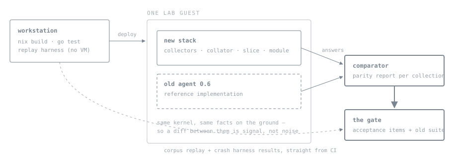

# Seven Gates

*The gated build of the three-tier rebuild: what gets written in each phase, the tests that open each gate, the rules that keep the repository shipping throughout.*

This plan executes [The Observation Model](DESIGN.md) and its Appendix C. The model says what and why; this says when, where, in what order, and by whom. Where the two disagree, the model wins — and where the model is silent, work stops and the gap goes to its adjudication queue, per its own governance rule.

## 01 · Six standing rules

> **1 · A gate is a set of tests, not a feeling**
>
> Every gate names its items from the model's twelve-test acceptance suite. A phase is done when its items pass — on the lab guest, in CI — and not before, and no phase begins until the previous gate is green. Two items run at *every* gate regardless: the shipping product's 2,077-test suite stays green, and the canary-credential check (item 11) passes on whatever channels exist so far.

> **2 · The repository ships the old product until the cut**
>
> `main` always builds and ships the current agent. The new stack grows in new top-level directories, additive, merged continuously — no long-lived branch, because a long-lived branch is two disagreeing documents written in code. From gate 2 onward the shipping adapters take **bug fixes only**: a moving porting target is how a rewrite never lands, and the live false-green (the never-run job ladder) is a bug, not a feature.

> **3 · The lab guest is the whole world until gate 5**
>
> Development deploys to VM-lab guests exclusively: full control, instant rebuild, no coordination with anything, and destruction is free. The estate is not touched until the cut — with one exception, supervised capture of corpus variants only real hardware has been in (a degraded pool, a populated enclosure).

> **4 · The old agent is the reference implementation**
>
> It runs *beside* the new stack on the same guest, and a comparator diffs the two products' answers for the same host. Parity — modulo declared renames and the re-minted ids — is how "is the port correct?" becomes a report instead of a judgement. The comparator is a development tool, not a deployment gate; it retires with the cut.

> **5 · Silence is a blocker at every tier of worker**
>
> Every executing agent's brief carries the same instruction: where the design document is unclear, silent, or contradicts the code you are writing, **stop, file the gap to the adjudication queue, and take other work.** Guessing is how the last architecture accumulated the drift this one exists to prevent — and the weaker the model, the more explicitly this must be said to it.

> **6 · A guard ships with the reversion that proves it discriminates**
>
> Not a test the fixed code passes — a demonstration that the unfixed code fails, executed. Round two found the round-one repair pinned by tests that stayed green with their fixes reverted: a check written to catch a known defect catches that defect and generalises to nothing. So every guard lands with its reversion run and shown red, an adversary's passing-wrong subject joins the suite as a permanent fixture, and a challenger-vs-reference mismatch is an adjudication, never a verdict — the reference has to be able to lose.

## 02 · The development loop



***Why a guest and not the estate:** both stacks observe the same live system, so the comparator's diff is meaningful; and the guest can be destroyed at every wrong turn, so no experiment needs anyone's permission. Federation tests use a second guest as a second "site".*

## 03 · Repository shape

```
system-explorer/
  contract/              # NEW · phase 0 — the JSON Schemas, versioned; the shared ground truth
  corpus/                # NEW · phase 1 — captured pairs per source × OS × version, anonymised, canaried
  harness/               # NEW · phase 1 — replay, collator, and protocol-crash harnesses
  go/
    cmd/se-collect-*/    # NEW · phase 2+ — one static binary per collector
    cmd/se-collate/      # NEW · phase 2 — the collator
    internal/
  src/system_explorer/   # the shipping product — bug fixes only from gate 2; retired at the cut
  conformance/           # the shipping product's suite — green at every merge until the cut
  test/vm-lab/           # existing — gains capture and corpus-regeneration verbs
  docs/DESIGN.md         # NEW · phase 0 — the observation model, canonical in-repo from gate 0
  docs/PLAN.md           # this document
```

Two notes on that tree. **The design document moves into the repository at phase 0** and the markdown becomes canonical — executing agents work in checkouts and worktrees, not in a browser, and rulings should land as reviewable diffs. **The corpus is public**, which is why anonymisation is a phase-1 deliverable and not an afterthought: structural consistency preserved, canaries planted, nothing real.

## 04 · The phases

### Phase 0 — contract freeze (small)

The queue rulings land; the wire schemas (declaration, stream, intent, problem-domain object, vocabularies) are extracted from the design document into `contract/` as real versioned JSON Schema files; hosted CI is stood up — the repository currently has none — running the old suite, the new toolchain, and **validation of every example in the design document against the schemas**, the check that would have caught both broken examples that document has shipped. The document itself ports to `docs/DESIGN.md`.

> **Gate 0 opens when**
>
> the adjudication queue holds no wire-blocking items — anything remaining carries a written proposal and blocks only the phase that consumes it · `contract/` exists and every design-doc example validates in CI · hosted CI is green on both toolchains.

### Phase 1 — corpus and harnesses (medium)

The three empty buckets get their machinery before any product code exists to hide behind. The capture pipeline: lab guests produce payload-plus-emitted-records pairs (the old agent generates the expected half), anonymised, canary credentials planted. The **replay harness** runs any collector binary against captured payloads and diffs its records against the committed expectation — the language-neutral seam, checking the outside of the process. The **collator harness** feeds recorded streams in and asserts minted ids, joins, observabilities and opinions out. The **protocol-crash harness** kills processes at every record, commit, transaction and checkpoint boundary. Tests written in this phase: acceptance items 8 and 11, plus the harness fixtures for 1–7.

> **Gate 1 opens when**
>
> the pipeline works end-to-end for two sources on two OSes · item 8 (an empty environment cannot go green) · item 11 across the channels that exist so far.
>
> *Retracted 2026-08-16: this gate's first green was false — the round-two audit showed the items passing for the wrong reasons. The criteria stand, but gate 1 now opens only through gate 1.5 below.*

### Phase 1.5 — the repair (medium)

A second adversarial round (six agents, 34 findings, 14 reproduced first-hand) showed gate 1's green was false: the published contract was enforced by nothing, the corpus certified a wrong answer about a firewall and punished the correct one, real identifiers sat unscrubbed in unpushed commits, and the round-one repair tests mostly pinned nothing. Scope, in order:

1. **Adapter truth** — recursive vmap/goto reachability walk, device resolution moved behind the replay seam, names published per law 1, no null fact values.
2. **Harness** — issued generations on the request line, the two-regimes law made self-enforcing (every dropped member has a named structural rule, proven exhaustively), typed fact equality, clone-safe corpus loading.
3. **Contract teeth** — every object closed, a rejection suite so a gutted schema is a red run.
4. **Scrubber** — manifest-driven deny-by-default classification, keyed substitution, an independent detector as the publish gate.
5. **Corpus** — reconstructed, re-scrubbed, regenerated, every variant carrying planted-truth anchors written at staging time.
6. **Guard discipline** — a guard ships with the reversion that proves it discriminates; the round's own passing-wrong collectors join the suite as permanent regression fixtures.
7. **Lab variants** — degraded pool, goto-reached chain, family-asymmetric ruleset, partial read, relation assertions, unobservable records, the three non-absent decline reasons, an nft-rules canary.
8. **History** — the six unpushed commits re-authored from origin/main as a clean series (the plaintext never enters public history), then push, then CI's first run from a clean checkout.
9. **Differential guard** — corpus payloads as seeds, a structural mutator, reference-versus-challenger disagreement as the verdict; every judge-fooling collector kept as a fixture that must disagree under mutation, so each catch closes a class rather than an instance.

> **Gate 1.5 — re-scoped 2026-08-17 — opens when**
>
> every previously-found exploit prints red · **no collector wrong about any committed capture passes** (judge soundness — decidable, absolute) · **every collector that has ever fooled a judge disagrees with the reference under the mutation set** (the differential guard — class-closing, held as regression) · a fresh fleet finds no new judge failure · coverage and the three replay bounds are declared, each with its authenticating venue named · the suite is green from a fresh clone. Only then does gate 1 open and Phase 2 (walking skeleton) begin.
>
> *The original second criterion — "no new passing-wrong collector at equal effort" — was retired after the first re-fleet closed the gate on it: it is an unbounded universal that no finite corpus can decide, pegging the verdict to adversary imagination rather than to properties of the artifact — the subset-guard defect, at process level. Coverage failures are owned by the differential guard and the live comparator, not by implied completeness.*

The round's generalisable lesson is now standing rule 6 (§01): every guard ships with its reversion, and a challenger-vs-reference mismatch is an adjudication, not a verdict.

### Phase 2 — walking skeleton on a guest (medium, sequential)

The smallest honest slice of the architecture, end to end: the collator core in Go — socket activation, batch/commit/generation application as one durable transaction, the store, minimal REST — plus *one* trivial collector (system identity: os-release and hostname, no privileges, present on all five OSes), the systemd units, the slice, and the NixOS module, deployed to a lab guest. This is where the contracts become code, and where every protocol mistake is cheapest.

> **Gate 2 opens when**
>
> items 2, 3, 4, 5 pass on the skeleton · the stack runs on a guest inside its slice budget · the old suite is untouched and green.

### Phase 3 — the collector fleet (large, parallel)

One collector per shipping adapter, each by the same loop: **capture its corpus first**, write the collector until replay equivalence holds, then live decline-correctness across the other lab OSes, then the comparator parity report against the old agent on the same guest. The collator's joins, identity walk, relations and opinion ladders grow alongside, fed by the collator harness. The old behavioural fixtures (8,600 lines, already fixture-shaped) convert to corpus expectations as each collector ports — converted, never deleted, since the old suite still guards the shipping product.

**Storage and network are the exemplars, and they go first** — not because they are easy but because they are the only two whose corpora were captured in phase 1, so their loop starts at step two, and the only two the mutation guard has operators for. They set the pattern the fleet copies.

The judge needed work before it could judge them, and that work is scope, not preamble:

1. **A collection is a coverage dimension.** *Done.* The coverage report named collectors, variant kinds, operating systems and interface versions and no dimension a collection could vanish on, which is how `nft-rules` stayed served-but-uncaptured behind a residual only a reader would find. `corpus/network/rules` closes it — the first pair to open two collections, built on the canary payload so the plant in a rule comment finally judges the collection that renders operator text. The seam now declares what it can replay and refuses the rest, closing a live escape where `collect links:5` read the interface of the machine *replaying* the corpus.
2. **The mutation guard points at ported collectors.** *Done.* Every call site passed a fixture or the reference; nothing passed a port, so the tier's demands on the artefacts this phase ships were enforced by nothing. Now a partition over the ported set: judged under every operator, or named with the venue that owns it.
3. **`se-capture` could not regenerate a ported collector's pair.** *Done.* It hardcoded the Python shim as the reference and never consults the ported table, so `corpus/system/healthy` declared itself re-stageable while nothing committed could re-stage it. It now resolves the reference through the one retirement table, and every pair is held to reproducing byte-for-byte — which also binds the two issuance seeds, `meta.collections` and `expected.jsonl`, that agreed and were required to by nothing.
4. **Nothing exercised `declare` or `probe`.** *Done.* The contract has three verbs and the harness drove one, so every judge graded a collector against the corpus and none against its own promises. The check §18 calls cheap and generic now exists: emitted implies declared across all three fact channels, declared implies observed or named in the residual ledger, and begin's digest hashes exactly the bytes `declare` emits.
5. **The differential guard could not carry a text-payload collector.** *Done.* `write_payloads` wrote every stem as `.json`, so a collector whose native documents are text would have been handed a directory its own seam cannot read and blamed for the REFUSED. The extension now follows the value's type. The system collector stays a named residual for the other reason: it has no second implementation to disagree with.
6. **A scrub manifest was required of no collector.** *Done.* Its absence silently meant "declares no address fields" where the truth would be "was never classified", and those are not the same statement.
7. **The live comparator is named as a venue five times and does not exist.** *Done.* It was where DESIGN 19 sent all three replay bounds and where both named residuals sent their truth, so five deferrals pointed at a promise a reader would have taken for coverage. `harness/bin/se-compare` now runs the shipping adapter and the ported collector against one machine at one moment and diffs them with the corpus's own comparator, and `harness/bin/se-live-reference` is the reference reaching a real interface — a separate tool from the replay shim, because there the danger is reading a host and here it is being mistaken for a replay. It closes the `boot_id` deferral more cheaply than the cross-boot capture originally named: beside a real machine the boot id is read from `/proc` and compared, so the corpus's own constant fails in one run. It authenticates `at` against the CLOCK_BOOTTIME window measured around the run, and with `--twice` proves the stamps advance — the one check with no replay analogue, since under a pinned clock identical stamps are correct. Proven both ways on the lab guest against the degraded pool: clean on the shipping port, and three named failures on a port built to emit the replay constants, while parity and the stream laws stayed green over it. Its rules are pure functions with 28 conformance tests, because CI has no pool and a guard only ever seen to pass is not a guard.
8. **No tier had relations at all, and the seam is why.** *Done, one tier at a time.* Every layer counted assertions and none produced one: the shipping adapters carry thirty-one relationship emissions between storage and network, all of them in `get_object`, which the replay seam never touches — so the corpus could not hold an edge, the ports faithfully reproduced zero, and acceptance item 6 was unstarted while every judge was green. What landed: both adapters and both ports now assert from the `acquire` path the seam does reach; the declaration carries the relation table, the discriminator and the confirmation rule; the corpus holds sixty-seven assertions across two pairs; a fifth anchor form plants edges as hand-asserted truth, because until it existed the only anchorable half of "the spare is in the pool twice" was a fact on a row; and the collator mints, resolves, keys and judges them. **The remaining half is the hub's** — cross-host re-testing against intent, which is phase 4 and is where `resolved-later` stops being one collator's two batches.

**Lab-live, four operating systems, 2026-08-18.** The first run of the comparator across the whole lab rather than one guest, and the matrix is the point — each guest is a different reading of "is the interface there", which is what makes decline-correctness testable at all.

| Guest | Interfaces | storage | network |
|---|---|---|---|
| ubuntu 26.04 | OpenZFS 2.4.1, nft | clean, incl. the engaged spare and nine assertions | clean |
| ubuntu 24.04 | OpenZFS **2.2.2**, nft | **adjudication** — no `status -j` on 2.2.2: port declines `unsupported`, reference raises | clean |
| debian 13 | neither | clean — both decline `absent` and commit zero | **adjudication** — port declines `absent`, reference raises |
| fedora 44 | nft only | clean — both decline `absent` and commit zero | clean |

Six of eight clean; the two adjudications are one finding, not two — **the shipping Python adapters raise where the collector contract requires a decline**, so the reference produces no reading exactly where the port produces a correct one. It is in the queue rather than patched, because bridging arbitrary exceptions into decline reasons inside the live reference would make the two agree by construction and destroy the comparator's independence on the cases it exists to adjudicate.

The run also found the defect the lab was for: **storage spelled its absent reading two ways** — `absent` under replay, `unsupported` live — so a host that lost ZFS would have served stale pool objects forever. Closed, with `corpus/storage/absent` (the variant that should have existed from day one, and whose absence is the whole reason the two halves drifted) and a shared constant that makes the disagreement unspellable.

**The lab, provisioned for the fleet, 2026-08-19.** The fleet was blocked on two things and neither was code. The first was interfaces: three of the four guests had almost nothing installed, so most collectors had nothing to capture and their negative case was the only case reachable. The guests now carry, deliberately unevenly:

| Guest | Interfaces | What it is FOR |
|---|---|---|
| ubuntu 26.04 | zpool 2.4.1, nft, docker (6 containers), libvirt, unbound, kea, restic, smartctl, busctl, dpkg | the positive case for nearly everything |
| ubuntu 24.04 | zpool **2.2.2**, nft, restic, smartctl, busctl, dpkg | old interface versions — where `status -j` does not exist |
| debian 13 | restic, busctl, dpkg | the sparse host: most collectors must decline here |
| fedora 44 | nft, podman-docker, unbound, restic, smartctl, busctl, **rpm** | the other package manager, and a docker-compatible socket that is not docker |

The unevenness is the design. A lab where every guest had everything would test the positive path four times and the decline path never, and decline-correctness is the half that retires objects.

The second blocker was the seam, and it was the real one: **ten of the seventeen unported adapters have no module-level acquisition at all**, so the monkeypatch the harness had could not reach them. Three seam kinds now cover the fleet — argument-dispatched module readers, instance methods, and instance methods returning an HTTP response — all deny-by-default, all proven on real captures.

**Captured and replaying: `vms`, `packages`, `docker`, `traefik`.** traefik's pair is committed — the first capture this product has taken from an HTTP interface, and it found a null fact value on three of three services the moment it ran. `docker`'s payloads were captured and held OUT of the tree until its scrub manifest classified them: its documents carry real MACs and host mount paths, and the deny-by-default walk refused an imperfect manifest, which was the gate working rather than an obstacle to route around. `corpus/docker/healthy` landed once the manifest passed.

**GATE 3 IS OPEN, 2026-08-20.** Every clause of the criterion below is met and
each was measured rather than argued:

- **Twenty of twenty collectors ported**, `nix` included. The deferral is
  withdrawn, not extended: what a host HAS BEEN ports, and what CHANGED between
  two generations left the rewrite's scope by ruling.
- **Nineteen of nineteen clean on two hosts** — the fully provisioned Ubuntu
  guest and the NixOS one, which is the sparse host as well. `system` is the
  twentieth and has no second implementation to disagree with, which the report
  states rather than counting as a pass. One divergence is named and accepted,
  `nix`'s five delta facts, and the comparator strips them from the reference
  only — so a port emitting one is still reported.
- **Item 1's collator half**: two instances with identical native names never
  merge, and one instance's re-commit retires only its own scope. Judged in
  process and, since today, through the black-box driver.
- **Item 6's collator half**: unresolved, resolved-later, parallel, confirmed,
  contradicted, unconfirmable and retired, plus an upgrade that never re-keys.
  Judged through the black-box driver, which had refused every fixture that
  would have exercised it.
- **Item 7's first half**: an unknown declaration hash is held rather than
  applied, and an undeclared fact reaches no join — the second of those
  enforced by nothing at the collator until today.
- **Item 8**: green since gate 1.5, carried by the discrimination guards.

Nine defects were found by the live comparator this round and by nothing else.
The four that arrived last are the ones worth remembering: a null fact value
the sweep of thirty-seven could not have caught, because it is written after
the sweep runs; two implementations composing different sentences for one fact
that no interface authors; a reference that said nothing where the answer was
none; and whole collections lost to an exception on every host that does not
run the thing they read.

**What the gate does NOT claim**, stated because a clean report invites the
wrong reading: not that the collectors are correct, only that two independent
implementations reading one machine at one moment agree.

> **Gate 3's claim was collector-level, and the question was collection-level. Corrected 2026-08-20.**
>
> "Twenty of twenty collectors ported" and "nineteen of nineteen clean on two hosts" are both true, and neither is what a person wants to know. A collector is *ported* at the granularity of a **binary**. Counted at the granularity that reaches a page: the shipping adapters serve **58 collections and the port serves 40**, so **eighteen are not built** — and they are the ones with data on every Linux host. `network` kept 2 of 10, losing links, routes, listening, resolver, nft-tables, port-exposure and tailscale. `storage` kept 1 of 6, losing block-devices, mounts, arrays and datasets. `system` kept 1 of 5, losing time, boot and overview.
>
> **The parity comparator could not see it, and that is the worse half.** `SERVES` is a hand-maintained list of which collections to compare, and it had been filled in with exactly what the port implements — so both implementations were asked only for what the port already had, agreed, and reported clean. A second guard held `SERVES` against the replay seam's table, and *both* are shaped like the port, so three lists agreed with each other and none was ever held against the reference. **That is this estate's most repeated defect occurring inside the guard built to catch it**, and the comparator's own comment names the shape — "a collection served but never compared is the hole `nft-rules` sat in" — while fixing one instance rather than inverting the rule.
>
> Found by the owner opening the UI and saying it looked empty, which no assertion in the suite had managed to say. `conformance/test_port_completeness.py` is the inversion: **deny-by-default over the reference**, so every collection the shipping product serves must be ported, deliberately dropped with a ruling, or listed as owed. Three are dropped by ruling (two `lookups`, now a verb; `system/self`, which the collator's own cost record replaces) and fifteen are owed.
>
> One further claim of gate 3's is simply wrong: *"`system` is the twentieth and has no second implementation to disagree with."* `adapters/system.py` serves `identity` among five collections. It was never compared, and comparing it needs a replay seam that does not exist for that adapter — recorded as owed rather than quietly added.
>
> **Gate 3 is not reopened.** What it measured, it measured; the port agrees with the reference everywhere both implement. What it did not measure is now named, counted and guarded, and gate 6 cannot be reached while the owed list is non-empty.

**And the census changed hours after the gate opened, without the gate moving.**
The ruling recorded in DESIGN's appendix C on 2026-08-20 — anything an estate
generates that is not normal NixOS or Linux stays out of the public product —
moves the whole `protection` collector to an estate plugin and `nix`'s
`Deployment` fact with it. Going forward the count is **nineteen first-party
collectors and one estate-bound**, and `Deployment` joins `nix`'s five delta
facts as a named divergence until the estate sequences it out. None of that is
retracted from the paragraphs above: twenty were ported and nineteen judged
clean on two hosts, which is what was measured, and a ruling taken after a
measurement does not unmake it. The gate is open on the evidence it was opened
on; what follows it is a smaller product, not a weaker claim.

**Where gate 3 stood earlier on 2026-08-19.** The parity report
(`docs/PARITY-REPORT.md`) is **clean — 18 of 18**, up from 8 this morning. Two
things got it there: the lab gained the venues twelve collectors need to read
anything at all (`harness/bin/se-provision-lab`), and `vms` was ported over
`virsh` once its blocking objection turned out to be about `virsh list` rather
than `virsh domstats`.

**All five rulings were taken and four are implemented.** A configuration gap
never retires — a missing receipt declines `unavailable`, and no collector
commits zero for a collection it could not read. The shipping adapters gain
declines per case and after adjudication, never as a blanket bridge, which
preserves the comparator's independence on everything unjudged; all three
measured triggers are bridged. `units` routes a failed property read to the
unobservable channel. And `vms` is ported.

**Two things were deliberately NOT done, each with its reason recorded.**
`MissingReferenceUnobservable` was not migrated to the unobservable channel
although the ruling asked for it: `rules/units.py` reads it as a FACT, rules are
computed from facts, and moving it would delete the rule's only signal that the
probe never ran — leaving the collector to opine confidently that an absent unit
is referenced by nothing. `vms` has the identical shape, which is what makes it
a pattern. The prior decision — whether the rules layer reads the unobservable
channel at all — is now the queue item that would settle both.

**One new item came out of the work**: five adapters cannot tell whether their
service is dark and three can, because only `traefik`, `unbound` and `kea` probe
their interface inside `capability()`. That decides how much of the
dark-service trigger can be bridged, and it is not free to fix.

**Item 7's decline reasons are no longer unmapped.** All three non-absent
reasons have now been observed live, each from a distinct real cause:
`unauthorised` (nft read unprivileged), `unavailable` (a stopped traefik, plex
or paperless-redis), and `unsupported` (kea without its lease hook). They are
observations rather than committed variants, so item 7's corpus half is what
remains of it.

**What the round found in the shipping reference**, none of which any other tier
could see: `units` lost 149 of 219 `Slice` facts non-deterministically, exiting
0 each time; `bazarr` and `plex` published rows stamped `at: 0`, which parity
called clean because the facts matched and only the clock check caught;
`paperless` publishes the instance's host and port inside a committed fact; and
`se-capture-guest`'s `kea` arm captured the downloaders adapter for two days
while `bash -n` reported the file fine.

**`nix` ports its generations and its deltas are out of scope — ruled
2026-08-19, and the deferral it replaces is withdrawn.** The collector was
deferred whole on the argument that it was about to be replaced. The ruling
splits it instead, because the two halves have different futures. What a host
*has been* — the list of generations, which one is current, which one booted,
what kernel and configuration revision each carries — ports now, and `packages`
must read a NixOS host, because those are questions an operator asks on any
machine and two of the three answers already exist. What *changed between two
generations* does not port and is not queued either. **It becomes a plugin
that this repository does not own** — ruled 2026-08-20: the estate computes
the closure delta, because the estate is what deploys and already produces
two of its four answers, and system-explorer owes only the SURFACE a plugin
attaches to. That is the sharper reading of a sentence that used to say "once
the plugin surface exists", which left the owner unstated and was taken by
two sessions to mean this repository would build both. So `_delta_rows`,
`_package_rows`, `_etc_rows`,
`_aggregate_rows` and the /etc collapse and enumerate ceilings leave the
rewrite's scope rather than sitting inside it as debt.

**Later the same day that ruling generalised, and it took a larger collector
with it.** Anything an estate generates that is not normal NixOS or Linux stays
out of the public product — which moves the whole `protection` collector, three
collections and forty facts, and `nix`'s `Deployment` fact. `se-generation.json`
stays. The ruling and its measurements are in DESIGN's appendix C; what belongs
here is the consequence for sequencing, because **a plugin defines four layers
and this plan owed an owner for each of them.**

| Facet a plugin needs | State | Owed by |
|---|---|---|
| observations — `collect` over the socket, the declaration travelling with the binary | exists, by construction | done |
| identities — the object prefixes it claims | exists | done |
| intent — somewhere for a hub-tier plugin to declare what should be true | `se.intent/1` enumerates one estate's stanza and closes the document | **phase 4**, where intent lands |
| opinions — a way to say what makes a published fact alarming | no member of a declaration is a rule | **phase 5**, where opinions first exist to be judged |
| representation — a state word or severity the product does not know | a lint-enforced literal in `app.js` that no endpoint publishes | **phase 5**, with the surfaces |
| conformance — corpus, mutation guard and comparator entry for a plugin's own facts | the harness is public, not packaged for outside use | **phase 6**, at the cut, or the estate inherits facts nothing judges |

Recorded because the sentence above it — "system-explorer owes only the SURFACE
a plugin attaches to" — named an owner for the plugin and none for the surface,
which is the same defect one level up from the one it corrected.

**That produces a named parity divergence, which is the third clause working
rather than being waived.** The shipping adapter keeps emitting
`ComparedWithGeneration`, `DeltaCounts` and their siblings until the cut,
because it is what the estate runs today and nothing is served by breaking it;
the port declares and emits neither. So the two disagree by construction on
exactly those facts and must agree on every other, and the divergence is listed
in the parity report as accepted — with the fact names written down, so a
disagreement anywhere else in the collection still fails.

What the port needs, recorded so it is not rediscovered: `nix` reads a
filesystem, and the ruled answer for a tree-shaped interface is the filesystem
transcribed — the directory listings the collector walked. Dropping the deltas
removes most of the tree walking with them (`_etc_entries`, `_tree_entries` and
`store_paths` are delta machinery), so what the corpus must hold is the profile
link farm and the handful of small files inside each closure, which is a far
smaller transcription than the deferral assumed.

> **Gate 3 opens when**
>
> every first-party collector passes replay and lab-live checks, `nix` included
> at the scope the ruling above leaves it — generations yes, deltas out of
> scope and not counted against this gate · **item 1's collator half**: two
> instances with identical native names never merge in one collator's store,
> the hub half being gate 4's · **item 6's collator half**: every relation state
> reached and an upgrade that never re-keys, judged through the black-box driver
> and not only in-process, cross-host re-testing against intent being gate 4's ·
> **item 7's first half**: a batch with an unknown declaration hash is held
> rather than applied, and an undeclared fact reaches no join — opinion and
> answer are gate 5's and the roll-up is gate 4's, because neither surface
> exists to be judged here · item 8 · the parity report per collection is clean
> or its diffs are named and accepted.
>
> *The three halvings are rulings taken 2026-08-19, not scope lost. Each names
> the gate that owes the other half, because an item whose unjudgeable half is
> silent reads as fully green — which is the failure this suite was written to
> catch, wearing the suite's own numbering.*

### Phase 4 — hub and protocol (medium)

The Python hub evolves: the connection reverses (collator dials in), checkpoint protocol with manifest and atomic promotion, `unswept` and the freeze, declarations travelling up, findings re-keyed to the new scope with the reset displayed. The intent declaration and hash federation land, tested with **two guests as two sites** — including the NAT-mode dial direction. Intent grows its plugin-supplied stanza, per the table above. First problem-domain object assembled end to end — **`are all hosts up to date`**, the first founding failure's own question, worked in full in DESIGN §25; the protection answer beside it there is a plugin's and not this phase's to assemble.

**Begun 2026-08-20**, the day gate 3 opened. `contract/se.checkpoint.1.json` landed with its eighteen rejection cases and the three-record worked example in DESIGN §06 — the wire meaning of a complete checkpoint, which is what the crash suite in the gate below is judged against.

**Both halves of the checkpoint exist, and neither has a transport yet.** The collator renders one from its store as NDJSON, a pure function of the store plus four parameters, so what a checkpoint says is assertable without a clock or a socket. The hub accumulates one and promotes it all at once, refusing eleven ways, each refusal discarding the whole fragment. The two are proven against **the same bytes**: the emitter generates the samples, the contract schema judges their shape, and the receiver is driven by them — so neither side is proven against somebody's idea of the other. `unswept`, `connected` and `dark` are distinguishable, which is item 9's precondition, and a dark host keeps its last promoted state because blanking it is absence rendered as health.

Two findings came out of building it, both recorded where they were found. **Acceptance item 1 had a hole one tier below the tier it was tested at**: two instances mint the same id, the store kept them apart by scope, and the read API dropped the scope — so both rows reached a consumer identical. Gate 3 claimed item 1's collator half on the store's own test, which was true and did not reach the serving path. Fixed, and the checkpoint carries `instance` for the same reason. And **a manifest that under-reports is invisible to every receiver-side check**, found by reverting the emitter: the manifest is the only account of what the sender declares, so it makes the *stream's* completeness falsifiable and never its own. DESIGN §06 says so now, and the rule lives beside the store that knows the answer.

**The freeze holds, which is the rest of item 9.** Absence only resolves where the host could look, carried forward from the shipping hub's own rule and given the state the new architecture adds. Six blindnesses, each stated separately because an operator reading a frozen finding has to know which silence they are looking at: unswept, dark, a stale collection, a collection the collator no longer names, one that has never applied, and evidence that has not moved since the finding was raised. That last one is the guard against a changed *rule* quietly resolving findings over facts that never changed. A finding carries every contributor rather than one batch id, so two of three inputs returning resolves nothing — which a single id could not have expressed.

Both new guards were reverted and the reversions executed. One did not fail, and the reason was worth having: the unswept check was written twice by two routes to the same condition, so no reversion of either could falsify it. Deduplicated, and the second attempt fails three tests including item 9's own.

**Every deliverable of this phase has landed except one, and the exception is environmental rather than unfinished.** The connection reverses — `se-collate` dials its hub, sends declarations then a checkpoint, and closes; mutual identity is required and plaintext must be asked for by name, because reversing the connection removes the network as a containment layer and identity is the only one left. Intent landed with its plugin stanza and its canonical hash. Declarations travel up and index per host, so one host's declaration never vouches for another's facts. Findings are re-keyed with the reset displayed. Two hubs federate over a socket, agree or refuse on the intent hash with versions beside it, and refuse a third site's request by name. And `are all hosts up to date` — the founding failure's own question — assembles from two real collator sessions and validates against `se.answer/1`.

> **Gate 4 — clause by clause, 2026-08-20**
>
> · **item 9** — green. `unswept`, `connected` and `dark` are distinguishable, the freeze holds with six separately-stated blindnesses, and a dark host keeps its last promoted state.
> · **item 10** — green. NAT-mode dial direction stated per pair and refused when both sides agree, one hop holding by capability, a forwarded request refused by name, and protocol and semantic versions checked beside the intent hash.
> · **item 1's hub half** — green, at gate 4's own wording: two instances, identical native names, two collators, four rows that stay four and are distinguishable by id alone.
> · **item 6's hub half** — green. `resolved-later` across two collators, with the key unchanged through the upgrade.
> · **item 7's roll-up half** — green. An undeclared fact reaches no roll-up and no basis, and is named rather than dropped silently.
> · **the checkpoint crash suite** — green at all three boundaries, judged against `boundaries.json` rather than against restated expectations, with recovery asserted too — a hub that refused everything would otherwise pass all three.
> · **the intent declaration validates a stanza this repository's schema does not enumerate** — green, and protection is the worked example of it.
> · **a two-guest estate renders one coherent view with reach and coverage stated** — green, and judged where standing rule 3 puts it: **two lab guests as two sites**, running the real binaries on real kernels. The Go collector reads the host, the Go collator applies and dials, the Python hub promotes, and one view carries a NixOS guest and an Ubuntu one with reach and coverage stated. The two then federate as two sites in both directions — agreeing on the intent hash, answering for the sibling's own site, refusing a third by name, and refusing a divergent estate with both hashes in the message. Which side dials is stated per pair rather than assumed symmetric. `harness/estate/` holds the vehicle, so the clause rests on something anybody can re-run.

**GATE 4 IS OPEN, 2026-08-20.** Every clause above is met and each was measured rather than argued.

**Two corrections this gate owes to its own record.** The clause above was first written down as *blocked*, on the strength of `vm-lab status` failing with "missing required command: virsh". That reading was wrong twice: virsh is required locally only when NO hypervisor is configured — in remote mode the lab checks the hypervisor's tools on the hypervisor — and the guests were already running, so nothing needed creating. **A local-mode error was read as an absent capability**, which is the probe-discipline rule this plan keeps citing, applied to the tooling rather than to a host, and it very nearly cost a gate.

**And the lab found two things no generated fixture produced.** A **booted generation carrying no configuration revision**: on the NixOS guest, generation 1 is booted and current and has none, while generation 4 has one and is neither — so answering from the generation that happens to carry a revision would report a revision the host is not running. And **two different silences behind one count**: one guest read its generations and none was booted-with-a-revision, the other runs no NixOS generations at all, and the answer named neither. Both are named now, and a dark host is still owed its reason, because going away and having had nothing to say are different facts.

### Phase 5 progress

**Begun 2026-08-20**, once its two blocking queue items were ruled: `se.views/1` survives unchanged, and the UI design system is the production token set. Both were ruled by the executing agent on their written proposals, which the queue records with what would reopen each — an owner override costs nothing and is expected.

**Opinions exist, and they are data.** `se.declaration/1` grows a `rules` member: a closed, small condition vocabulary over the collection's own declared facts, so a rule table can be read before it runs. That is the shape D5 left to this document, and the argument for it over a plugin-supplied evaluator is exactly that boundedness — an expression language free to grow becomes third-party code in the judging path by increments.

Only self-evident opinions live there, and that is not a preference: **intent never reaches a host**, so a rule travelling with a declaration cannot be intent-relative. The collator evaluates them because it is the lowest tier that can reach the facts (law 2), and a collector gains no new obligation — the rules are data in a declaration it already publishes. Opinions ride to the hub on the checkpoint's `collection_state`, beside the objects rather than inside them, because an opinion has its own key and its own lifecycle.

`grounds` is carried and kept distinct: `interface` is the system declaring its own fault, `threshold` is *our* number. A surface rendering both identically would present our opinion as the machine's, which is §17's point made structural.

**Item 7's last half is green at both ends**, and they are different failures. At the collator, a rule citing — or a condition *reading* — a fact its collection does not declare is refused outright, because an opinion resting on an undeclared fact is a judgement nobody can interpret and a citation nobody can follow. At the hub, an opinion arriving with a citation no held declaration backs reaches no roll-up.

**The plugin's opinion facet is green.** A collection this repository has never heard of, with its own facts and its own rule table, reaches a finding with a lifecycle — proven end to end with the real collator binary.

Two supporting changes came with it. The store now keeps declaration **documents** beside their digests, which the rule table needs and which also removes a coupling: a session no longer re-asks live collectors for declarations it already holds, so a collector restarting during a checkpoint no longer costs the hub axes for facts it already has. And the checkpoint refuses an opinion whose subject the collection did not send — a verdict with nothing to go and look at.

**Both scales render on the server, from one token set.** The producer renders, so §27 — the renderer knows nothing the producer knows — is settled structurally rather than by discipline, and the browser-side fourth-copy bugs this product has shipped three of become impossible. Neither renderer holds a severity table, a state table or a fact glossary. The token set is two files because the two renderers are in two languages and neither toolchain reads the other's tree; drift between them is a test failure, and the coverage is stated at the top of the copy.

**One route table, three consumers.** The hub declares its routes once; the HTTP surface, the estate page and MCP are generated from it, so a tool per route is a property of the construction. Both tiers publish their own table, which is what lets one MCP surface become either — and why a plugin's collection is reachable the day it exists, since the tools are per ROUTE and never per collection.

**MQTT is a projection out**: publish-only, findings and never facts, discovery retained and state never, availability driven by reach, and a republish protocol without which refusing retain is just silence. A resolved finding's discovery entry is removed rather than set to a good value.

> **Gate 5 — clause by clause, 2026-08-20**
>
> · **item 11 across every channel including UI, MCP and MQTT** — green, and it found a real gap while being written. Every fact declares what it tells a reader and `secret` means withheld at source, but nothing enforced it, so a collector emitting one anyway would have had it rendered. Both tiers now drop declared credentials before any channel sees them and NAME what they withheld. The sweep walks each tier's **published route table** rather than a list its author remembered, which is how it caught the collator's objects route after the page and the checkpoint had already been fixed.
> · **item 7's last half** — green at both ends. At the collator a rule citing, or a condition merely reading, an undeclared fact is refused; at the hub an opinion whose citations no held declaration backs reaches no roll-up and no answer.
> · **MCP-parity check** — green, and structural rather than remembered.
> · **UI smoke on both scales** — green: the collator's host page answers whether or not a hub is reachable, and the hub's estate page carries the answer, the reach, the opinions and the objects.
> · **the plugin's two remaining facets** — green. An opinion declared by a collector this repository has never heard of reaches a finding with a lifecycle, proven end to end with the real collator binary. And a plugin is bound to the product's severity vocabulary by the CONTRACT — a rule's `level` `$ref`s the closed set — while state words need no binding at all, because a server-rendered page switches on nothing.
>
> **GATE 5 WAS DECLARED OPEN AND IS REOPENED, 2026-08-20.** The surfaces clause is not met.
>
> `UI smoke on both scales` was satisfied by assertions that cannot see the thing they were supposed to judge. Escaping, no-vocabulary-copies, self-containment, page size — every property its author thought of, and not one of them can tell a usable page from a debug dump. **The gate was opened on a check that enumerated what its author thought of and reported success about the rest**, which is the defect this suite exists to catch, in the clause about the surface a person actually looks at. It was found by the owner opening the page, not by the suite.
>
> The gap is not the eighteen unported collections above, and is worse than them: **on a collection that IS ported, the rewrite's page is a dump.** The shipping UI renders one fact per column, states what its default filter is hiding and offers to reveal it, facets by a fact's values, nests slices over their units, links a machine scope to the guest it runs and a docker scope to the container it holds, and reaches evidence and lookup from a row. The rewrite's page joins the facts into one cell with commas and truncates.
>
> Reopened rather than amended, because the clause as written is the right clause.

Phase 6 — the cut — is not started, and it is owner-supervised by its own rule.

> **Gate 4 opens when**
>
> items 9 and 10 pass · **item 1's hub half** — two instances with identical native names never merge across two collators either · **item 6's hub half** — cross-host re-testing against intent, where `resolved-later` stops being one collator's two batches · **item 7's roll-up half** — an undeclared fact reaches no roll-up · the checkpoint crash suite is green · a two-guest estate renders one coherent view with reach and coverage stated · the intent declaration validates a stanza this repository's schema does not enumerate, so a hub-tier plugin has somewhere to declare intent.

### Phase 5 — surfaces (medium, parallel)

Server-rendered HTML/CSS UI at both scales from one token system; MCP on collator and hub with a tool per route in the same commit; the MQTT findings projection with birth, last-will, and republish. The design library decision comes off the queue before this phase starts.

> **Gate 5 opens when**
>
> item 11 across every channel including UI, MCP and MQTT · **item 7's last half** — an undeclared fact reaches no opinion and no answer, judgeable only once opinions and the answer surfaces exist · MCP-parity check · UI smoke on both scales · **the plugin's two remaining facets** — an opinion declared by a collector this repository does not ship reaches a finding, and a plugin either speaks the product's severity and state vocabulary by stated rule or those enums are published and `app.js` stops keeping a copy no endpoint serves.

### Phase 6 — the cut (small, supervised)

Exactly as the design document's §06 rules it: the canary host first, then the estate; old agent retired; snapshot stores archived read-only; findings reset displayed; SPEC.md and COLLECTOR-DEPLOYMENT.md disposed and Appendix B closed. Estate-touching and partly destructive, so it runs with the owner present, one staged review gate per boundary — state, plan, and what is *not* changing, at each step.

> **Gate 6 — done — when**
>
> item 12 · the full acceptance suite green on the canary, then per site · no undisposed rule left in either superseded document.

## 05 · Execution assignments

Which worker executes which phase is tracked outside this repository, with the plan's
owner. The binding rules travel with every brief regardless of who holds it: the gate
reviewer never wrote the code under review, and rule 5 — silence in the design document
is a blocker, never a licence to guess.

---

*Companion to The Observation Model; where they disagree, the model wins. Phases small/medium/large are relative effort, deliberately not day counts — the gates, not a calendar, decide when a phase ends.*
